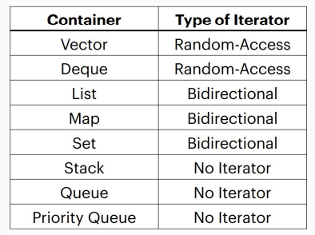

# Iterators and Pointers

## Iterators

Iterators let you access all data in containers programmatically. An iterator has a certain `order` and it knows what  element will come next. However, not necessarily the same each time you iterate. 

### Operations of Iterators

All containers in the STL implement iterators, but they're not all the same. Each container has its own iterator, which can have different behavior. 

All iterators implement a few shared operations:

* Initializing: `iter = s.begin();`

* Incrementing: `++iter;`

* Dereferencing: `*iter;`

* Comparing: `iter != s.end();`

* Copying: `new_iter = iter;`

### Categories of Iterators

Iterators are classified into five categories depending on the functionality they implement:

* `Input` and `output` iterators are the most limited types of iterators, they can perform sequential single-pass input or output  operations.

* `Forward` iterators have all the functionality of `input` iterators. If they are not `constant` iterators, they have also the functionality of `output` iterators. All standard containers support at least `forward` iterator types.

* `Bidirectional` iterators are like `forward` iterators but can also be iterated through backwards.

* `Random-access` iterators implement all the functionality of `bidirectional` iterators, and also have the ability to access ranges non-sequentially. Distant elements can be accessed directly by applying an offset value to an iterator without iterating through all the elements in between.

`Forward` iterators are the minimum level of functionality for standard containers. `Input` iterators can appear on the `RHS` of an `=` operator.

```cpp
auto elem = *it;
```

`Output` iterators can appear on the `LHS` of an `=` operator.

```cpp
*elem = value;
```

`Bidirectional` iterators can go forward as well as backward.

```cpp
--iter;
```

`Random-access` iterators allow you to directly access values without visiting all elements sequentially.

```cpp
iter += 5;
```



### Loop

To access each element individually, you can use:

```cpp
for(auto iter = set.begin(); iter != set.end(); ++iter) {
    // use *iter to dereference
    const auto& elem = *iter;
}
```

Don't use `iter++` because it returns the value before being incremented, which is slightly more inefficient.

If we have a map, we can use structured binding to be more efficient while dereferencing:

```cpp
std::map<int> map{{1, 6}, {1, 8}, {0, 3}, {3, 9}};
for(auto iter = map.begin(); iter != map.end(); ++iter) {
    const auto& [key, value] = *iter;
}
```

## Pointers

### Intro

Iterators are a particular type of pointer. Iterators point at particular elements in a container while pointers can point at any objects in your code. Pointers reference those memory addresses and not the object themselves.

### Dereference

Pointers are marked by the asterisk(*) next to the type of the object they're pointing at when they're declared. The address of a variable can be accessed by using `&` before its name, same as when passing by reference.

If we need to access a pointer's object's member variables, we can use `ptr->var` instead of `*ptr.var`.
