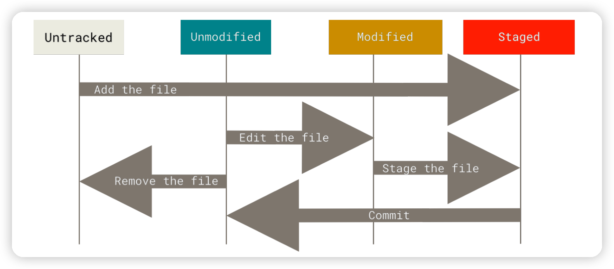

# Some Basic Tips of Using Git

## Files State

Each file in your working directory can only be in one of two stages, `tracked` or `untracked`. In other word, tracked files are files that Git knows about and they can be `unmodified`, `modified` or `staged`. After you edit `unmodified` files, Git sees them as `modified`. If you stage the file through `git add`, them will become `staged` file.



## Ignore Files

To void Git automatically add some files, you can create a file named `.gitignore`. There are some rules for the patterns you can put in the .gitignore file:

* Blank lines or lines starting with `#` are ignored.
* Standard glob patterns will be applied recursively throughout the entire working tree.
* Start patterns with a forward slash `/` can avoid recursivity.
* End patterns with a forward slash `/` can specify a directory.

* Start with an exclamation point `!` can negate a pattern.

```
# ignore doc/notes.txt, but not doc/server/arch.txt
doc/*.txt

# ignore all .pdf files in the doc/ directory and any of its subdirectories
doc/**/*.pdf
```

## Record Changes

### View Staged and Unstaged Changes

`git diff` compares what is in your working directory with what is in your staging area. If you want to see what you've staged that will go into your next commit, you can use `git diff --staged` or `git diff --cached`, which compares your staged changes to your last commit.

### Commit Changes

If you expect an explicit reminder of what you've modified, you can pass the `-v` option to `git commit`. If you want to skip the staging area, you can add the `-a` option to the `git commit`, which makes Git automatically stage every file that is already tracked before doing the commit.

### Remove Files

Through `git rm` command, you can remove files from your working directory. If you want to remove modified file, you should add `-f` option. If you want to keep the file in your working tree but remote it from your staging area, you can use `git rm --cached`.

```shell
# remove all files thiat have the .log extension in the log/ directory
git rm log/\*.log
# remove all files whose names end with a ~
git rm \*~
```

### Moving Files

If you want to rename a file in Git, you can run something like `git mv file_from file_to`, which is equivalent to running:

```shell
mv file_from file_to
git rm file_from
git add file_to
```

## View Commit History

By default, `git log` with no arguments lists the commit s made in that repository in reverse chronological order. `-p` or `--patch` option helps to show difference introduced in each commit. If you want to see some abbreviated stats for each commit, you can use the `--stat` option. `--pretty`, `--oneline`, `--short`, `--full`, `fuller` options will change the log output to formats other than default. If you use `git log --pretty=format:"%h %s" --graph`, you can get a nice little ASCII graph showing your branch and merge history.

`git log` also takes several useful limiting options. `-<n>` will show only the last `n` commits. `git log --since=<n>.weeks` gets the list of commits made in the last `n` weeks. `--author` allows you to filter on a specific author and `--grep` option lets you search for keywords in the commit messages. `-S` takes a string and shows only those commits that changed the number of occurrences of that string. If you specify a directory or file name, you can limit the log output to commits that introduced a change to those files, like `git log -- path/to/file`.

## Undoing Things

If you want to redo a commit, make the additional changes you forgot, you can stage them and commit again using the `amend` option. If you've made no changes since your last commit, all you'll change is your commit message.

### Unstaging Staged File

`git reset HEAD -- <file>` can help you unstage the file that you stage wrongly. Besides, you can also use `git restore --staged <file>` to unstage.

### Unmodify Modified File

`git checkout -- <file>` replace the file with the last staged or committed version, which means your local changes are gone if you use it. If you would like to keep the changes but still need to get it out of the way for now, you can learn how to stash and branch, which will be introduced later. Similarly, you can use `git restore <file>` to unmodify a modified file.

## Work with Remotes

### Show Remotes

To see which remote servers you have configured, you can use `git remote`. If you've cloned your repository, you should at least see `origin`. When you specify `-v`, it will show you the URLs that Git has stored for the shortname to be used when reading and writing to that remote.

### Add Remote Repositories

To add a new remote Git repository as a shortname, you can run `git remote add <shortname> <url>`.

### Fetch and Pull From Remotes

If you want to fetch all the information from your remote repositories, you can use `get fetch <remote>`. `git fetch` only downloads the data to your local repository, which means it doesn't automatically merge it with any of your work or modify what you're currently working on.

If your current branch is set up to track a remote branch, you can use `git pull` to automatically fetch and then merge that remote branch into your current branch.

### Push to Remotes

You can push upstream when you have your project at a point that you want to share through `git push <remote> <branch>`, which means you push your `master` branch to your `origin` server.

### Rename and Remove Remotes

You can run `git remote rename <name_old> <name_new>` to change a remote's shortname.

If you want to remove a remote, you can use `git remote remove <shortname>` or `git remote rm <shortname>`.

## Tag

### List Tags

You can just type `git tag` to list the existing tags in Git. Besides, you can also search for tags that match a particular pattern through `git tag -l "<pattern>"`.

### Create Tags

To create an annotated tag in Git, the easiest way is to specify `-a` when you run `git log`, such as `git tag -a <tag> -m <tag message>`. The `-m` specifies a tagging message.

### Share Tags

By default, `git push` doesn't transfer tags to remote servers, you can push tags to a shared server with `git push origin <tag>`, or `git push origin --tags` if you have many tags to push.

### Delete Tags

To delete a tag on your local repository, you can use `git tag -d <tag>`. To delete a tag from a remote server, you can use `git push <remote> :refs/tags/<tag>` or `git push origin --delete <tag>`.

### Check out Tags

To view the versions of files a tag is pointing to, you can use `git checkout -v <branch> <tag>`. If you do this and make a commit, your new branch will be slightly different than your tag since it will move forward with your new changes.

## Git Aliases

Git doesn't automatically infer your command if you type it in partially. If you don't want type the entire text of each of the Git commands, you can set up an alias for each command with `git config`:

```shell
git config --global alias.co checkout
git config --global alias.br branch
git config --global alias.ci commit
git config --global alias.st status
git config --global alias.unstage 'reset HEAD --'
```
