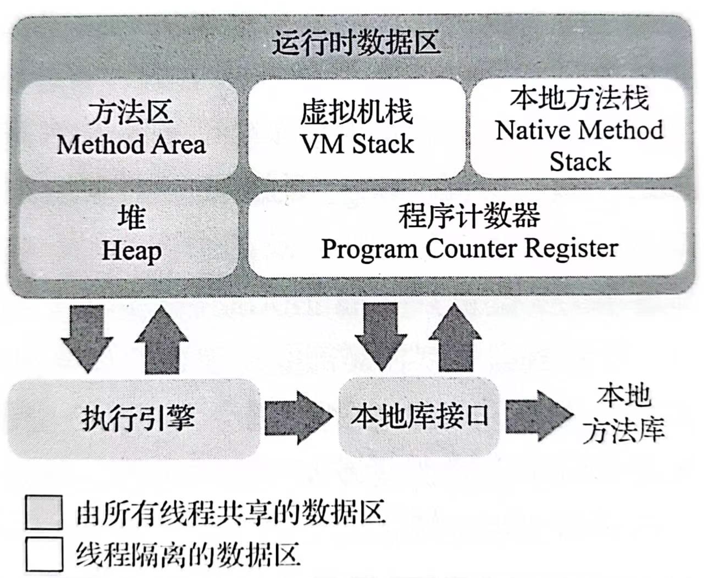
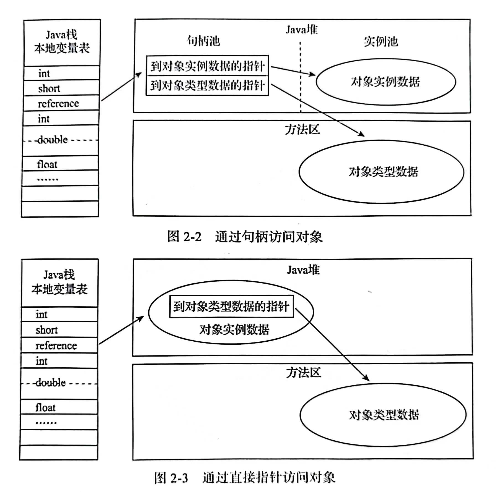

# Java内存区域与内存溢出异常

## 概述

对于`C`、`C++`程序员来说，在内存管理区域，他们既拥有每一个对象的`所有权`，又担负着每一个对象生命从开始到终结的维护责任。对于`Java`程序员来说，在虚拟机自动内存管理机制的帮助下，不再需要为每一个`new`操作去写配对的`delete`、`free`代码，不容易出现内存泄漏和内存溢出问题，但一旦出现内存泄漏和溢出方面的问题，如果不了解虚拟机是怎样使用内存的，那排查修复工作将异常艰难。

## 运行时区域

根据《Java虚拟机规范》的规定，`Java`虚拟机所管理的内存将会包括以下几个运行时数据区域。

### 程序计数器

程序计数器可以看作是当前线程所执行的字节码的行号指示器。在`Java`虚拟机的`概念模型`里，字节码解释器工作时就是通过改变这个计数器的值来选取下一条需要执行的字节码指令。为了支持多线程，每条线程都需要有一个独立的程序计数器，这类内存区域为线程`私有`的内存。

如果线程正在执行的是一个`Java`方法，这个计数器记录的是`正在执行的虚拟机字节码指令的地址`；如果正在执行的是`本地`方法，这个计数器值则应为空。

该内存区域未规定任何`OutOfMemotyError`情况。

### Java 虚拟机栈

`Java`虚拟栈也是线程私有的，它的生命周期与线程相同。其描述的是`Java`方法执行的线程内存模型：每个方法被执行的时候，`Java`虚拟机都会同步创建一个`栈帧`用于存储局部变量表、操作数栈、动态链接、方法出口等信息。每一个方法被调用直至执行完毕的过程，就对应着一个栈帧在虚拟机栈中从入栈到出栈的过程。

`Java`虚拟机基本数据类型（`boolean`、`byte`、`char`、`short`、`int`、`float`、`long`、`double`和`reference`）在局部变量表中的存储空间以`局部变量槽`来表示，局部变量槽所需的内存空间在编译期间完成分配，当进入一个方法时，这个方法需要在栈帧中分配多大的局部变量空间是完全确定的，在方法运行期间不会改变局部变量表的`大小`，其中，这里的`大小`指的是`变量槽的数量`。

该内存区域规定了两类异常状态：

1. `StackOverflowError`：线程请求的栈深度大于虚拟机所允许的深度。
2. `OutOfMemoryError`：栈在动态扩展时无法申请到足够的内存。

### 本地方法栈

其与`Java虚拟机栈`类似，区别是`虚拟机栈`为虚拟机执行`Java`方法（字节码）服务，而`本地方法栈`则是为虚拟机使用到的本地方法服务。

《Java虚拟机规范》对本地方法栈中方法使用的语言、使用方式与数据结构没有任何强制规定，具体的虚拟机可以根据需要自由实现它，特别地，`HotSpot`虚拟机直接将本地方法栈与虚拟机栈合并。

该内存区域同样会抛出`StackOverflowError`和`OutOfMemoryError`.

### Java 堆

对于`Java`应用程序来说，`Java堆`是虚拟机所管理的内存中最大的一块区域，它被所有线程共享，在虚拟机启动时创建，该内存区域的唯一目的就是存放对象实例，由`垃圾收集器`进行管理。根据《Java虚拟机规范》的规定，`Java堆`可以处于物理上不连续的内存空间中，但在逻辑上它应该被视为连续的。

该内存区域规定了一类异常状态：

1. `OutOfMemoryError`：在`Java`堆中没有内存完成实例分配，并且堆也无法再扩展。

### 方法区

方法区由各个线程共享，用于存储已被虚拟机加载的类型信息、常量、静态变量、即时编译器编译后的代码缓存等数据。该区域和`Java堆`一样不需要连续的内存，可以选择固定大小或者可扩展，特别地，其甚至不要求实现垃圾收集，该区域内存回收目标主要是针对常量池的回收和对类型的卸载。

该内存区域规定了一类异常状态：

1. `OutOfMemoryError`：方法区无法满足新的内存分配需求。

### 运行时常量池

运行时常量池是方法区的一部分，用于存放`Class`文件中的常量池表，其中常量池表存放了编译器生成的各种字面量和符号引用。

相对于`Class`文件常量池，`运行时常量池`的一个重要特性是具备动态性，`Java`语言并不要求常量一定只有编译期才能产生，因此运行期间也可以将新的常量放入池中，比如`String`类的`intern()`方法。

该内存区域规定了一类异常状态：

1. `OutOfMemoryError`：常量池无法申请到内存。

### 直接内存

直接内存即本机内存，其并不是虚拟机运行时数据区的一部分，但被频繁地使用，在一些场景可以显著提高性能。

该内存区域规定了一类异常状态：

1. `OutOfMemoryError`：如果服务器管理员配置虚拟机参数时，忽略掉直接内存，使得各个内存区域总和大于物理内存限制，会导致动态扩展时抛出`OutOfMemoryError`。

## HotSpot 虚拟机对象探秘

### 对象的创建

当`Java`虚拟机遇到一条字节码`new`指令时，首先将去检查这个指令的参数是否能在常量池中定位到一个类的符号引用，并且检查这个符号引用代表的类是否已被记载、解析和初始化过。类加载检查通过后，虚拟机将为新生对象分配内存。一般有两种分配方式，分别是`Bump The Pointer`和`Free List`，选择哪种决定于`Java堆`内存是否规整，而是否规整决定于`垃圾收集器`是否带有空间压缩整理的能力。

需要注意的是，即使仅仅修改一个指针所指向的位置，在并发情况下也并不是线程安全的。解决这个问题有两种可选方案：一是对分配内存空间的动作进行同步处理，比如采用`CAS`配上`失败重试`的方法保证更新操作的原子性；二是把内存分配的动作按照线程划分在不同的空间之中进行，该空间称为本地线程分配缓冲`TLAB`，当`TLAB`使用完了再通过同步操作分配新的缓冲区。

内存分配完成之后，虚拟机需要将除了`对象头`的内存空间都初始化为零值，这步操作保证了对象的实例字段在`Java`代码中可以不赋初始值就直接使用，使程序能访问到这些字段的数据类型所对应的`零值`。接下来，虚拟机将设置`对象头`，记录这个对象是哪个类的实例、如何找到类的元数据信息、对象的哈希码、对象的`GC`分代年龄等信息。

在上面工作都完成之后，从虚拟机的视角来看，一个新的对象已经产生了，但是从`Java`程序的视角来看，对象创建才刚刚开始，下面将执行`构造函数`，按照程序员的意愿对对象进行初始化。

### 对象的内存布局

在`HotSpot`虚拟机里，对象对`Java堆`内存中的存储布局可以划分为三个部分：对象头`Header`、实例数据`Instance Data`和对齐填充`Padding`。

`Header`包括两类信息，第一类是用于存储对象自身的运行时数据，如哈希码、`GC`分代年龄、锁状态标志、线程持有的锁、偏向线程`ID`、偏向时间戳等；另一类是类型指针，即对象指向它的类型元数据的指针，`Java`虚拟机通过这个指针来确定该对象是哪个类的实例。

`Instance Data`是对象真正存储的有效信息，无论是从父类继承下来的，还是在子类中定义的字段都必须记录起来。这部分的存储顺序会受到`虚拟机分配策略参数`和字段在`Java`源码中`定义顺序`的影响。`HotSpot`虚拟机默认的分配顺序为`longs/doubles`、`ints`、`shorts/chars`、`bytes/booleans`、`oops`，在满足这个前提条件的情况下，在父类中定义的变量会出现在子类之前。

`Padding`仅仅起占位符的作用，这是由于`HotSpot`虚拟机的自动内存管理系统要求对象的起始地址必须是`8字节`的整数倍，也就是说任何对象的大小都必须是`8字节`的整数倍。

### 对象的访问定位

创建对象是为了后续使用该对象，`Java`程序会通过栈上的`reference`数据类型来操作堆上的具体对象。由于在《Java虚拟机规范》里面只定义了`reference`类型是一个指向对象的引用，所以对象访问方式也是由虚拟机实现而定的，主流的访问方式主要有`使用句柄`和`直接指针`两种：

1. 如果使用句柄访问的话，`Java堆`中将可能会划分出一块内存来作为句柄池，`reference`中存储的就是对象的`句柄地址`，而句柄中包含了对象实例数据与类型数据各自具体的地址信息。
2. 如果使用直接指针访问的话，`Java堆`中对象的内存布局就必须考虑如何放置访问类型数据的相关信息，`reference`中存储的直接就是`对象地址`，如果只是访问对象本身的话，就不需要多一次间接访问的开销。

使用`句柄`来访问的最大好处就是`reference`中存储的是稳定句柄地址，在对象被移动时，比如垃圾收集，只会改变句柄中的实例数据指针，而`reference`本身不需要修改。

使用`直接指针`来访问最大的好处就是速度更快，它节省了一次指针定位的时间开销。

## OutOfMemoryError 异常

### Java 堆溢出

`Java堆`内存的`OutOfMemoryError`异常是实际应用中最常见的内存溢出异常情况，要解决这个内存区域的异常，常规的处理方法是通过`内存映像分析工具`对`Dump`出来的`堆转储快照`进行分析。第一步首先应确认内存中导致`OOM`的对象是否是必要的，也就是判断是否发生了内存泄漏。如果是内存泄漏，可进一步通过工具查看泄漏对象到`GC Roots`的引用链，找到泄漏对象是通过怎样的引用路径、与那些`GC Roots`相关联，才导致`垃圾收集器`无法回收它们。如果内存中的对象确实都是必须存活的，那就应当检查`Java`虚拟机的堆参数设置，与机器的内存对比，看看是否还有向上调整的空间。

### 虚拟机栈和本地方法栈溢出

出现`StackOverflowError`异常时，会有明确错误堆栈可供分析，相对而言比较容易定位到问题所在。
