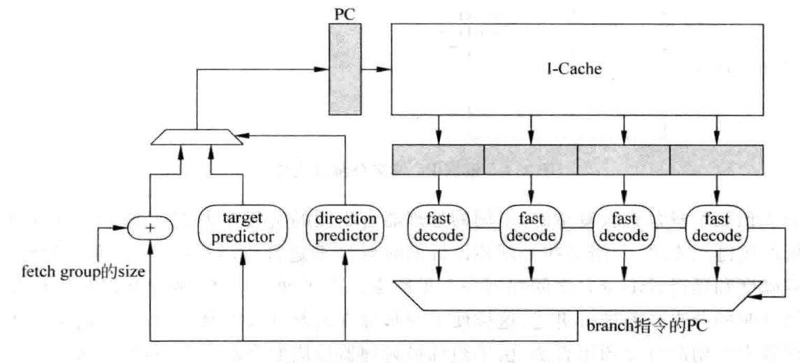
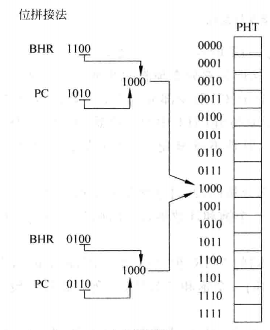
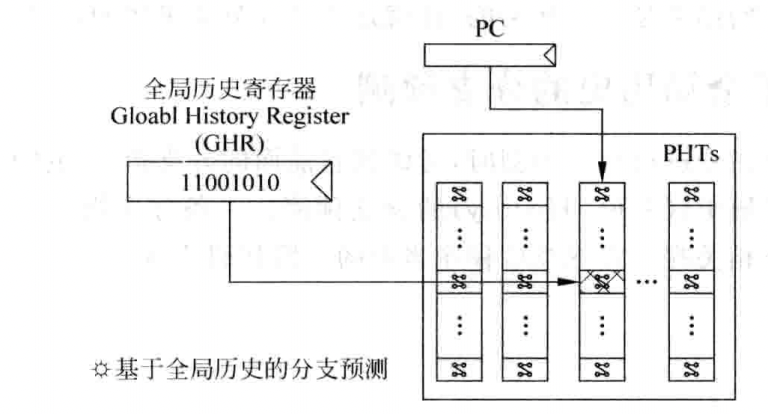
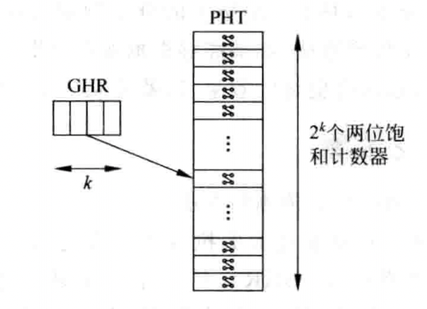
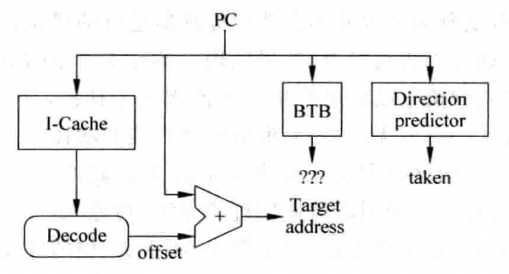
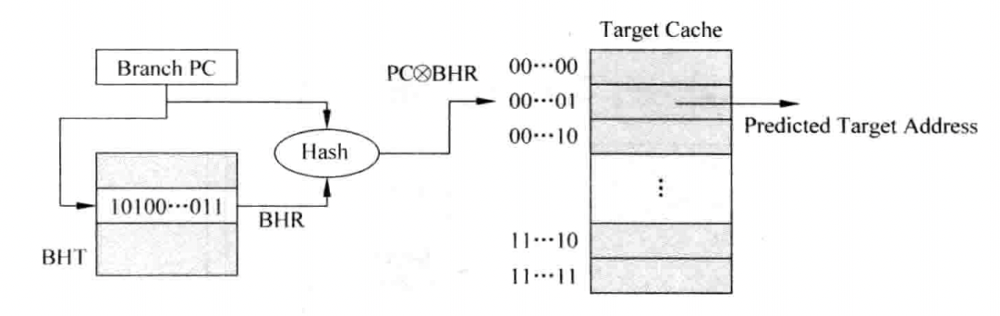
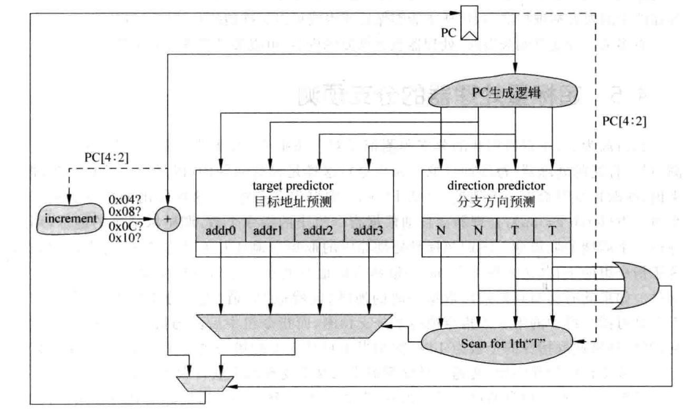

---

sidebar_position: 4
---

# 分支预测

随着处理器并行度的提高以及流水线的加深，静态分支预测算法已经不能够满足复杂处理器对性能的要求，需要更准确的分支预测方法，能够根据处理器实际的执行情况，动态地对分支指令进行预测。动态分支预测并不简单地预测分支指令一直发生跳转或者不跳转，而是会根据分支指令在过去一段时间的执行情况来决定预测的结果。

要进行分支预测，首先需要知道从`I-Cache`取出来的指令中，哪条是分支指令，对于每周期取出多条指令的超标量处理器来说，这需要从指令组`fetch group`中找出分支指令。从指令组中的指令从`I-Cache`取出来之后，可以进行快速的解码，这只需要辨别解码指令是否是分支指令，然后将找到的分支指令对应的`PC`值送到分支预测器，就可以对分支指令进行预测了：

然而，由于`I-Cache`的访问可能需要多个周期才可以完成，采用上图所示的方式进行分支预测，从开始取指令直到分支预测得到结果，中间需要间隔好几个周期，在这些周期内无法得到准确的预测结果，只能够顺序地取指令，也就相当于这些周期都是预测分支指令不发生跳转，这样就降低了分支预测的准确度，造成了处理器性能的降低。

在流水线中，分支预测是越靠前越好的，因此分支预测的最好时机就是在当前周期得到取指令地址的时候，在取指令的同时进行分支预测，这样在下个周期就可以根据预测的结果继续取指令。对于一条指令来说，它的物理地址是会变化的（这取决于操作系统将它放到物理内存的位置），而它的虚拟地址，也就是`PC`值，是不会变化的。因为在一个进程内，每一个`PC`值对应的指令是固定的，不可能出现一个`PC`值对应多条指令的情况，所以使用`PC`值进行分支预测，只不过在进行进程切换之后，需要将分支预测器中的内容进行情况，这样可以保证不同进程之间的分支预测不会互相干扰，如果使用了`ASID`，那么可以将它和`PC`值一起进行分支预测，此时就不需要在进程切换时情况分支预测器了，这个过程如图所示：

## 分支指令的方向预测

对于分支指令来说，它的方向只有两个：发生跳转`taken`和不发生跳转`not taken`，因此可以用`1`和`0`来表示。

### 根据最后一次结果进行预测

该方法直接使用上次分支的结果：

但是如果分支指令的方向每次都发生变化，则使用最后一次指令的结果进行分支预测的方法，它的失败率将是`100%`。

### 基于两位饱和计数器的分支预测

基于两位饱和计数器的分支预测并不会马上使用分支指令上一次的结果，而是根据一条分支指令前两次执行的结果来预测本次的方向，这种方法可以用一个有着`4`个状态的状态机来表示，这四个状态分别如下：

1. `Strongly taken`：计数器处于饱和状态，分支指令本次会被预测发生跳转，编码为`11`；
2. `Weakly taken`：计时器处于不饱和状态，分支指令本次会预测发生跳转，编码为`10`；
3. `Weakly not taken`：计数器处于不饱和状态，分支指令本次会预测不发生跳转，编码为`01`；
4. `Strongly not taken`：计数器处于饱和状态，分支指令本次会被预测不发生跳转，编码为`00`。

整个状态机如图所示：

可以使用格雷码对状态机进行编码，保证在状态转换时每次只有一位发生变化，这样可以减少出错的概率，并降低功耗。

分支预测都是以`PC`值为基础进行的，正常来说，每一个`PC`值都应该对应一个两位的饱和计数器，因此，对于`32`位的`PC`值来说，共需要$2^{30}\times 2b$但是实际芯片当中无法使用这样大的存储器。考虑到并不是所有的指令都是分支指令，一般使用下图所示的方法来存储两位饱和计数器的值：

在上图中，`PHT`是一个表格，这个`PHT`使用`PC`值的一部分来寻址，但是，使用这种方式来寻址`PHT`，必然就导致了`k`部分相同的所有`PC`值都使用同一个两位饱和计数器的值，如果这些`PC`值对应的指令中不止有一条分支指令，那么相互之间肯定会产生干扰，这种情况称为`别名（aliasing）`。但是考虑到这个方法实现起来比较容易，而且占用的存储器资源也不大，因此轻微的预测准确度降低也是能够接受的。

在基于两位饱和计数器的分支预测方法中，别名会降低分支预测的准确度，可以采用一些更高级的方法来避免别名情况的发生，比较典型的方法就是使用`哈希`，对`PC`值进行处理之后再去寻址`PHT`，这个过程如图所示：

上图的哈希算法能够将`32`位的`PC`值压缩为固定长度的较小的值，这个小的值称为哈希值，在计算机算法领域中，哈希指的就是把任意长度的输入值，通过哈希算法，变为固定长度的输出，一般输出值的长度远小于输入值的长度。哈希算法的实现可以很简单，例如使用普通的异或逻辑，当然为了得到好的效果，也可以做得很复杂。

两位的饱和计数器需要根据分支指令的结果（发生跳转或者不发生跳转）进行更新，有三个时间点可以对`PHT`进行更新：

1. 在流水线的取指令阶段，进行分支预测时，根据预测的结果来更新`PHT`；
2. 在流水线的执行阶段，当分支指令的方向被实际计算出来时，更新`PHT`；
3. 在流水线的`Commit`阶段，当分支指令要离开流水线时，更新`PHT`。

对于第一种方法，因为此时分支预测的结果可能是错误的，使用错误的结果来更新`PHT`是不可靠的。

对于第二种方法，如果对分支指令采用了乱序执行的方式，那么即使在指令阶段得到了一条分支指令的结果，也不能够保证这个结果是正确的，因为这条分支指令可能处于分支预测失败的路径上。

对于第三种方法，在分支指令被确认已经正确执行的时候，更新`PHT`是万无一失的，而考虑到饱和计数器的特点，只要计数器处于饱和状态，它的预测值就会比较固定，因此即使更新`PHT`的时间晚一些，也不会对分支预测的精度产生太大的负面影响。

### 基于局部历史的分支预测

在这种方法中，会使用一个寄存器来记录一条分支指令在过去的历史状态，当这个历史状态很有规律时，就可以为分支预测提供一个可以利用的工具，这样的寄存器称为分支历史寄存器`BHR`。对一条分支指令来说，通过将它每次的结果（发生跳转或者不发生跳转，用`1`或`0`表示）移入`BHR`寄存器，就可以记录这条分支指令的历史状态了，如果这条分支指令很有规律，那么就可以使用`BHR`寄存器对这条分支指令进行预测，这种分支预测的工作机制如图所示：

如果为每条分支指令都配一个`BHR`和`PHT`，这样需要很大的存储空间，将所有分支指令的`BHR`组合在一起称为分支历史寄存器表`BHT`，在实际当中，`BHT`不可能照顾到每个`PC`，一般都是使用`PC`的一部分来寻址`BHT`，如图所示：

使用`PC`的一部分来寻址`BHT`，得到当前指令对应的分支历史寄存器`BHR`，设`BHR`的宽度为`n`位，则整个`BHT`所占的存储空间为$2^k\times nbit$。

然而，这种方法可能存在两种冲突：

1. 两条分支指令的`PC`值对应的`k`部分相同，此时这两条分支指令就会对应到同一个`BHR`寄存器，也就对应到了`PHT`中的同一个饱和计数器，这样，两条分支指令的结果就会互相干扰，降低了分支预测的准确度。
2. 两条分支指令虽然对应着两个不同的`BHR`，但是这两个`BHT`中的内容是一样的，这样两条分支指令也会共用`PHT`当中的同一个饱和计数器，也会降低分支预测的准确度。

为了避免上述两种情况，可以将`PC`进行哈希处理之后，得到一个固定长度的值，再用词此值来寻址`BHT`，这样可以解决上面提到的情况一当中遇到的问题。从`BHT`中可以得到这条分支指令对应的`BHR`值，再将该`BHR`的值和`PC`值的一部分进行拼接，用得到的新值来寻址`PHT`，从而得到饱和计数器的值，也就是得到了分支预测的结果，这样可以解决上面提到的情况二当中遇到的情况。有多种方法可以将`PC`值和`BHR`值进行处理，如`位拼接法`和`异或法`。

### 基于全局历史的分支预测

如果对一条分支指令进行分支预测时，考虑到它前面的分支指令的执行结果，则称这种预测方法为基于全局历史的预测。在这种基于全局历史的分支预测方法中，需要一个寄存器来记录程序中所有的分支指令在过去的执行情况，这个寄存器被称为`全局历史寄存器（GHR）`。而`GHR`寄存器不可能记录下所有分支指令的执行结果，因此一般是使用一个有限位宽`GHR`，来记录最近执行的所有分支指令的结果，每当遇到一条分支指令时，就将这条分支指令的结果插入到`GHR`寄存器的右边，`1`表示发生了跳转，`0`表示没有发生跳转，`GHR`寄存器最左边被移出的位会被抛弃掉。

基于全局历史的分支预测方法，最理想的情况是对每条分支指令都使用一个`PHT`，这样每条分支指令都会使用当前的`GHR`来寻址自身对应的`PHT`，这种预测方法的示意图如图所示：

但是这种方法在实际当中是无法使用的，为每个`PC`值都使用一个`PHT`会占据非常大的存储空间，因此一般都会使用`哈希法`将`PC`进行处理，得到位宽很小的值，这样`PHTs`就可以包含少量的`PHT`了，如图所示：

考虑到上面方法中，`PHT`中有很多饱和计数器都没有被使用，因此可以采取一种更简单的方式，即只使用一个`PHT`，如图所示：

上图所示的分支预测方法的缺点是如果两条不同的分支指令所对应的`GHR`值恰好相同的话，那么这两条分支指令就会共用`PHT`中同一个饱和计数器，这样就造成了冲突。为了解决这个问题，仍旧可以将`PC`值和`GHR`做一定的处理，比如`位拼接法`和`异或法`，使用处理之后的结果来寻址`PHT`，这样即使两条不同的分支指令对应同样的`GHR`的值，也不会对应到`PHT`中的同一个饱和计数器，避免了冲突的问题，如图所示：

### 竞争的分支预测

对于基于局部历史的分支预测和基于全局历史的分支预测，两种预测方法都有着自身的局限性，因此可以设计一种自适应的分支预测方法，根据不同的分支指令和执行情况自动地选择这两种分支预测方法，称为竞争的分支预测，如图所示为这种分支预测方法的原理图：

`P1`表示基于全局历史的分支预测方法，`P2`表示基于局部历史的分支预测方法，对于不同的分支指令会选择不同的预测方法。`CPHT`是由分支指令的`PC`值来寻址的一个表格，类似于`PHT`，它仍是由两位的饱和计数器组成的，当其中一种分支预测方法两次预测失败，而同时另外一种分支预测方法两次预测成功时，会使状态机转到使用另一个分支预测方法的状态，`CPHT`中每个饱和计数器的状态如图所示：

该状态机的转换机制如下：

1. 当`P1`预测正确，`P2`预测错误时，计数器减`1`；
2. 当`P1`预测错误，`P2`预测正确时，计数器加`1`；
3. 当`P1`和`P2`预测的结果一样时，不管预测正确与否，计数器都保持不变。

### 分支预测的更新

对于分支指令的方向预测来说，需要更新的内容包括两个方面：

1. 历史寄存器，在基于全局历史的分支预测方法中是`GHR`，在基于局部历史的分支预测中是`BHR`。
2. 两位饱和计数器，基于全局历史和基于局部历史的分支预测方法均需要在`PHT`中使用饱和计数器来捕捉历史寄存器的规律，因此也需要对饱和计数器进行更新。

#### 更新历史寄存器

当分支指令到达流水线的`Commit`阶段，要离开流水线而退休时更新`GHR`是最保守的，但是会产生效率问题。假设一条分支指令`b`在时间`t`被分支预测，在时间$t+\Delta t$从流水线中退休并更新`GHR`，任何在$\Delta t$时间段之内被预测的分支指令，都不会从分支指令`b`的结果中获益，这就降低了分支预测的准确度。

当分支指令的方向在`执行`阶段被实际计算出来时更新`GHR`，会导致问题，因为如果对分支指令采用了乱序执行的方式，在执行阶段分支指令可能处于分支预测失败的错误路径中，即使是顺序执行分支指令的处理器，由于`异常`的处理需要清空流水线，分支指令在执行阶段的结果未必一定会写到`GHR`中，因此在执行阶段更新`GHR`也并不一定是正确的。

综合来看，最好在取指令阶段，根据分支预测的结果对`GHR`进行更新，这可以使后续的分支指令使用到最新的`GHR`，而且，当一条分支指令的分支预测失败时，即使后续的分支指令都使用了错误的`GHR`也不会产生影响，因为它们会被从流水线中清除。这种更新的`GHR`的方式在分支预测失败时，需要一种机制对`GHR`进行修复，使`GHR`能够恢复到正确的值，有如下两种修复方法。

##### Commit阶段修复法

在流水线的提交阶段防止一个`GHR`，每当一条分支指令退休的时候，就会将它的结果更新到这个`GHR`中，这个`GHR`称做`Retired GHR`，这样处理器中就有了两个`GHR`：在前端取指令阶段的`GHR`，它用来进行分支预测，采用了推测的方式进行更新；在后端提交阶段的`GHR`，每当一条分支指令退休的时候才会更新它，因此这个`GHR`肯定时正确的。当一条分支指令发现分支预测失败的时候，表明此时前端的`GHR`肯定是错误的，需要进行修复，此时只需要等待分支指令退休的时候，将后端的`GHR`写到前端的`GHR`中，就完成了前端`GHR`的修复，然后根据这条分支指令所指定的目标地址，重新取指令来执行即可。

使用这种方法对`GHR`进行修复，缺点是会造成分支预测失败时惩罚的增大。

##### Checkpoint修复法

在取指令阶段对前端的`GHR`进行更新的同时，可以将旧的`GHR`值保存起来，这个保存的内容就称为`Checkpoint GHR`。一旦这条分支指令的结果在流水线中被计算出来，就可以对这条分支指令的分支预测是否正确进行检查了，如果发现分支预测正确，说明此时前端`GHR`中的值是正确的，那么继续执行就可以了；如果发现其分支预测失败，那么就将这条分支指令对应的`Checkpoint GHR`恢复到前端的`GHR`中，并从这条分支指令正确的目标地址开始取指令来执行，这个过程如图所示：

由于分支预测发生在取指令阶段，此时指令之间仍然保持着顺序的方式，所以存储`Checkpoint GHR`的存储器只需要按照`FIFO`的方式进行写入就可以了；如果后续的流水线采用顺序的方式来执行分支指令，那么读取上述存储器也只需要按照`FIFO`的方式即可。而对于乱序执行分支指令的流水线来说，在执行阶段得到的分支指令的结果仍旧有可能是错误的，因为这条分支指令可能处于分支预测失败的路径上，也可能处于异常的路径上，所以仍旧需要在流水线的提交阶段对分支指令的预测是否正确进行检查。因此，在提交阶段仍需要放置一个`Retired GHR`，当分支指令退休的时候发现分支预测失败了，或者一条普通的指令发现了异常，都可以将此时的`Retired GHR`写回到前端的`GHR`中，这样就对`GHR`值进行了恢复。

在基于局部历史的分支预测方法中，可以在分支指令退休的时候更新`BHR`，这样可以简化设计，也不会对处理器的性能产生太大的负面影响。

#### 更新饱和计数器

在两种分支预测方法中，一般都是在分支指令退休的时候对`PHT`中的饱和计数器进行更新。

## 分支指令的目标预测

分支指令的目标地址可以分为两种，即直接跳转和间接跳转。对于直接跳转的分支指令，由于它的偏移值是以立即数的形式固定在指令当中，所以它的目标地址也是固定的，只要记录下这条分支指令的目标地址就可以了，当再次遇到这条分支指令时，如果方向预测的结果是发生跳转，那么它的目标地址就可以使用以前记录下的那个值；对于间接跳转的分支指令来说，由于它的目标地址来自于通用寄存器，因此进行目标地址的预测并不容易。然而，程序中大部分间接跳转类型的分支指令是用来处理子程序调用的`CALL`和`Return`指令，这两种指令的目标地址是有规律可循的，因此可以对其进行预测。

### 直接跳转类型的分支预测

#### BYB

对于直接跳转类型的分支指令来说，它的目标地址有两种情况。

1. 当分支指令不发生跳转时，`目标地址 = 当前分支指令的PC值 + Sizeof(fetch group)`。
2. 当分支指令发生跳转时，`目标地址 = 当前分支指令的PC值 + Sign_extend(offset)`。

由于分支预测是基于`PC`值进行的，不可能对每一个`PC`值都记录下它的目标地址，所以一般都是用`Cache`的形式，使多个`PC`值共用一个空间来存储目标地址，这个`Cache`称为`BTB`，`PC`的一部分作为`Index`来寻址`BTB`，`PC`值的其他部分作为`Tag`，`BTB`中存放着分支指令的目标地址`BTA`。

为了解决`Cache`冲突的问题，可以采用组相连结构的`BYB`，如图所示：

由于组相连结构降低了`BTB`的访问速度，因此在现实世界的处理器中，`BTB`中`way`的个数一般都比较小。

#### BTB缺失的处理

##### 停止执行

对于直接跳转类型的分支指令，在流水线的解码阶段就可以从指令中分离出偏移值，此时就可以将这条分支指令的目标地址计算出来，这个过程的示意图如图所示：

在分支指令的目标地址被计算出来之前，暂停取指令会导致流水线中出现一些气泡，如图所示：

##### 继续执行

对于方向预测会发生跳转的分支指令来说，如果发生了`BTB`的缺失，此时可以使流水线继续使用顺序的`PC`值来取指令。之所以这样做，是考虑到分支指令的方向可能会预测错误，所以当`BTB`发生缺失时，采用顺序的`PC`值来取指令，也存在正确的可能性。

### 间接跳转类型的分支预测

#### CALL/Return指令的分支预测

在`MIPS`中，使用`JAL`指令作为`CALL`指令，而使用`JR $31`指令作为`Return`指令。对于程序中的一条指定的`CALL`指令来说，它每次调用的子程序都是固定的，也就是说，一条`CALL`指令对应的目标地址是固定的，因此可以使用`BTB`对`CALL`指令的目标地址进行预测，如图所示：

因为`Return`指令的目标地址是不确定的，还因此无法使用`BTB`对它的目标地址进行预测，但是可以看出，`Return`指令的目标地址总是等于最近一次执行的`CALL`指令的下一条指令的地址，因此，可以设计一个存储器，保存最近执行的`CALL`指令的下一条指令的地址，这个存储器是后进先出的，即最后一次进入的数据将最先被使用，称为`RAS`。使用`BTB`对`CALL`指令的目标地址进行预测，使用`RAS`对`Return`指令的目标地址进行预测，过程如图所示：

为了在分支预测阶段通过`PC`判断一条指令是否是`CALL`指令，这需要借助于`BTB`，因为`BTB`中保存了所有发生跳转的分支指令，而`CALL\Return`指令都是永远会发生跳转的，因此它们都会保存在`BTB`中，这需要在`BTB`中增加一项，用来标记分支指令的类型，这样就可以在分支预测阶段识别出`CALL`指令，从而将`PC + 4`的值保存在`RAS`中。

当对`Return`指令进行目标地址预测的时候，需要能够选择`RAS`的输出作为目标地址的值，而不是选择`BTB`的输出值，因此仍需要在分支预测阶段就可以知道指令的类型。

因此，在`BTB`中，除了存储目标地址和`Tag`值之外，还需要存储分支指令的类型：

在实际当中，如果一个程序中`CALL`指令嵌套很深，`RAS`已经满了时，有两种方法可以处理：

1. 不对新的`CALL`指令进行处理，此时不修改`RAS`，最后执行的这个`CALL`指令对应的返回地址就会被抛弃掉。
2. 继续按照顺序向`RAS`中写入，此时`RAS`中最旧的那个内容就会被覆盖掉。由于存在递归函数调用的情况，所以这种方法存在正确的可能性。

对于连续执行的同一个`CALL`指令来说，完全可以将它们的返回地址都放到`RAS`中的同一个地方，并用一个计数器来标记`CALL`指令执行的次数，这样相当于扩展了`RAS`的容量，增大了预测的准确度。

#### 其他预测方法

对于非`CALL/Return`的间接跳转类型的分支指令，它的目标地址也可能和过去的执行情况有关系，因此可以利用基于局部历史的分支预测方法中使用`BHR`对目标地址进行预测，如图所示：

上图所示的方法已经在分支指令的方向预测中出现过，只是现在将`PHT`换成了`Target Cache`。

一种完整的分支预测方法如图所示：

## 分支预测失败时的恢复

分支预测是一种预测技术，需要处理器中有对应的验证和恢复机制，在流水线的很多阶段都可以对分支预测是否正确进行检查，它们包括以下几点。

1. 在解码阶段，可以得到一个`PC`值对应的指令是否是分支指令，以及这条分支指令的类型，如果这条指令是直接跳转类型的分支指令，还可以在这个阶段得到它的目标地址，因此在解码阶段可以对一部分的分支指令是否预测正确进行检查。如果此时发现了分支预测失败，可以马上进行恢复，但如果此时仍不能获得处理取指令的正确地址，则可以简单地停止流水线。
2. 在读取物理寄存器的阶段，如果此时读取到了寄存器的值，那么就可以对间接跳转类型的分支指令所预测的目标地址进行检查，如果发现目标地址预测错误了，那么就可以使用正确的地址开始重新取指令，此时可能需要在发射队列中选择性的清除指令。
3. 在执行阶段，不管什么类型的分支指令都可以被计算出结果，此时可以对分支预测是否正确进行检查。对于乱序执行的超标量处理器，此时的流水线中还有部分指令是在这条分支指令之前进入流水线中的，它们不应该受到分支预测失败的影响，可以继续执行，而`ROB`中记录了指令之间本来的顺序，因此可以使用`ROB`对分支预测失败时的处理器进行状态恢复。除了采用基于`ROB`的方法进行分支预测失败时的状态恢复，很多现代的处理器都采用了基于`Checkpoint`的方法进行状态恢复。所谓`Checkpoint`，是指发现分支指令，并且在分支指令之后的指令更改处理器的状态之前，将处理器的状态保存起来，这里所要保存的处理器状态主要是指寄存器重命名中使用的映射表`mapping table`，还有预测跳转的分支指令对应的下一条指令的`PC`值等。为了选择性的清除指令，可以对每一条分支指令进行编号，所有在这条分支指令后面进入到流水线的指令都会得到这个编号，直到遇到下一条分支指令为止。分支指令的编号个数决定了最多可以在流水线中存在的分支指令个数，这个编号值都会保存在一个`FIFO`中，这个`FIFO`称为编号列表`tag list`，它的容量等于处理器最多支持的分支指令的个数。一旦这个列表满了，就不能再向流水线中送入分支指令。因此，如果再解码出分支指令，就会暂停解码阶段之前的流水线，直到编号列表中有空余的空间为止。可以通过`tag list`和`free tag list`分别记录已使用和未使用的编号值，工作流程如下：

需要注意的是，编号值的分配应该放置于解码阶段。

通过编号列表的编号值来找到处于分支预测失败路径上指令的流程如图所示：

其实，并不是一定需要在一个周期之内将`ROB`和`Issue Queue`中的相关指令都清楚掉，因为在流水线的执行阶段发现一条分支指令预测错误时，需要从正确的地址开始取指令，这些新取出来的指令需要经过流水线的好几个阶段才可以到达发射阶段，只要在新指令到达这个阶段之前，`ROB`和`Issue Queue`以及发射阶段之后的其他流水级中的相关指令被清楚，那么流水线就可以使用到正确的状态，不需要暂停了，因此可以每周期只从分支指令的`tag list`广播一个或几个编号值。

在每周期执行多条指令的超标量处理器中，为了避免使用多端口的`FIFO`，可以约定在流水线的解码阶段每周期最多只能处理一条分支指令。如果在解码阶段，发现从`IB`中读出的N条指令中存在多于一条的分支指令，那么第二条分支指令及其后面的所有指令在本周期就不能够进入解码阶段，它们会被延迟到下一个周期。

要想在流水线的后续阶段得到分支指令的预测值，就需要在流水线的解码阶段，将每条指令的预测值保存起来，比如使用缓存来保存那些预测跳转的分支指令：

一条分支指令如果被预测发生跳转，那么会将它的信息写到`PTAB`中，同时这条分支指令在`PTAB`中的地址也随着分支指令在流水线中流动，这样，当这条分支指令到达流水线的执行阶段时，就可以使用这个地址，直接从`PTAB`中找到对应的预测信息了。

`PTAB`只需要保存所有预测预测跳转的分支指令，这样可以减少`PTAB`的容量，在这种情况下，写`PTAB`的过程可以在流水线的取指令阶段完成，只要在取指令阶段预测到一条发生跳转的分支指令，就将其写到`PTAB`中。对于`自修改代码`，执行完成后，需要将`分支预测器`、`I-Cache`等部件中的内容都进行清空，这样才能够保证流水线可以正确地执行被修改过的指令。

## 超标量处理器的分支预测

如果对超标量处理器取指令的过程进行限制，例如对于一个`4-way`的超标量处理器来说，使每周期取出的指令位于四字对齐的边界之内，那么这样就可以使用它们的公共地址来寻址分支预测器，而对于分支预测器来说，它只需要记录下每组四字对齐的指令中，第一个预测跳转的分支指令的信息就可以了。需要注意的是，在`BTB`中需要记录下分支指令在四条指令中的位置，避免有些时候错误地使用它的结果，如图所示：

对于一个`4-way`的超标量处理器来说，每周期取出的指令可以不局限于四字对齐的边界之内，那么要达到最理想的效果，就需要对一个周期内取出的所有指令都进行分支预测，将第一个预测跳转的分支指令的目标地址作为下个周期取指令的地址，如图所示：

### 交叠方式

交叠方式是在超标量处理器中经常使用的一种结构，可以通过单端口存储器来模拟多端口的结构，例如对于`PHT`，可以采用如图的方式实现四个读端口：

在超标量处理器内部，这种`交叠`结构的存储器是经常被使用的，大部分多端口的功能部件都需要使用这种结构，例如`ROB`、`Issue Queue`和`Instruction Buffer`等部件。
