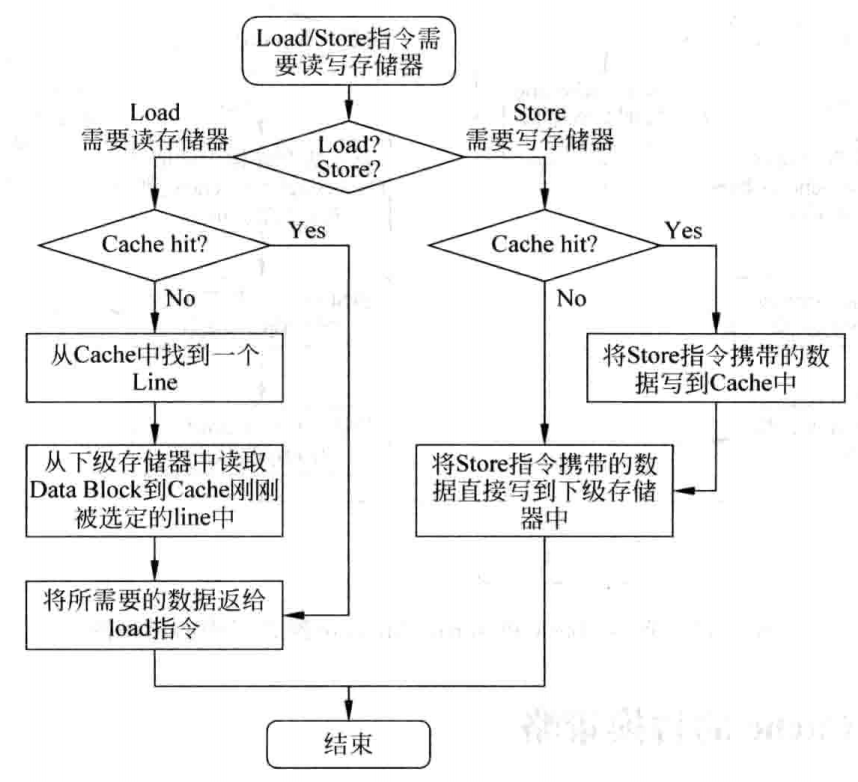
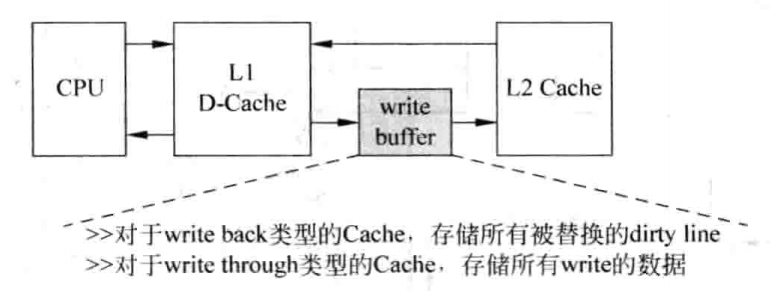
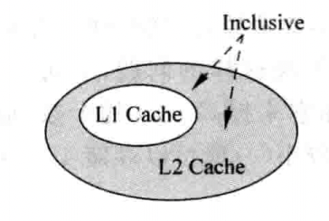
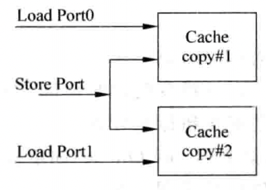

# Cache

`Cache`主要由两部分组成，`Tag`部分和`Data`部分。`Data`部分用来保存一片连续地址的数据，`Tag`部分用来存储这片连续数据的公共地址。一个`Tag`和它对应的所有数据组成的一行称为一个`Cache line`，`Cache line`中的数据部分称为`Cache data block`。如果一个数据可以存储在`Cache`中的多个地方，这些被同一个地址找到的多个`Cache line`称为`Cache set`。

在实际当中，`Cache`有三种主要的实现方式，`直接映射`、`组相连`和`全相连`。现代处理器中的`Cache`一般属于上述三种方式中的某一种，例如`TLB`和`Victim Cache`多采用全相连结构，而普通的`I-Cache`和`D-Cache`则采用组相连结构等。

`Cache`只能保存最近被处理器使用过的内容，由于它的内容有限，很多情况下，要找的指令或数据并不在`Cache`中，这称为`Cache的缺失(Cache miss)`，它发生的频率直接影响着处理器的性能，在计算机领域，影响`Cache`缺失的情况可以概括如下：

1. Compulsory：由于`Cache`只是缓存以前访问过的内容，因此第一次被访问的指令或数据并不在`Cache`中，而可以通过`预取(prefetching)`的方法来尽量降低这种缺失发生的频率。
2. Capcity：`Cache`容量越大，就可以缓存更多的内容。
3. `Conflict`：为了解决多个数据映射到`Cache`中同一个位置的情况，一般使用组相连结构的`Cache`，`Victim Cache`可以缓解由于相连度低导致`Cache`缺失率高的问题。

## Cache的组成方式

### 直接映射

在直接映射中，处理器访问处理器的地址会被分为三部分，`Tag`、`Index`和`Block Offset`。`Index`用于从`Cache`中找到一个对应的`Cache line`；`Tag`部分用于判断这个`Cache line`是否是需要的那个`Cache line`；`Block Offset`用于找到定位字节，找到真正想要的数据。在`Cache line`中还有一个`有效位(valid)`，用来标记这个`Cache line`是否保存着有效的数据，只有在之前被访问过的存储器地址，它的数据才会存在于对应的`Cache line`中，相应的有效位也会被置为`1`。

### 组相连

在组相连中，存储器中的一个数据不单单只能放在一个`Cache line`中，而是可以放在多个`Cache line`中，对于一个组相连的`Cache`来说，如果一个数据可以放在`n`个位置，则称这个`Cache`是`n`路组相连的`Cache`。

这种结构仍然使用存储器地址的`Index`部分对`Cache`进行寻址，此时可以得到多个`Cache line`，这多个`Cache line`称为一个`Cache set`，而究竟哪个`Cache line`才是最终需要的，是通过`Tag`比较的结果来确定的。如果多个`Cache line`的`Tag`比较结果都不相等，那么就说明这个存储器地址对应的数据不在`Cache`中，也就是发生了`Cache`缺失。

在实际的实现当中，`Tag`和`Data`部分是分开放置的，称为`Tag SRAM`和`Data SRAM`，可以同时访问这两个部分，这种方式称为`并行访问`；相反，如果先访问`Tag SRAM`部分，根据`Tag`比较的结果再去访问`Data SRAM`部分，这种方式称为`串行访问`。

#### 并行访问

对于并行访问的结构，当`Tag`部分的某个地址被读取的同时，这个地址在`Data`部分对应的所有数据也会被读取出来，被送到一个多路选择器上，这个多路选择器受到`Tag`比较结果的控制，选出对应的`Data block`，然后根据存储器地址中`Block Offset`的值，选择出合适的字节，一般将选择字节的这个过程称为`数据对齐`。

`Cache`的访问一般都是处理器中的关键路径，要想使处理器运行在比较高的频率下，`Cache`的访问就需要使用`流水线`。对于`I-Cache`来说，流水线的结构不会有太大的影响，仍旧可以实现每周期读取指令；而对于`D-Cache`来说，使用流水线则会增大`load`指令的延迟，从而对处理器的性能造成负面影响。

如图，`Address Calculation`阶段可以计算得出存储器的地址；`Disambiguation`阶段对`load/store`指令之间存在的相关性进行检查；`Cache Access`阶段直接并行地访问`Tag SRAM`和`Data SRAM`，并使用`Tag`比较的结果对输出的数据进行选择；`Result Drive`阶段使用存储器中的`Block Offset`值，从数据部分给出的`Data block`中选出最终需要的数据（字节或字）。

#### 串行访问

对于串行访问的结构，首先对`Tag SRAM`进行访问，根据`Tag`比较的结果获知数据部分哪一路的数据是需要被访问的，此时就可以直接访问该路的数据，而不需要访问其他的`SRAM`，因此相对于并行访问可以节省能耗。

串行访问可以降低处理器的周期时间，但`Cache`的访问增加了一个周期，也就是增大了`load`指令的延迟，这对处理器的执行效率有一定的负面影响。但在乱序执行的超标量处理器中，可以将访问`Cache`的这段时间通过填充其他指令掩盖起来，因此可以使用串行访问的方式来提高时钟频率，同时并不会由于访问`Cache`的时间增加了一个周期而引起性能的明显降低。

### 全相连

在全相连中，对于一个存储器地址来说，它的数据可以放在任意一个`Cache line`中，存储器地址中将不再有`Index`部分，而是直接在整个`Cache`中进行`Tag`比较，找到比较结果相等的那个`Cache line`；这种方式相当于直接使用存储器的内容来寻址，从存储器中找到匹配的项，这其实就是内容寻址的存储器`CAM`。实际当中的处理器在使用`全相连`结构的`Cache`时，都是使用`CAM`来存储`Tag`值，使用`SRAM`来存储数据。当`CAM`中的某一行被寻址到时，`SRAM`中对应的行（一般称为`word line`）也会被找到，从而`SRAM`可以直接输出对应的数据。

`全相连`结构的`Cache`缺失率最低，但由于有大量的内容需要进行比较，它的延迟也是最大的，因此这种结构的`Cache`一般都不会有很大的容量，例如`TLB`就会使用这种`全相连`的方式来实现。

## Cache的写入

对于`D-Cache`来说，它的写操作和读操作有所不同，当执行一条`store`指令时，如果只是向`D-Cache`中写入数据，而不改变它的下级存储器中的数据，这样就会导致`D-Cache`和下级存储器中，对于这一个地址有着不同的数据，这称做`non-consistent`。要保持它们的一致性，可以采取`写通（Write Through）`或`写回（Write Back）`的策略。

### 写通

对于写通，当数据写到`D-Cache`的同时，也写到它的下级存储器中。但由于`D-Cache`的下级存储器需要的访问时间相对是比较长的，而`store`指令在程序中出现的频率又比较高，如果每次执行`store`指令时都向这样的慢速存储器中写入数据，处理器的执行效率就不会很高。

### 写回

对于写回，在执行`store`指令时，数据被写到`D-Cache`后，只是将被写入的`Cache line`做一个记号，并不将这个数据写到更下级的存储器中，只有当`Cache`中这个被标记的`Cache line`要被替换时，才将它写到下级存储器中，被标记的记号称为`脏（dirty）状态`。

如果要写入的地址不在`D-Cache`中，这就发生了`写缺失（Write Miss）`。此时最简单的处理方式就是将数据直接写到下级存储器中，而不写到`D-Cache`中，这种方式称为`Non-Write Allocate`。与之对应的方法就是`Write Allocate`，在这种方法中，如果写`Cache`发生了缺失，会首先从下级存储器中将这个发生缺失的地址对应的整个数据块取出来，将要写入到`D-Cache`中的数据合并到这个数据块中，然后将这个被修改过的数据块写到`D-Cache`中和下级存储器中，这种方法就是`写通`；如果只是将`D-Cache`中对应的`Cache line`标记为`脏（dirty）状态`，只有等到这个`Cache line`要被替换时才将其写回到下级存储器中，则这种方法就是`写回`。

对于`D-Cache`来说，一般情况下，`写通`的方法总是配合`Non-Write Allocate`一起使用的，它们都是直接将数据更新到下级存储器中，工作流程如下：

而`写回`的方法也是和`Write Allocate`配合在一起使用的，工作流程如下：

## Cache的替换策略

不管是读取还是写入`D-Cache`时发生了缺失，都需要从对应的`Cache Set`中找到一个`Cache line`来存放从下级存储器中读出的数据，如果此时这个`Cache set`内的所有`Cache line`都已经被占用了，那么就要替换掉其中一个。如何从这些有效的`Cache line`找到一个并替换，就是替换策略。

### 近期最少使用法

近期最少使用法会选择最近被使用次数最少的`Cache line`，因此这个算法需要追踪每个`Cache line`的使用情况，这需要为每个`Cache line`都设置一个`age`部分，每次当一个`Cache line`被访问时，它对应的`age`部分就会增加，或者减少其他`Cache line`的`age`，这样当进行替换时，`age`最小的那个`Cache line`就会被替换。

### 伪LRU

### 随机替换

在处理器中，`Cache`的替换算法一般都是使用硬件来实现的，因此如果做得很复杂，会影响处理器的周期时间，于是就有了随机替换的实现方法，这种方法不再需要记录每个`way`的`age`信息，而是随机地选择一个`way`进行替换。相比于`LRU`替换方法来说，这种方法发生缺失的频率会高一些，但是随着`Cache`容量的增大，这个差距是越来越小的。

而在实际的设计中很难实现严格的随机，一般采用一种称为时钟算法的方法来实现近似的随机，它的工作原理本质上就是一个计数器，这个计数器一直在运转，计数器的宽度由`Cache`的相关度来决定。每次当`Cache`中的某个`Cache line`需要被替换时，就会访问这个计数器，使用计数器当前的值，从被选定的`Cache set`中找到要替换的`Cache line`，这样就近似地实现了一种随机的替换。

## 提高Cache的性能

在实际的处理器中，会采用更复杂的方法提高`Cache`的性能，这些方法包括`写缓存（write buffer）`、`流水线（pipelined Cache）`、`多级结构（multilevel Cache）`、`Victim Cache`和`预取（prefetching）`等方法。除此之外，对于乱序执行的超标量处理器来说，根据它的特点，还有一些其他的方法来提高`Cache`的性能，例如`非阻塞（non-blocking）Cache`、`关键字优先（critical word first）`和`提前开始（early restart）`等方法。

### 写缓存

在处理器中，当`D-Cache`发生缺失时，都需要从下一级存储器中读取数据，并写到一个选定的`Cache line`中，如果这个`Cache line`是脏的状态，那么首先需要将它写到下级存储器中，考虑一般的下级存储器，一般只有一个读写端口，这就要求上面的过程是串行完成的，也就是说，先要将脏状态的`Cache line`中的数据写回到下级存储器中，然后才能够读取下级存储器而得到缺失的数据，由于下级存储器的访问时间都比较长，这种串行的过程导致`D-Cache`发生缺失的处理时间变得很长，此时就可以采用`写缓存`来解决这个问题，脏状态的`Cache line`会首先写到写缓存中，等到下级存储器有空闲的时候，才会将写缓存中的数据写到下级存储器中，这个过程如图所示：

对于`写通`类型的`D-Cache`来说，采用`写缓存`之后，每次当数据写到`D-Cache`的同时，并不会同时也写到下级存储器中，而是将其放到写缓存中，这样就减少了写通类型的`D-Cache`在写操作时需要的时间，从而提高的处理器的性能，而`写通`类型的`Cache`由于便于进行存储器一致性的管理，所以在多核的处理器中，`L1 Cache`会经常采用这种结构。

加入写缓存后，当读取`D-Cache`发生缺失时，不仅需要从下级存储器中查找这个数据，还需要在写缓存中也进行查找，这需要在写缓存中加入地址比较的`CAM`电路。由于写缓存中存储的数据是最新的，如果在其中发现了缺失的数据，那么就需要使用它，而抛弃从下级存储器中读取的数据。

### 流水线

对于读取`D-Cache`来说，由于`Tag SRAM`和`Data SRAM`可以同时进行读取；而对于写`D-Cache`来说，读取`Tag SRAM`和`Data SRAM`的操作也只能串行地完成。只有通过`Tag`比较，确认要写的地址在`Cache`中以后，才可以写`Data SRAM`，在主频比较高的处理器中，这些操作很难在一个周期内完成，这就需要对`D-Cache`的写操作采用流水线的结构。流水线的划分有很多种方式，比较典型的方式是将`Tag SRAM`的读取和比较放在一个周期，写`Data SRAM`放在下一个周期，这样对于一条`store`指令来说，即使在`D-Cache`命中的时候，最快也需要两个周期才可以完成写操作，但是整体来看，如果连续地执行`store`指令，那么仍可以获得每周期执行一条`store`指令的效果，将`D-Cache`的写操作进行流水线的示意图如下：

在上图的实现方式中，`load`指令在`D-Cache`命中的情况下，可以在一个周期内完成，但是对`store`指令需要进行流水线的处理，第一个周期读取`Tag SRAM`并进行比较，根据比较的结果，在第二个周期选择是否将数据写到`Data SRAM`中。

需要注意的是，当执行`load`指令时，它想要的数据可能正好在`store`指令的流水线寄存器中，而不是来自于`Data SRAM`，因此需要一种机制，能够检测到这种情况，这需要将`load`指令所携带的地址和`store`指令的流水线寄存器进行比较，如果相等，那么就将`store`指令的数据作为`load`指令的结果。

### 多级结构

对存储器来说，容量和速度是一对相互制约的因素，容量大必然速度慢，速度快只能容量小，为了能够使处理器看起来使用了一个容量大同时速度快的存储器，可以使用多级结构的`Cache`，如图所示：

一般来说，`L1 Cache`的容量很小，能够和处理器内核保持在同样的速度等级，`L2 Cache`的访问通常需要消耗处理器的几个时钟周期，但是容量要更大一些。

一般在处理器中，`L2 Cache`会使用写回的方式，但是对于`L1 Cache`来说，写通的实现方式也是可以接受的，这样可以简化流水线的设计，尤其是便于在多核的环境下，管理存储器之间的一致性。

#### Inclusive

如果`L2 Cache`包括了`L1 Cache`中的所有内容，则称`L2 Cache`是`Inclusive`的。

#### Exclusive

如果`L2 Cache`和`L1 Cache`的内容互不相同，则称`L2 Cache`是`Exclusive`的。

### Victim Cache

`Victim Cache`可以保存最近被踢出`Cache`的数据，因此所有的`Cache set`都可以利用它来提高`way`的个数，通常`Victim Cache`采用全相连的方式，容量都比较小（一般可以存储4~16个数据），它在处理器的位置如图：

`Victim Cache`本质上相当于增加了`Cache`中`way`的个数，能够避免多个数据竞争`Cache`中有限的位置，从而降低`Cache`的缺失率。一般情况下，`Cache`和`Victim Cache`存在互斥关系，也就是它们不会包含同样的数据，处理器内核可以同时读取它们，如果在`Cache`中没有发现想要的数据，而在`Victim Cache`中找到了，那么只需要使用`Victim Cache`的数据就可以了，这样和`Cache`命中时的效果是一样的，同时`Victim Cache`的数据会被写到`Cache`中，而`Cache`中被替换的数据会写到`Victim Cache`中，这相当于它们互相交换了数据，这个过程其实和`Exclusive`类型的`Cache`是一样的。

### Filter Cache

还有一种和`Victim Cache`类似的设计思路，称为`Filter Cache`，只不过它是用在`Cache ` `“之前”`，`Victim Cache`使用在`Cache` `“之后”`。当一个数据第一次被使用时，它并不会马上放到`Cache`中，而是首先会被放到`Filter Cache`中，等到这个数据再次被使用时，它才会被搬移到`Cache`中，这样做可以防止那些偶然被使用的数据占据`Cache`，因为这样的数据在以后的时间并不会继续被使用，这种设计思路如图：

### 预取

当处理器第一次访问一条指令或者一个数据时，这个指令或数据肯定不会在`Cache`中，这样看起来，这种情况引起的缺失似乎是无可避免的，但是实际上，使用`预取`可以缓解这个问题。`预取`本质上也是一种预测技术，它猜测处理器在以后可能使用什么指令或数据，然后提前将其放到`Cache`中，这个过程可以使用硬件完成，也可以使用软件完成，它们最终的目的都是一样的。

#### 硬件预取

由于程序本身是串行执行，猜测后续会执行什么指令相对是比较容易的，因此只需要在访问`I-Cache`中的一个数据块的时候，将它后面的数据块也取出来放到`I-Cache`中。而由于程序中存在分支指令，所以这种猜测有时候也会出错，导致不会被使用的指令进行了`I-Cache`，不仅浪费了时间，还会影响处理器的执行效率，为了避免这种情况的发生，可以将预取的指令放到一个单独的缓存中，如图所示：

当`I-Cache`发生缺失时，除了将需要的数据块从下级存储器取出来并放到`I-Cache`中，还会将下一个数据块也读取出来，只不过它不会放到`I-Cache`中，而是放到一个称为`Stream Buffer`的地方，在后续执行时，如果在`I-Cache`中发生了缺失，但是在`Stream Buffer`中找到了想要的指令，那么除了使用`Stream Buffer`中读取的指令之外，还会将其中对应的数据块搬移到`I-Cache`中，同时继续从`L2 Cache`中读取下一个数据块放到`Stream Buffer`中。

不同于指令的预取，数据预取的规律更加难以捕捉。一般情况下，当访问`D-Cache`发生缺失时，除了将所需要的数据块从下级存储器中取出来之外，还会将下一个数据块也读取出来。

#### 软件预取

在程序的编译阶段，编译器就可以对程序进行分析，进而知道哪些数据是需要预取的，如果在指令集中设有预取指令，那么编译器就可以直接控制程序进行预取，此时的预取就是比较有针对性的了。

还需要注意的是，使用软件预取的方法，当执行预取指令的时候，处理器需要能够继续执行，也就是继续能够从`D-Cache`中读取数据，而不能够让预取指令阻碍了后面指令的执行，这就要求`D-Cache`是非阻塞结构的。

在实现了虚拟存储器的系统中，预取指令有可能会引起一些异常，例如发生`Page Fault`、`虚拟地址错误（Virtual Address Fault）`或者`保护违例（Protection Violation）`等。此时有两种选择，如果对这些异常进行处理，就称这种预取指令为处理错误的预取指令；反之，如果不对这些异常进行处理，并抛弃掉这条预取指令，就称这种预取指令为不处理错误的预取指令，此时发生异常的预取指令就会变成一条空指令，这种方法符合预取指令的定位，对于程序员来说是不可见的，现代的很多处理器都采用了这种方式。

## 多端口Cache

在超标量处理器中，为了提高性能，处理器需要能够在每周期同时执行多条`load/store`指令，这需要一个多端口的`D-Cache`，以便能够支持多条`load/store`指令的同时访问。而由于`D-Cache`的容量很大，如果采用多端口的设计，会对芯片面积和速度带来很大的负面影响，因此需要采用一些方法来解决这个问题，如`True Multi-port`、`Multiple Cache Copies`和`Multi-banking`。

### True Multi-port

该方法通过一个多端口的`SRAM`来实现多端口的`Cache`，在这种设计中，所有在`Cache`中的控制通路和数据通路都需要进行复制，因此增大了面积，并且由于这种多端口的`SRAM Cell`需要驱动多个读端口，因此需要更长的访问时间，对于处理器周期时间的负面影响是很大的。

### Multiple Cache Copies

该方法将`Tag SRAM`和`Data SRAM`进行了复制，因此`SRAM`将不再需要使用多端口的结构，这样可以基本上消除对处理器周期时间的影响。但是这种方法浪费了很多的面积，而且需要保持两个`Cache`间的同步，当对其中一个`Cache`操作时，需要对另一个`Cache`进行相同的操作，设计较为麻烦。

### Multi-banking

该方法将`Cache`分为很多小的`bank`，每个`bank`都只有一个端口，如果在一个周期之内，`Cache`的多个端口上的访问地址位于不同的`bank`之中，那么这样不会引起任何问题，只有当两个或者多个端口的地址位于同一个`bank`之中时，才会引起冲突，称之为`bank冲突`。使用这种方法，一个双端口的`Cache`仍旧需要两个地址解码器、两个多路选择器、两套比较器和两个对齐器，而`Data SRAM`此时不需要实现多端口结构了，这样就提高了速度，并在一定程度上减少了面积。但是由于需要判断`Cache`的每个端口是不是命中，所以对于`Tag SRAM`来说，仍旧需要提供多个端口同时进行读取的功能，也就是需要采取多端口`SRAM`来实现，或者采用将单端口`SRAM`进行复制的方法。

影响这种多端口`Cache`性能的一个关键因素就是`bank冲突`，可以采取更多的`bank`来缓解这个问题，使`bank冲突`发生的概率尽可能降低，并且还可以提高`bank`的利用效率，避免有用的数据都集中在一个`bank`的情况发生（这个功能或许还需要编译器的配合才可以实现）。

## 超标量处理器的取指令

对于一个`n-way`的超标量处理器来说，它给出一个取指令的地址后，`I-Cache`应该能够至少送出`n`条指令，最简单的实现方法就是使数据块的大小为`n`个字，每周期将其全部进行输出，此时处理器送出的取指令地址应是`n`字对齐的，那么此时就可以实现每周期从`I-Cache`中读取`n`条指令的功能，但在实际情况中，由于存在跳转指令，处理器送出的取指令地址不可能总是`n`字对齐的，因此可以使处理器每周期取出的指令个数多余它能够解码的指令个数，通过一个缓存来将多余的指令缓存起来，这样就可以使后续的流水线得到充足的指令，避免了硬件资源的浪费。

其实，上述的`Cache`仍然可以进行改进，即使取指令的地址不是`n`字对齐的，仍旧可以在一个周期内读取`n`条指令，最简单的方法就是使数据块变大，如使其包含`2n`个字，只要取指令的地址不是落在数据块的最后`n-1`个字上，就可以在每周期内读取`n`条指令。由于在实际的版图设计中，每块`SRAM`周围都需要摆放一圈保护电路，如果`SRAM`的个数过多，会导致这些保护电路也占用过多的面积，因此在这种`Cache`中，一个`2n`个字数据块仍旧通过`n`个`SRAM`来实现，也就是说，一个`Cache line`中包含的`2n`个字实际上占据了`SRAM`的两行。这样每次`Cache`命中时，每个`SRAM`的两行数据都是有效的，可以从这`2n`个字中选择`n`条指令。通过上面的描述，可以看出这个`Cache`需要两个额外的控制电路，一个控制电路用于产生每个`SRAM`的读地址，而真正要生成`SRAM`的地址还需要`Index`部分的配合才可以实现，`Index`部分用来寻址整个`Cache`，从而找到对应的`Cache set`；第二个控制电路用来将四个`SRAM`输出的内容进行重排序，使其按照程序中规定的原始顺序进行排序，重排序逻辑电路如下：

当取指令的地址指向了`Cache line`中最后`n-1`条指令的某一个时，此时在本周期并不能输出`n`条指令，因此在重排序逻辑电路中还需要加入指示每条指令是否有效的标志信号，这样才能够将有效的指令写入到后续的指令缓存`IB`中。
