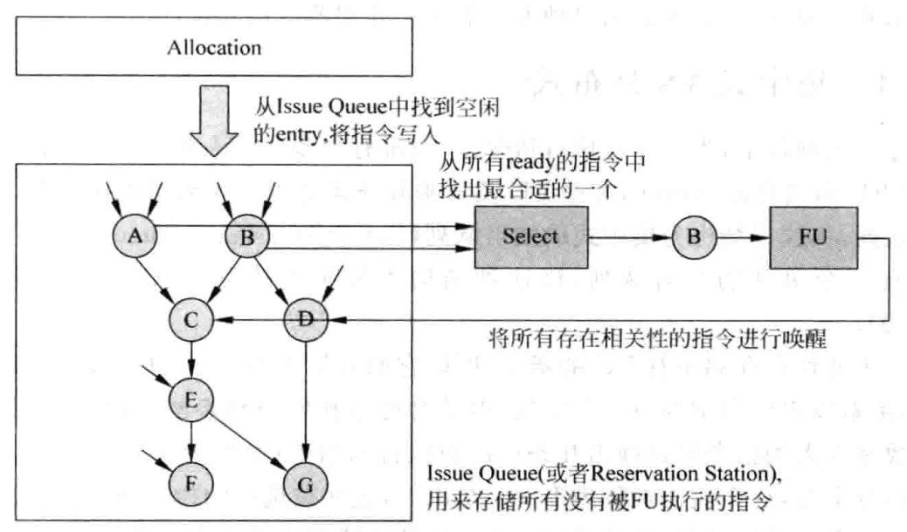

# 发射

## 概述

上图给出了流水线的发射阶段的执行过程，以及所涉及到的一些重要的部件，包括以下几个：

1. 发射队列`Issue Queue`，用来存储已经被寄存器重命名，但是没有被送到`FU`执行的指令。
2. 分配电路`Allocation Unit`，用来从发射队列中找到空闲的空间，将寄存器重命名之后的指令存储到其中。
3. 选择队列`Arbiter Unit`，如果在发射队列中存在多条指令的操作数都已经准备好了，那么这个电路会按照一定的规则，从其中找出最合适的指令，送到`FU`中去执行。
4. 唤醒电路`Wake-up Unit`，当一条指令经过`FU`执行而得到结果数据时，会将其通知给发射队列中所有等待这个数据的指令，这些指令中对应的源寄存器会被设置为有效的状态，这个过程就是唤醒。如果发射队列中一条指令的所有源操作数都有效了，则这个指令就处于`ready`的状态，可以向选择电路发出申请。

### 集中式VS分布式

如果所有的`FU`都共用一个发射队列，则这种结构为集中式的发射队列`CIQ`；而如果每个`FU`都有一个单独的发射队列，则这种结构为分布式的发射队列`DIQ`。

`CIQ`因为要负责存储所有`FU`的指令，所以它的容量需要很大，这种设计有着最大的利用效率，但是会使选择电路和唤醒电路变得比较复杂。

`DIQ`为每一个`FU`都配备了一个发射队列，所以每个发射队列的容量可以很小，这样就大大简化了选择电路的设计，但是由于它的分布比较分散，进行唤醒操作时所需要的布线复杂度较高。

正因为这两种方式各有优缺点，现代的处理器一般都结合使用上述的两种方法，使某几个`FU`共同使用一个发射队列。

### 数据捕捉VS非数据捕捉

在流水线的发射阶段之前读取寄存器，这种方法称为数据捕捉的结构，在这样的设计中，被寄存器重命名之后的指令会首先读取物理寄存器堆，然后将读取到的值随着指令一起写入发射队列中。如果有些寄存器的值还没有被计算出来，则会将寄存器的编号写到发射队列中，以供唤醒的过程使用，它会被标记为当前无法获得的状态，这些寄存器都会在之后的时间通过旁路网络得到它们的值，不需要再访问物理寄存器堆。

在流水线的发射阶段之后读取物理寄存器堆，这种方法也称为非数据捕捉结构，在这样的设计中，被重命名之后的指令不会去读取物理寄存器堆，而是直接将源寄存器的编号放到发射队列中，当指令从发射队列中被选中时，会使用这个源寄存器的编号来读取物理寄存器堆，将读取的值送到`FU`中去执行。

### 压缩VS非压缩

当一条指令被选中而离开时，在发射队列中就会出现空闲的位置，经过压缩之后，这个空闲的位置会被挤掉，这样所有的指令又都靠在一起了，这就是压缩方式的发射队列。这样可以保证空闲的空间都是处于发射队列的上部，此时只需要将重命名之后的指令写到发射队列的上部即可。

非压缩的发射队列就是每当有指令离开发射队列的时候，发射队列中其他的指令不会进行移动，而是继续停留在原来的位置。在这种方法中，空闲空间在发射队列中的分布将是没有规律的，不能够根据指令的位置来判断指令的新旧。

## 发射过程的流水线

### 非数据捕捉结构的流水线

进入到发射队列当中的一条指令要被`FU`执行，必须要等到下述几个条件都成立：

1. 这条指令所有的源操作数都准备好了；
2. 这条指令能够从发射队列中被选中，即需要经过仲裁电路的允许才能够进行发射；
3. 需要能够从寄存器、`payload RAM`或者旁路网络中获得源操作数的值。

通过处理器中的旁路网络，能够使唤醒的过程提前。

### 数据捕捉结构的流水线

这种结构相比于上一种方法，最大的不同就是它在发射队列中采用`payload RAM`来存储所有指令的源操作数，这样当指令离开发射队列的时候，可以直接得到操作数，而不需要再去读取物理寄存器堆。
