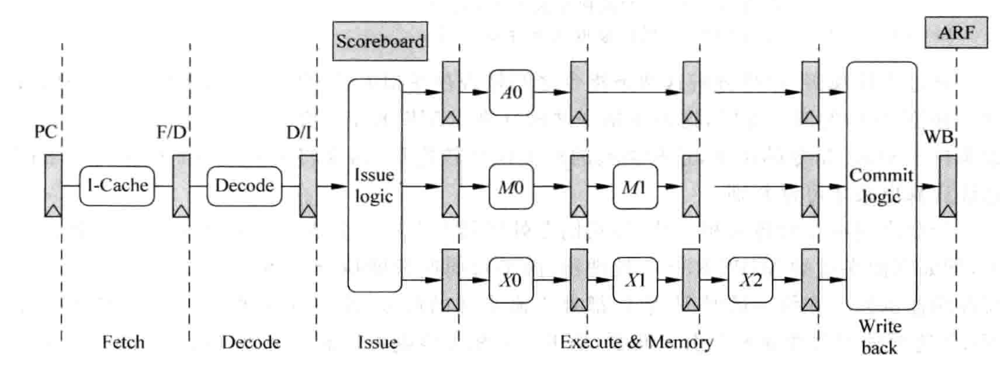

# 流水线

`Frontend` 阶段表示流水线中的 `Fetch` 和 `Decode` 两个阶段。这两个阶段没有必要实现乱序执行。

`Issue` 阶段表示将指令送到对应的功能单元`FU`中执行。该阶段可以实现乱序执行，只要指令的源操作数已准备好便可以先于其他指令执行。

`Write back` 阶段表示将指令的结果写到目的寄存器中。为实现乱序写回寄存器，可以在处理器内部使用寄存器重命名，将指令集中定义的逻辑寄存器动态转化为物理寄存器。

`Commit` 阶段表示一条指令被允许更改处理器的状态。为了保证程序按照原来的意图得到执行，并且实现精确异常，该阶段需要顺序执行，这样才能够保证从处理器外部看起来，程序是串行执行的。

## 顺序执行

在顺序执行的超标量处理器中，指令的执行必须遵照程序中指定的顺序，这种类型的处理器可以通过下图进行概括：

注意如果将发射的过程放在指令的解码阶段，会严重影响处理器的的周期时间，因此发射的过程应单独使用一个流水级。而因为要保证流水线的写回阶段是顺序执行的，因此所有 `FU` 都需要经历同样周期数的流水线。

`ScoreBoard` 用来记录流水线中每条指令的执行情况，例如一个指令在哪个 `FU` 中执行，什么时候可以得到该条指令的结果，下图为一个典型的 `ScoreBoard`：

在典型情况下，需要记录的信息有：

1. P：`Pending`，表示指令的结果还没有写回到逻辑寄存器中。
2. F：一个指令在哪个 `FU` 中执行，在将指令结果进行旁路时会使用这个信息。
3. Result Position：该部分记录了一条指令到达 `FU` 中哪个流水级，`3` 表示指令处于 `FU` 中的第一个流水级，`1` 表示指令到达 `FU` 中的最后一个流水级，`0` 表示指令处于流水线的写回阶段。

在流水线的发射阶段，会将指令的信息写到 `ScoreBoard` 中，同时这条指令会查询 `ScoreBoard` 来获知自身的源操作数是否已准备好。

当一个指令被送到`FU`中执行之后的每个周期，都会将 `Result Position` 的值右移一位。对于执行 `ALU` 类型指令的 `FU` 来说，当指令到达 `3` 时就可以将结果进行旁路；而对于执行乘法指令的 `FU` 来说，只有当指令到达 `1` 时才可以将结果进行旁路。

## 乱序执行

在顺序执行的处理器中，由于指令需要按照顺序的方式执行，所以指令在很多时候都处于等待的状态。而在乱序执行的处理器中，指令在流水线中不再遵循程序中指定的顺序来执行，这种类型处理器的流水线可以用下图来表示：

为解决在乱序执行时`WAW`和`WAR`这两种相关性，需要对寄存器进行`重命名`,这个过程既可以在流水线的`Decode`阶段完成，也可以单独使用一个流水级来完成，而处理器中需要增加物理寄存器堆`PRF`来配合对指令集中定义的寄存器`ARF`进行重命名，`PRF`中寄存器的个数要多于`ARF`。

在`Issue`阶段，指令将被存储在一个缓存中，这个缓存称为发射队列`IQ`。一旦指令的操作数准备好，指令就可以从发射队列中离开，前往对应的`FU`中执行。

与顺序执行不同，乱序执行处理器每个`FU`都有自己的流水线级数，这也使得指令在流水线的`Write Back`阶段是乱序的。在`Write Back`阶段，一个指令只要计算完毕就会将结果写到`PRF`中，而由于`分支预测失败`和`异常`的存在，`PRF`中的结果未必都会写到`ARF`中。

为保证程序的串行结果，指令需要按照程序中执行的顺序更新处理器的状态，这需要使用重排序缓存`ROB`来配合，流水线中的所有指令都按照程序中规定的顺序存储在`ROB`中，使用`ROB`来实现程序对处理器状态的顺序更新，这个阶段称为`Commit`阶段。在`Commit`阶段，一个指令会将它的结果从`PRF`搬移到`ARF`中，同时`ROB`也会配合完成对`异常`的处理。如果不存在`异常`，这条指令就可以顺利离开流水线，并对处理器的状态进行更改，此时称该条指令退休。一条指令一旦退休，它就再也不可能回到之前的状态了，然而对于`store`指令，由于发生分支预测失败或者异常时，需要将`store`指令从流水线中清除，但此时并没有办法对存储器的状态进行恢复，因为存储器中原来的值已被覆盖。于是可以使用`Store Buffer(SB)`来存储`store`指令没有退休之前的结果。`store`指令在流水线的`Write Back`阶段会将它的结果写到`SB`中，只有一个`store`指令真正从流水线中退休时，才可以将它的值从`SB`写到存储器中。而使用`SB`后，`load`指令既需要从`D-Cache`中寻找数据，也需要在`SB`中进行查找。

在现代的处理器中，旁路网络是影响速度的关键因素，因此很多处理器都使用了`Cluster`的结构，将`FU`分成不同的组，在一个组内的`FU`，在布局布线时会紧挨在一起，这样在这个组内的旁路网络，由于经过的路径比较短，一般可以在一个周期内完成；而当旁路网路跨越不同的组时，可能就需要两个或者多个周期了，`Cluster`的结构是一种典型的这种方案。
