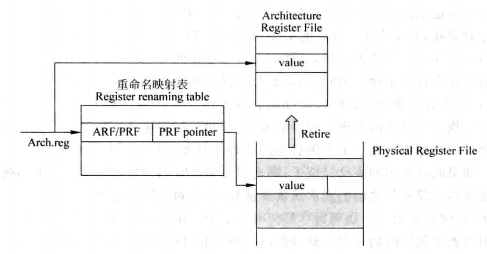

# 寄存器重命名

`WAW`和`WAR`相关性最好的解决办法是使用硬件管理的寄存器重命名，处理器中实际存在的寄存器个数要多于指令集中定义的通用寄存器的个数，这些在处理器内部实际存在的寄存器称为物理寄存器，与之对应的，指令集中定义的寄存器称为逻辑寄存器。

处理器在进行寄存器重命名的时候，会动态地将逻辑寄存器映射到物理寄存器，这样可以解决`WAW`和`WAR`的相关性，如图所示为使用寄存器重命名的方法来解决`WAW`和`WAR`相关性的过程：

## 寄存器重命名的方式

对于寄存器重命名来说，有三种方法都可以实现它，这三种方式分别如下：

1. 将逻辑寄存器扩展来实现寄存器重命名；
2. 使用统一的物理寄存器来实现寄存器重命名；
3. 使用`ROB`来实现寄存器重命名。

要实现寄存器重命名，一般都要考虑下面的内容：

1. 什么时候占用一个物理寄存器？这个物理寄存器来自于哪里？
2. 什么时候释放一个物理寄存器？这个物理寄存器去往何处？
3. 发生分支预测失败时，如何进行处理？
4. 发生异常时，如何进行处理？

### 使用ROB进行寄存器重命名

在超标量处理器中，每条指令都会将自身的信息按照程序中原始的顺序存储到`ROB`中，当一条指令将结果计算出来之后，会将其写到`ROB`中，但是由于分支预测失败和异常等原因，这些结果未必就是正确的，它们的状态被称为推测的。在一条指令离开流水线之前，它都会一直待在`ROB`中，只有当指令变为流水线中最旧的指令，并且被验证为正确的时候，才会离开`ROB`，并使用它的结果对处理器的状态进行更新，这种方式相当于将物理寄存器`PRF`和`ROB`集成到了一起，如图所示：

### 将ARF扩展进行寄存器重命名

可以使用一个独立的存储部件，用来存储流水线中所有指令的结果，只有那些存在目的寄存器的指令才会占据这个存储部件当中的存储空间，这个存储部件称为`PRF`，它可以看作是`ARF`的扩展，`PRF`可以通过`FIFO`来实现，这和`ROB`是一样的。

指令在进行寄存器重命名的时候，如果它存在目的寄存器，则这条指令会占据`PRF`的一个空间，指令在得到结果之后，会首先将这个结果存储到`PRF`中，等到这条指令退休的时候，才会将它的结果搬移到`ARF`中，这个过程和基于`ROB`进行重命名的方式是一样的。如果`PRF`中已经没有空间了，那么流水线中，寄存器重命名阶段之前的所有流水线都需要暂停，直到流水线中有指令离开而释放`PRF`的空间时，寄存器重命名阶段之前的流水线才可以继续执行，如图所示：

### 使用统一PRF进行寄存器重命名

在这种方法中，将上一种方法使用的`ARF`和`PRF`进行了合并，合并之后的部件称为统一的`PRF`，在其中存储了所有推测的和正确的寄存器值。在这个`PRF`中，没有和指令产生映射关系的寄存器都是处于空闲状态，使用一个空闲列表来记录这个`PRF`中哪些寄存器处于空闲状态；当一条指令被寄存器重命名，并且它存在目的寄存器的时候，它就会占据`PRF`当中的一个寄存器，这个寄存器就处于被占用的状态，处于这个状态的寄存器会经历值没有被计算出来、值被计算出来但是没有退休、退休这三个过程，在此过程中，并不需要将寄存器的内容进行搬移，这样便于后续的指令读取操作数。这种寄存器重命名的方法也需要一个重命名映射表，用来存储每个逻辑寄存器和物理寄存器的对应关系，如图所示：

一条指令只有退休的时候，它的结果才会被外部看到，此时还需要使用另一个`RAT`，用来存储所有`退休`状态的指令和物理寄存器的对应关系。

当一条指令和后面的某条指令都写到同一个目的寄存器时，则后面的指令退休的时候，前面指令对应的物理寄存器就已经没有用处了，可以将其变为空闲状态，为了实现上述的功能，在`ROB`中，除了记录逻辑寄存器当前对应的物理寄存器之外，还需要存储它之前对应的物理寄存器，以便在指令退休的时候，将它对应的旧映射关系进行释放。

## 重命名映射表

### 基于SRAM的重命名映射表

在基于`SRAM`的重命名映射表中，表项的个数等于处理器中逻辑寄存器的个数，使用逻辑寄存器的编号作为地址对`sRAT`进行寻址，对于每个逻辑寄存器来说，在`sRAT`中只有一个表项与之对应，如图所示：

对于`4-way`的超标量处理器来说，每周期最多需要对四条指令进行重命名，也就是`sRAT`需要支持`8`个读端口和`4`个写端口，为了指示哪些物理寄存器是空闲状态的，还需要使用一个表格`Free List`来进行记录；新写入到`sRAT`的值会覆盖掉原来旧的对应关系。

基于`sRAT`的寄存器重命名方法中，不能使用个数太多的`Checkpoint`，而处理器性能的提高要求更多的分支指令存在于流水线中，而由于在超标量处理器中，大量地使用了预测算法，例如分支预测、`load\store`相关性预测、数值预测等，分支指令一旦预测正确，那么它对应的`Checkpoint`就没有作用，因此可以对分支指令预测的正确度也进行预测，对于那些预测正确率很高的分支指令，就不需要对它们使用`Checkpoint`了，而那些经常预测错误的分支指令，对它们就要使用`Checkpoint`，经常预测错误的分支指令只是一小部分，因此这种方法可以大大减少`Checkpoint`的个数。

### 基于CAM的重命名映射表

在基于`CAM`的重命名映射表`cRAT`中，由于要找到逻辑寄存器和物理寄存器的对应关系，因此逻辑寄存器的编号就是每个表项中保存的内容，而物理寄存器的编号则是最后的结果。在`cRAT`中，表项的个数等于物理寄存器的个数，使用逻辑寄存器的编号对`cRAT`进行`CAM`方式的寻址，每个逻辑寄存器在`cRAT`中只有一个有效的表项与之对应，也就是在任意时刻，每个逻辑寄存器都只有一个物理寄存器与之对应，这可以使用一个有效位`V`来表示。每次对`cRAT`进行`Checkpoint`，只需要保存这个有效位即可，如图所示：

## 超标量处理器的寄存器重命名

### 解决RAW相关性

若四条指令不存在`RAW`相关性，则四条指令的源寄存器只需要从重命名映射表`Mapping Table`中找到对应的物理寄存器，目的寄存器也会从`Mapping Table`中找到之前映射的物理寄存器的编号，同时本周期还会从`Free List`中找到四个空闲的物理寄存器的编号，将它们和四条指令的目的寄存器产生新的映射关系，并将这个关系也写到`Mapping Table`中。每次当一个物理寄存器不会再被使用时，就会将它的编号写回到空闲列表中。

然而，由于`RAW`相关性的存在，处理器中需要有一种检查机制，对一个周期内进行重命名的所有指令进行`RAW`相关性的检查。由于在寄存器重命名阶段，指令之间还保持着程序中指定的顺序，因此只需要将每条指令的源寄存器编号和它前面所有指令的目的寄存器编号进行比较，如果存在一个相等的项，那么这个源寄存器对应的物理寄存器就不是来自于`Mapping Table`的输出，而是来自于当前周期从`Free List`输出的对应值；如果存在多个相等的项，那么就使用最新的那条指令所对应的物理寄存器。

### 解决WAW相关性

`WAW`相关性影响着对`Mapping Table`和`ROB`的写入过程，因此也需要在重命名阶段对其进行检查，但是对这两个部件来说，它们的处理过程是不一样的，需要区别进行对待。

#### 对写Mapping Table进行检查

在进行寄存器重命名的这个周期，如果存在多条指令的目的寄存器都相等的情况，那么只有最新的那条指令的映射关系才允许写入到`Mapping Table`中。因此，对于每条指令来说，都要将它的目的寄存器和后面所有指令的目的寄存器进行比较，如果发现存在相等的情况，则说明本条指令不应该更新`Mapping Table`：

#### 对写ROB进行检查

为了能够释放掉那些不再使用的物理寄存器，同时又可以对处理器的状态进行恢复，每条指令都需要从`Mapping Table`中读出它以前的物理寄存器，并将其写到`ROB`当中，如果在一个周期内进行寄存器重命名的几条指令中，有两条指令的目的寄存器相等，那么比较新的这条指令对应的旧的物理寄存器就直接来自于比较旧的那条指令，而不是来自于`Mapping Table`。

由于有些指令并没有目的寄存器，而有些指令的源操作数是立即数，这些特殊的情况都需要在指令解码之后加以标记，做法如下：

1. 根据当前周期中需要重命名的目的寄存器的个数，决定当前周期需要从`Free List`中读取的数值的个数；
2. 使用目的寄存器读取`Mapping Table`时，根据标记的信息，目的寄存器不存在的那些指令将不会读取`RAT`，也不会写入`RAT`；

3. 使用源寄存器读取`RAT`时，根据标记的信息，源寄存器不存在的那些指令将不会读取`Mapping Table`，或者忽略从`Mapping Table`中读出的结果；
4. 在重命名阶段进行`RAW`和`WAW`相关性的检查时，如果一条指令的源寄存器或者目的寄存器不存在，那么忽略掉和它相关的所有比较结果。

## 寄存器重命名过程的恢复

### 使用Checkpoint

将`Checkpoint`简称为`GC`，对于一个正在工作的部件来说，它可以将整个内容放到任意一个`GC`中，在它进行状态恢复的时候，也可以从任意一个`GC`中读取数据，那么就称这种方式为随机访问的`GC`；如果在进行状态保存的时候，需要经过逐个地移位才能够放到指定的`GC`中，这种方式就称为串行访问的`GC`，这两种方式的工作原理如图所示：

考虑到使用Checkpoint的目的是快速地对处理器中的某些部件进行保存和恢复，随机访问的`GC`是更合适的实现方式。

### 使用WALK

对每一条指令来说，在`ROB`中都存储了这条指令之前对应的物理寄存器，利用这个信息，可以将`Mapping Table`的状态逐步地回退，使那些处于错误路径上的指令，对`Mapping Table`的修改都进行恢复。

### 使用Architecture State

当需要从处理器外部访问一个逻辑寄存器时，直接使用寄存器重命名阶段的`Mapping Table`是很难做到的，因为它处于推测状态，因此一般都会在流水线的提交阶段也使用一个`Mapping Table`，所有正确离开流水线的指令都会更新这个`Mapping Table`，因此这个`Mapping Table`中记录的状态肯定是正确的，称它为`Architecture Mapping Table`。

## 分发

对于超标量处理器来说，乱序执行是最关键的地方，流水线的分发阶段是顺序执行和乱序执行的分界点，指令经过寄存器重命名之后，就会进入流水线的分发阶段。在这个阶段，经过寄存器重命名之后的指令会被写到流水线的很多缓存中，这样就为乱序执行做好了准备，具体来说，可以分为三大类的缓存。

### Out-of-order Issue Queue

当指令被放到这个缓存中的时候，它的操作数可能还没有完全准备好，那么它就在这个缓存中等待，只要一个指令的所有源操作数都准备好了，就可以将其送到`FU`中执行 ，而不用理会这条指令在程序中原始的顺序。

### In-order Issue Queue

即使在乱序执行的超标量处理器中，仍旧有部分指令是按照程序中指定的顺序来执行的，例如分支指令和`store`指令。

### ROB

这个部件可以将乱序执行的指令拉回程序中指定的原始顺序，指令经过寄存器重命名之后，按照程序中指令的顺序写到`ROB`中，同时在`ROB`中还会记录下指令在执行过程中的一些状态，例如是否产生异常等信息。
