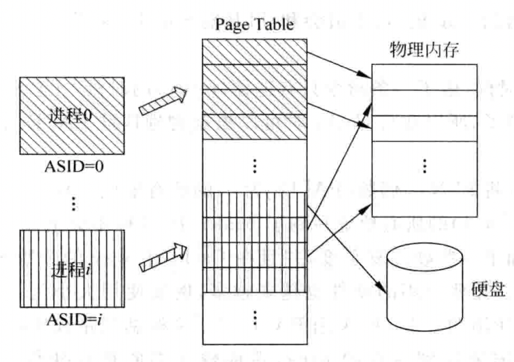
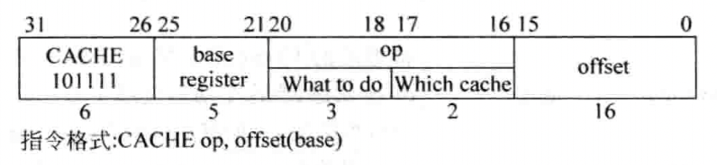
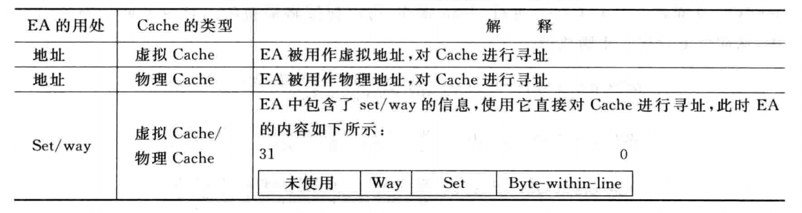
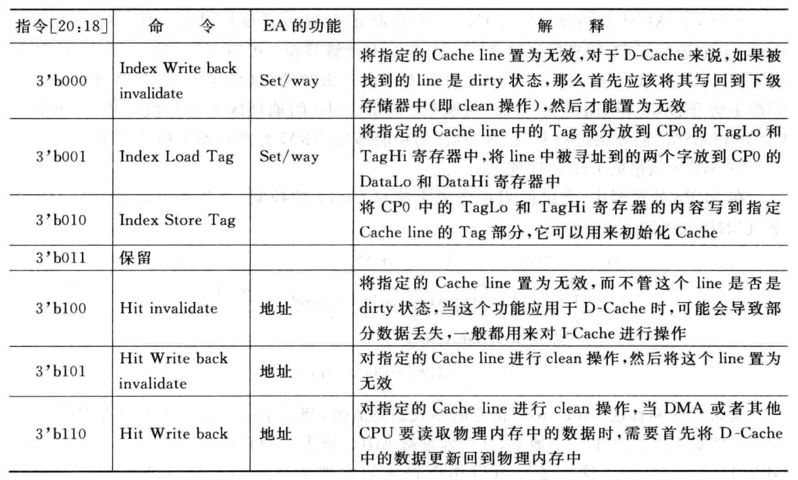
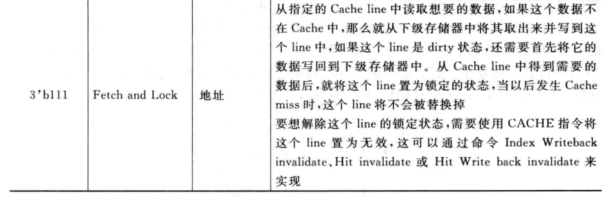
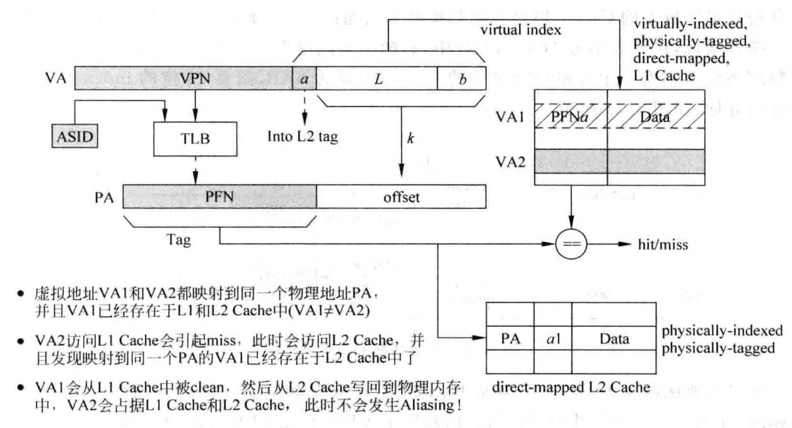
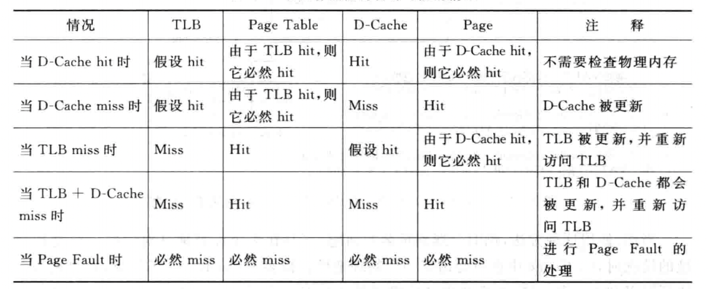

# 虚拟存储器

在没有使用虚拟地址的系统中，处理器输出的地址会直接送到物理存储器中，这个过程如图所示：


而如果使用了虚拟地址，则处理器输出的地址就是虚拟地址了，这个地址不会被直接送到物理存储器，而是需要先进行地址转换，负责地址转换的部件一般称为`内存管理单元（MMU）`。


通过操作系统动态地将每个程序的虚拟地址转化为物理地址，可以使得程序员在编写程序的时候，不需要考虑地址的限制，每个程序都认为处理器中只有自己在运行；同时，还可以实现程序的保护与程序间的共享。

## 地址转换

当前大多数处理器都使用基于`分页机制`的虚拟存储器，虚拟地址空间的划分以`页`为单位，典型的`页`大小为`4KB`，相应的物理地址空间也进行同样大小的划分；物理地址空间的划分以`frame`为单元，它和`页`的大小相等。

对于一个虚拟地址`VA`来说，`VA[11:0]`用来表示页内的位置，称为`page offset`，`VA`剩余的部分用来表示哪个`页`，也称为`VPN`。相应的，对于一个物理地址`PA`来说，`PA[11:0]`用来表示`frame`内的位置，称为`frame offset`，`PA`剩余的部分用来表示哪个`frame`。也称为`PFN`。由于`页`和`frame`的大小是一样的，所以从`VA`到`PA`的转化实际上也就是`VPN`到`PFN`的转化，`offset`的部分是不需要变化的。


当`MMU`发现`页`没有被映射之后，就产生一个`Page Fault`的异常送给处理器，这时候处理器就需要转到`Page Fault`对应的异常处理程序中处理这个事情，它必须从物理内存的`frame`中找到一个当前很少被使用的`frame`，然后将其与原来映射`page`解除映射关系，再把需要的内容从硬盘搬移到物理内存中该`frame`的空间，并将需要的`page`标记为该`frame`；如果被替换的`frame`是`dirty状态`，还需要先将它的内容搬移到硬盘中。处理完上述的内容，就可以从`Page Fault`的异常处理程序中进行返回。

### 单级页表

在使用虚拟存储器的系统中，会使用一张表格来存储从虚拟地址到物理地址（实际上是`VPN`到`PFN`）的对应关系，这个表格称为`页表（PT）`，一般`PT`会被放置于物理内存中，使用虚拟地址来寻址，表格中被寻址的内容就是这个虚拟地址对应的物理地址。每个程序都有自己的页表，为了指示一个程序的页表在物理内存中的位置，在处理器中一般都会包括一个寄存器，用来存放当前运行程序的页表在物理内存中起始地址，这个寄存器称为`页表寄存器（PTR）`，每次操作系统将一个程序调入物理内存中执行的时候，就会将寄存器`PTR`设置好，下图表示了如何使用`PTR`从物理内存中定位到一个页表：


一个进程的页表指定了它能够在物理内存中访问的地址空间，这个页表位于物理内存当中，在一个进程进行状态保存的时候，并不需要保存整个页表，只需要将这个页表对应的`PTR`进行保存即可。因为每个进程都拥有全部的虚拟存储器空间，因此不同的进程肯定会存在相同的虚拟地址，操作系统需要负责将这些不同的进程分配到物理内存中不同的地方，并将这个映射信息更新到`页表`中（使用`store`指令就可以完成这个任务），这样不同的进程使用的物理内存就不会产生冲突了。

由于要得到一个虚拟地址对应的数据，需要访问两次物理内存。第一次访问物理内存中的页表，得到对应的物理地址；第二次使用这个物理地址来访问物理内存，得到需要的数据，而由于物理内存的访问速度和处理器的速度相比是很慢的，现实当中的处理器都会使用`TLB`和`Cache`来加快这个过程。

### 多级页表

事实上，一个程序很难使用完整的虚拟存储器空间，大部分程序只是用了很少一部分，这就造成了页表中大部分内容都是空的，并没有被实际地使用，这样整个页表的利用效率是很低的。可以采用很多方法来减少一个进程的页表对于存储空间的需求，最常用的方法是多级页表，这种方法可以减少页表对于物理存储空间的占用，而且非常容易使用硬件来实现。

在多级页表的设计中，一个线性页表被划分为若干个更小的`子页表`，处理器在执行进程的时候，不需要一次把整个线性页表放入物理内存中，而是根据需求逐步放入这些子页表。而且，这些子页表不再需要占用连续的物理内存空间了，也就是说，两个相邻的子页表可以放在物理内存中不连续的位置，这样也提高了物理内存的利用效率。但是，由于所有的子页表是不连续地放在物理内存中，所以仍旧需要一个表格，来记录每个子页表在物理内存中存储的位置，称这个表格为第一级页表，而那些子页表则为第二级页表。


这样，要得到一个虚拟地址对应的数据，首先需要访问第一级页表，得到这个虚拟地址所属的第二级页表的基地址，然后再去第二级页表中才可以得到这个虚拟地址对应的物理地址，这时候就可以在物理内存中取出相应的数据了。


在一个页表中的`表项`简称为`PTE`，当操作系统创建一个进程时，就在物理内存中为这个进程找到一块连续的空间，存放这个进程的第一级页表，并且将第一级页表在物理内存中的起始地址放到`PTR`寄存器中。随着这个进程的执行，操作系统会逐步在物理内存中创建第二级页表，每次创建一个第二级页表，操作系统就要将它的起始地址放到第一级页表对应的表项中。

需要注意的是，使用这种多级页表的结构，要得到一个虚拟地址对应的数据需要多次访问物理内存：


利用虚拟存储器，可以管理每一个页的访问权限，这些权限的管理就是通过`页表`来实现的，通过在页表中设置每个页的属性，操作系统和内存管理单元`MMU`可以控制每个页的访问权限，这样就实现了程序的权限管理。

### Page Fault

如果一个进程中的虚拟地址在访问页表时，发现对应的`PTE`中，`有效位`为`0`，这就表示这个虚拟地址所属的页还没有被放到物理内存中，因此在页表中就没有存储这个页的映射关系，这时候就说发生了`Page Fault`，需要从下级存储器，例如硬盘中，将这个页取出来，放到物理内存中，并将这个页在物理内存中的起始地址写到页表中。`Page Fault`是`异常`的一种，通常由操作系统来完成。

需要注意的是，直接使用虚拟地址并不能知道页位于硬盘的哪个位置，也需要一种机制来记录一个进程的每个页位于硬盘中的位置。通常，`操作系统`会在硬盘中为一个进程的所有页开辟一块空间，称为`swap`空间，在这个空间中存储一个进程所有的页，操作系统在开辟`swap`空间的同时，还会使用一个表格来记录每个页在硬盘中存储的位置，这个表格的结构其实和`页表`是一样的，它可以单独存在，也可以和`页表`合并在一起，如图所示：


在虚拟存储器的系统中，一般采用了`写回`的方式，因此在发生`Page Fault`的时候，操作系统需要从物理内存中找到一个页进行替换（当物理内存没有空闲的空间时），这就需要操作系统实现替换算法，以便能够找到一个最近不经常被使用的页。操作系统可以使用`LRU`算法进行替换，但是要达到这样的功能，操作系统要使用复杂的数据结构才可以精确地记录物理内存中哪些页最近被使用，这样的代价是很大的；每次执行访问存储器的指令，都需要操作系统更新这个数据结构。为了帮助操作系统实现这个功能，需要处理器在硬件层面提供支持，这可以在页表的每个`PTE`中增加一位，用来记录每个页最近是否被访问过，这一位称为`使用位`，当一个页被访问时，`使用位`被置为`1`，操作系统周期性地将这一位清零，然后过一段时间再去查看它，这样就能够知道每个页在这段时间是否被访问过，那些最近这段时间没有被使用过的页就可以被替换了。这种方式是近似的`LRU`算法，被大多数操作系统所使用，由于使用了硬件来实现`使用位`，所以操作系统的任务量被大大地减轻了。

需要注意的是，在`写回`类型的`Cache`中，`load/store`指令在执行的时候，只会对`D-Cache`起作用，对物理内存中`页表`的更新可能会有延迟，当操作系统需要查询页表中的这些状态位时，首先需要将`D-Cache`中的内容更新到物理内存中，这样才能够使用到页表中正确的状态位。


不发生`Page Fault`时的访问流程：


发生`Page Fault`时的访问流程：


## 程序保护

在页表中规定了每个页的访问权限，因此一旦发现当前的访问不符合规定，例如一个页不允许用户进程访问，但是当前的用户进程却要读取这个页内的某个地址，这样就发生了非法的访问，会发生一个异常来通知处理器，使处理器跳转到异常处理程序中，这个处理程序一般是操作系统的一部分，由操作系统决定如何处理这种非法的访问，加入程序保护之后的地址转换如图：


如果采用了两级页表的结构，上图为第二级页表的工作过程，事实上在第一级页表中也可以进行权限控制，而且可以控制更大的地址范围。

存在`D-Cache`的系统中，处理器送出的虚拟地址经过页表转化为物理地址之后，并不会直接去访问物理内存，而是先访问`D-Cache`。但是，如果处理器送出的虚拟地址并不是要访问物理内存，而是要访问芯片内的外设寄存器，此时对这些寄存器的读写是为了对外设进行操作，因此这些地址是不允许经过`D-Cache`被缓存的，如果被缓存了，那么这些读写将只会在`D-Cache`中起作用，并不会传递到外设寄存器中而真正对外设模块进行操作，因此在处理器的存储器映射中，总会有一块区域，是不可以被缓存的。

到目前为止，总结起来，在页表中的每个`PTE`都包括如下的内容：

1. `PFN`，表示虚拟地址对应的物理地址的页号；
2. `Valid`，表示对应的页当前是否在物理内存中；
3. `Dirty`，表示对应页中的内容是否被修改过；
4. `Use`，表示对应页中的内容是否最近被访问过；
5. `AP`，访问权限控制，表示操作系统和用户程序对当前这个页的访问权限；
6. `Cacheable`，表示对应的页是否允许被缓存。

## 加入TLB和Cache

### TLB的设计

对于取指令来说，考虑到程序本身的串行性，会顺序地从一个页内取指令，此时若将`PTE`缓存起来能够加快一个页内内容的地址转换速度。缓存`PTE`的部件称之为`TLB`，在`TLB`中存储了页表中最近被使用过的`PTE`，从本质上讲，`TLB`就是页表的`Cache`，但只有时间相关性，因此`预取`是没有办法应用于`TLB`中的。

在现代的处理器中，很多都采用两级`TLB`，第一级`TLB`采用哈佛结构，分为`指令TLB（I-TLB）`和`数据TLB（D-TLB）`，一般采用全相连的方式；第二级`TLB`是指令和数据共用，一般采用组相连的方式，这种设计方法和`多级Cache`是一样的。

下图表示了一个全相连方式的`TLB`：


从处理器送出的虚拟地址首先送到`TLB`中进行查找，如果`TLB`对应的内容是有效的（即`valid`位是1），则表示`TLB`命中，可以直接使用从`TLB`得到的物理地址来寻址物理内存；如果`TLB`缺失（即`valid`位是`0`），那么就需要访问物理内存中的页表，此时有如下两种情况：

1. 在页表中找到的`PTE`是有效的，即这个虚拟地址所属的页存在于物理内存中，那么就可以直接从页表中得到对应的物理地址，使用它来寻址物理内存从而得到需要的数据，同时将页表中的这个`PTE`写回到`TLB`中，供以后使用。
2. 在页表中找到的`PTE`是无效的，即这个虚拟地址所属的页不在物理内存中，此时就应该产生`Page Fault`类型的异常，通知操作系统来处理这个情况，操作系统需要从硬盘中将相应的页搬移到物理内存中，将它在物理内存中的首地址放到页表内对应的`PTE`中，并将这个`PTE`的内容写到`TLB`中。

因为`TLB`采用了全相连的方式，所以相比页表，多了一个`Tag`的项，它保存了虚拟地址的`VPN`，用来对`TLB`进行匹配查找，`TLB`中其他的项完全来自于`页表`，每当发生`TLB`缺失时，将`PTE`从页表中搬移到`TLB`内。

在很多处理器中，还支持容量更大的页，但如果程序利用不到这么大的页，那么就会造成一个页内的很多空间被浪费了，这种现象称为`页内碎片`，它降低了页的利用效率，而且，每次发生`Page Fault`时，更大的页也就意味着要搬移更多的数据，需要更长的时间才能将这样大的页从下级存储器（如硬盘）搬移到物理内存中，这样使`Page Fault`的处理时间变得更长了。为了解决这种矛盾，在现代的处理中都支持大小可变的页，由操作系统进行管理，根据不同应用的特点选用不同的大小的页，这样可以最大限度地利用`TLB`中有限的空间。为了支持这种特性，在`TLB`中需要相应的位进行管理，例如在`MIPS`处理器的`TLB`中，有一个`12`位的`Pagemask`项，它用来指示当前被映射的页的大小。

在`TLB`的所有项中，除了`使用位`和`脏状态位`之外，其他的项在`TLB`中是不会改变的，它们的属性都是只读。

#### TLB缺失

当一个虚拟地址查找`TLB`，发现需要的内容不在其中时，就发生了`TLB`缺失，解决`TLB`缺失的本质就是要从页表中找到对应的映射关系，并将其写回到`TLB`内，这个过程称为`Page Table Walk`，可以使用硬件的状态机来完成这个事情，也可以使用软件来做这个事情。

##### 软件实现Page Table Walk

当发现`TLB`缺失时，硬件把产生`TLB`缺失的虚拟地址保存到一个特殊寄存器中，同时产生一个`TLB`缺失类型的异常，在异常处理程序中，软件使用保存在特殊寄存器当中的虚拟地址去寻址物理内存中的页表，找到对应的`PTE`，并写回到`TLB`中，因此，处理器需要支持直接操作`TLB`的指令，如`写TLB`、`读TLB`等。为了防止在执行`TLB`缺失的异常处理程序时再次发生`TLB`缺失，一般都将这段程序放到一个不需要进行地址转换的区域（这个异常处理程序一般属于操作系统的一部分，而操作系统就放在不需要地址转换的区域），这样处理器在执行这段异常处理程序时，相当于直接使用物理地址来取指令和数据，避免了再次发生`TLB`缺失的情况。使用软件处理`TLB`缺失的过程如图所示：


##### 硬件实现Page Table Walk

硬件实现一般由内存管理单元`MMU`完成，当发现`TLB`缺失时，`MMU`自动使用当前的虚拟地址去寻址物理内存中的页表。多级页表的最大优点就是容易使用硬件进行查找，只需要使用一个状态机，逐级进行查找就可以了，如果从页表中找到`PTE`是有效的，那么就将它写回到`TLB`中，这个过程全部都是由硬件自动完成的，软件不需要做任何事情。而如果`MMU`发现查找到的`PTE`是无效的，那么`MMU`会产生`Page Fault`类型的异常，由操作系统来处理这个情况。使用硬件处理`TLB`缺失的方法更适合超标量处理器，它不需要打断流水线，但是这需要操作系统保证页表已经在物理内存中建立好了，并且操作系统也需要将页表的基地址预先写到处理器内部对应的寄存器中（例如`PTR`寄存器），这样才能够保证硬件可以正确地寻址页表。

采用软件处理`TLB`缺失可以减少硬件设计的复杂度，而采用硬件处理`TLB`缺失则会复杂一些，除了需要使用硬件状态机来寻址页表之外，还需要将整个流水线都暂停，等待`MMU`处理这个`TLB`缺失，只有它处理完了，才可以使流水线继续执行，软硬件处理`TLB miss`的对比如下：


由于软件处理`TLB`缺失需要将流水线中的全部指令都清空，因此将这些指令重新取回到流水线中所耗费的时间也会比较长，这导致在超标量处理器中，软件处理`TLB`缺失需要更长的时间。而一旦由`TLB`缺失转变成`Page Fault`，所需要的处理时间就取决于页的替换算法，以及被替换的页是否是脏状态等因素了。

对于`组相连`或`全相连`结构的`TLB`，当一个新的`PTE`被写到`TLB`中时，如果当前`TLB`中没有空闲的位置了，那么就要考虑将其中的一个表项进行替换，例如最近最少使用算法。但是实际上对于`TLB`来说，`随机替换算法`是一种比较合适的方法，由于很难实现严格的随机，此时仍然可以采用一种称为`时钟算法`的方法来实现近似的随机。

#### TLB的写入

操作系统可以认为，被`TLB`记录的所有页都是需要被使用的，这些页在物理内存中不能够被替换。操作系统可以采用一些办法来记录页表中哪些`PTE`被放到了`TLB`中，而`TLB`中记录的所有页都不允许从物理内存中被替换。

#### 对TLB进行控制

对`TLB`的管理需要包括的内容有如下几点：

1. 能够将`I-TLB`和`D-TLB`的所有表项置为无效；
2. 能够将`I-TLB`和`D-TLB`中某个`ASID`对应的所有表项置为无效；
3. 能够将`I-TLB`和`D-TLB`中某个`VPN`对应的表项置为无效。

##### MIPS中对TLB进行控制的指令


`MIPS`中，一个典型的`TLB miss`的异常处理程序如下：

``` assembly
mfc0  $k1 context  // 将寻址PT的地址放到寄存器$k1中
lw    $k1, 0($k1)  // 寻址PT，将得到的PTE放到寄存器$k1中
mtc0  $k1, EntryLo // 将PTE放到寄存器EntryLo中
tlbwr              // 将EntryLo和EntryHi寄存器的内容随机写到TLB中
eret               // 从TLB异常处理程序中退出
```

### Cache的设计

#### Virtual Cache

使用虚拟存储器，处理器送出的地址需要先经过`TLB`才能再访问物理`Cache`，因此必然会增加流水线的延迟，因此可以使用`Cache`来直接缓存从虚拟地址到数据的关系，这种`Cache`称为`虚拟Cache`，使用`虚拟Cache`的工作流程如图：


由于虚拟地址的属性和物理地址是不同的，每个物理地址总是有且只有一个物理内存中的位置和它对应，而使用`虚拟Cache`则会引入问题，可以概括为`同义问题`和`同名问题`。

##### 同义问题

即多个不同的名字对应相同的物理位置，使用`bank`的方法解决重名问题的方法如下：


##### 同名问题

即相同的名字对应不同的物理位置，由于无法直接从虚拟地址中判断它属于哪个进程，那么就可以为每个进程赋一个编号`ASID`，每个进程中产生的虚拟地址都附上这个编号，这个编号就相当于是虚拟地址的一部分，这样不同进程的虚拟地址就肯定是不一样的了。

当多个进程想要共享同一个页时，就需要在`ASID`之外再增加一个标志位，称之为`Global`位，当一个页不只是属于某一个进程，而是被所有的进程共享时，就可以将这个`Global`位置为`1`，这样在查找页表的时候，就过发现`Global`是`1`，那么就不需要再理会`ASID`的值，使用了`ASID`之后的地址转换如图：



加入`ASID`后，相当于虚拟地址是`40`位，此时第一级页表和第二级页表可能过大，导致其内部出现碎片，降低页表的利用效率，因此可以采取三级页表的方式：


当系统中运行的进程超过`ASID`能够表示的最大范围时，此时就需要操作系统从已经存在的`ASID`中挑出一个不经常使用的值，将它在`TLB`中对应的内容情况，并将这个`ASID`分配给新的进程。由于此时新的进程会更新`PTR`寄存器，为了能够对旧的进程进行恢复，操作系统需要将被覆盖的`PTR`寄存器的值保存起来，这样等到这个旧的进程再次被执行时，就可以知道它存在于物理内存的哪个位置了。

#### 对Cache进行控制

对`Cache`进行的操作有如下几种：

1. 能够将`I-Cache`内的所有`Cache line`都置为无效；
2. 能够将`I-Cache`内的某个`Cache line`置为无效；
3. 能够将`D-Cache`内的所有`Cache line`进行`clean`；
4. 能够将`D-Cache`内的某个`Cache line`进行`clean`；
5. 能够将`D-Cache`内的所有`Cache line`进行`clean`，并置为无效；
6. 能够将`D-Cache`内的某个`Cache line`进行`clean`，并置为无效。

在上面的描述中，`Cache`的`clean`操作指的是将`脏状态`的`Cache line`写回到物理内存的过程。

##### MIPS风格的Cache管理

在`MIPS`处理器中，直接使用指令来完成对`Cache`的控制，这条指令就是`CACHE指令`，它的格式如图所示：



这条指令由指定的寄存器加上`16`位的立即数来共同产生一个地址，这个地址被`MIPS`称为`EA`，即`EA = GPR[base] + offset`。这个地址可以用作普通的虚拟地址从而直接寻址`Cache`，而在`MIPS`处理器中，也可以使用`set/way`的信息来直接寻址`Cache`，`set/way`的信息在这个地址`EA`中直接指定，总结起来，这个有效地址`EA`的用处如表所示：



在`5`位的`op`部分中，后`2`位用来指定对何种`Cache`进行操作，它的内容如下所示：


`op`的高`3`位用来指定操作的类型，如表所示：





### 将TLB和Cache放入流水线

#### Physically-Indexed, Physically-Tagged

在使用虚拟存储器的系统中，仍旧可以使用物理`Cache`，因为处理器送出的虚拟地址`VA`会首先被`TLB`转换为对应的物理地址`PA`，然后使用物理地址来寻址`Cache`，此时就像是没有使用虚拟存储器一样，直接使用了物理`Cache`，并且使用物理地址的一部分作为`Tag`，这种设计的示意图如图所示：


因为这种设计方法完全串行了`TLB`和`Cache`的访问，所以很少被真实的处理器采用。

#### Virtually-Indexed, Physically-Tagged

这种方法使用了`虚拟Cache`，根据`Cache`的大小，直接使用虚拟地址的一部分来寻址这个`Cache`（这就是`virtually-indexed`），而在`Cache`中的`Tag`则使用物理地址中的`PFN`（这就是`Physically-tagged`），大多数的现代处理器都使用了这种方式。

如图为使用了这种方式的`直接映射`结构的`Cache`：


重名问题可以通过`L2 Cache`来解决：



#### Virtually-Indexed, Virtually-Tagged

在这种方式中，直接缓存了从虚拟地址到数据的过程，它会使用虚拟地址来寻址`Cache`（也就是`virtually-indexed`），并使用虚拟地址作为`Tag`（也就是`virtually-tagged`）。如果`Cache`命中，那么直接就可以从`Cache`中获得数据，都不需要访问`TLB`；如果`Cache`缺失，那么就仍旧需要`TLB`来将虚拟地址转换为物理地址，然后使用物理地址去寻址`L2 Cache`，从而得到缺失的数据。

重名问题仍旧可以通过`L2 Cache`来解决：


#### 访问存储器时各种可能的情况


