# 超标量处理器

## 流水线


`Frontend` 阶段表示流水线中的 `Fetch` 和 `Decode` 两个阶段。这两个阶段没有必要实现乱序执行。

`Issue` 阶段表示将指令送到对应的功能单元`FU`中执行。该阶段可以实现乱序执行，只要指令的源操作数已准备好便可以先于其他指令执行。

`Write back` 阶段表示将指令的结果写到目的寄存器中。为实现乱序写回寄存器，可以在处理器内部使用寄存器重命名，将指令集中定义的逻辑寄存器动态转化为物理寄存器。

`Commit` 阶段表示一条指令被允许更改处理器的状态。为了保证程序按照原来的意图得到执行，并且实现精确异常，该阶段需要顺序执行，这样才能够保证从处理器外部看起来，程序是串行执行的。

### 顺序执行

在顺序执行的超标量处理器中，指令的执行必须遵照程序中指定的顺序，这种类型的处理器可以通过下图进行概括：


注意如果将发射的过程放在指令的解码阶段，会严重影响处理器的的周期时间，因此发射的过程应单独使用一个流水级。而因为要保证流水线的写回阶段是顺序执行的，因此所有 `FU` 都需要经历同样周期数的流水线。

`ScoreBoard` 用来记录流水线中每条指令的执行情况，例如一个指令在哪个 `FU` 中执行，什么时候可以得到该条指令的结果，下图为一个典型的 `ScoreBoard`：


在典型情况下，需要记录的信息有：

1. P：`Pending`，表示指令的结果还没有写回到逻辑寄存器中。
2. F：一个指令在哪个 `FU` 中执行，在将指令结果进行旁路时会使用这个信息。
3. Result Position：该部分记录了一条指令到达 `FU` 中哪个流水级，`3` 表示指令处于 `FU` 中的第一个流水级，`1` 表示指令到达 `FU` 中的最后一个流水级，`0` 表示指令处于流水线的写回阶段。

在流水线的发射阶段，会将指令的信息写到 `ScoreBoard` 中，同时这条指令会查询 `ScoreBoard` 来获知自身的源操作数是否已准备好。

当一个指令被送到`FU`中执行之后的每个周期，都会将 `Result Position` 的值右移一位。对于执行 `ALU` 类型指令的 `FU` 来说，当指令到达 `3` 时就可以将结果进行旁路；而对于执行乘法指令的 `FU` 来说，只有当指令到达 `1` 时才可以将结果进行旁路。

### 乱序执行

在顺序执行的处理器中，由于指令需要按照顺序的方式执行，所以指令在很多时候都处于等待的状态。而在乱序执行的处理器中，指令在流水线中不再遵循程序中指定的顺序来执行，这种类型处理器的流水线可以用下图来表示：

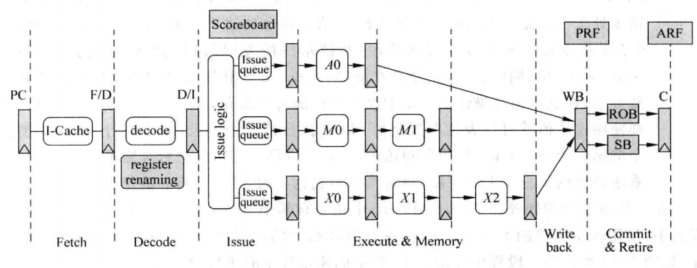

为解决在乱序执行时`WAW`和`WAR`这两种相关性，需要对寄存器进行`重命名`,这个过程既可以在流水线的`Decode`阶段完成，也可以单独使用一个流水级来完成，而处理器中需要增加物理寄存器堆`PRF`来配合对指令集中定义的寄存器`ARF`进行重命名，`PRF`中寄存器的个数要多于`ARF`。

在`Issue`阶段，指令将被存储在一个缓存中，这个缓存称为发射队列`IQ`。一旦指令的操作数准备好，指令就可以从发射队列中离开，前往对应的`FU`中执行。

与顺序执行不同，乱序执行处理器每个`FU`都有自己的流水线级数，这也使得指令在流水线的`Write Back`阶段是乱序的。在`Write Back`阶段，一个指令只要计算完毕就会将结果写到`PRF`中，而由于`分支预测失败`和`异常`的存在，`PRF`中的结果未必都会写到`ARF`中。

为保证程序的串行结果，指令需要按照程序中执行的顺序更新处理器的状态，这需要使用重排序缓存`ROB`来配合，流水线中的所有指令都按照程序中规定的顺序存储在`ROB`中，使用`ROB`来实现程序对处理器状态的顺序更新，这个阶段称为`Commit`阶段。在`Commit`阶段，一个指令会将它的结果从`PRF`搬移到`ARF`中，同时`ROB`也会配合完成对`异常`的处理。如果不存在`异常`，这条指令就可以顺利离开流水线，并对处理器的状态进行更改，此时称该条指令退休。一条指令一旦退休，它就再也不可能回到之前的状态了，然而对于`store`指令，由于发生分支预测失败或者异常时，需要将`store`指令从流水线中清除，但此时并没有办法对存储器的状态进行恢复，因为存储器中原来的值已被覆盖。于是可以使用`Store Buffer(SB)`来存储`store`指令没有退休之前的结果。`store`指令在流水线的`Write Back`阶段会将它的结果写到`SB`中，只有一个`store`指令真正从流水线中退休时，才可以将它的值从`SB`写到存储器中。而使用`SB`后，`load`指令既需要从`D-Cache`中寻找数据，也需要在`SB`中进行查找。

在现代的处理器中，旁路网络是影响速度的关键因素，因此很多处理器都使用了`Cluster`的结构，将`FU`分成不同的组，在一个组内的`FU`，在布局布线时会紧挨在一起，这样在这个组内的旁路网络，由于经过的路径比较短，一般可以在一个周期内完成；而当旁路网路跨越不同的组时，可能就需要两个或者多个周期了，`Cluster`的结构是一种典型的这种方案。

## Cache

`Cache`主要由两部分组成，`Tag`部分和`Data`部分。`Data`部分用来保存一片连续地址的数据，`Tag`部分用来存储这片连续数据的公共地址。一个`Tag`和它对应的所有数据组成的一行称为一个`Cache line`，`Cache line`中的数据部分称为`Cache data block`。如果一个数据可以存储在`Cache`中的多个地方，这些被同一个地址找到的多个`Cache line`称为`Cache set`。


在实际当中，`Cache`有三种主要的实现方式，`直接映射`、`组相连`和`全相连`。现代处理器中的`Cache`一般属于上述三种方式中的某一种，例如`TLB`和`Victim Cache`多采用全相连结构，而普通的`I-Cache`和`D-Cache`则采用组相连结构等。

`Cache`只能保存最近被处理器使用过的内容，由于它的内容有限，很多情况下，要找的指令或数据并不在`Cache`中，这称为`Cache的缺失(Cache miss)`，它发生的频率直接影响着处理器的性能，在计算机领域，影响`Cache`缺失的情况可以概括如下：

1. Compulsory：由于`Cache`只是缓存以前访问过的内容，因此第一次被访问的指令或数据并不在`Cache`中，而可以通过`预取(prefetching)`的方法来尽量降低这种缺失发生的频率。
2. Capcity：`Cache`容量越大，就可以缓存更多的内容。
3. `Conflict`：为了解决多个数据映射到`Cache`中同一个位置的情况，一般使用组相连结构的`Cache`，`Victim Cache`可以缓解由于相连度低导致`Cache`缺失率高的问题。

### Cache的组成方式

#### 直接映射


在直接映射中，处理器访问处理器的地址会被分为三部分，`Tag`、`Index`和`Block Offset`。`Index`用于从`Cache`中找到一个对应的`Cache line`；`Tag`部分用于判断这个`Cache line`是否是需要的那个`Cache line`；`Block Offset`用于找到定位字节，找到真正想要的数据。在`Cache line`中还有一个`有效位(valid)`，用来标记这个`Cache line`是否保存着有效的数据，只有在之前被访问过的存储器地址，它的数据才会存在于对应的`Cache line`中，相应的有效位也会被置为`1`。

#### 组相连


在组相连中，存储器中的一个数据不单单只能放在一个`Cache line`中，而是可以放在多个`Cache line`中，对于一个组相连的`Cache`来说，如果一个数据可以放在`n`个位置，则称这个`Cache`是`n`路组相连的`Cache`。

这种结构仍然使用存储器地址的`Index`部分对`Cache`进行寻址，此时可以得到多个`Cache line`，这多个`Cache line`称为一个`Cache set`，而究竟哪个`Cache line`才是最终需要的，是通过`Tag`比较的结果来确定的。如果多个`Cache line`的`Tag`比较结果都不相等，那么就说明这个存储器地址对应的数据不在`Cache`中，也就是发生了`Cache`缺失。

在实际的实现当中，`Tag`和`Data`部分是分开放置的，称为`Tag SRAM`和`Data SRAM`，可以同时访问这两个部分，这种方式称为`并行访问`；相反，如果先访问`Tag SRAM`部分，根据`Tag`比较的结果再去访问`Data SRAM`部分，这种方式称为`串行访问`。

##### 并行访问


对于并行访问的结构，当`Tag`部分的某个地址被读取的同时，这个地址在`Data`部分对应的所有数据也会被读取出来，被送到一个多路选择器上，这个多路选择器受到`Tag`比较结果的控制，选出对应的`Data block`，然后根据存储器地址中`Block Offset`的值，选择出合适的字节，一般将选择字节的这个过程称为`数据对齐`。


`Cache`的访问一般都是处理器中的关键路径，要想使处理器运行在比较高的频率下，`Cache`的访问就需要使用`流水线`。对于`I-Cache`来说，流水线的结构不会有太大的影响，仍旧可以实现每周期读取指令；而对于`D-Cache`来说，使用流水线则会增大`load`指令的延迟，从而对处理器的性能造成负面影响。

如图，`Address Calculation`阶段可以计算得出存储器的地址；`Disambiguation`阶段对`load/store`指令之间存在的相关性进行检查；`Cache Access`阶段直接并行地访问`Tag SRAM`和`Data SRAM`，并使用`Tag`比较的结果对输出的数据进行选择；`Result Drive`阶段使用存储器中的`Block Offset`值，从数据部分给出的`Data block`中选出最终需要的数据（字节或字）。

##### 串行访问


对于串行访问的结构，首先对`Tag SRAM`进行访问，根据`Tag`比较的结果获知数据部分哪一路的数据是需要被访问的，此时就可以直接访问该路的数据，而不需要访问其他的`SRAM`，因此相对于并行访问可以节省能耗。


串行访问可以降低处理器的周期时间，但`Cache`的访问增加了一个周期，也就是增大了`load`指令的延迟，这对处理器的执行效率有一定的负面影响。但在乱序执行的超标量处理器中，可以将访问`Cache`的这段时间通过填充其他指令掩盖起来，因此可以使用串行访问的方式来提高时钟频率，同时并不会由于访问`Cache`的时间增加了一个周期而引起性能的明显降低。

#### 全相连


在全相连中，对于一个存储器地址来说，它的数据可以放在任意一个`Cache line`中，存储器地址中将不再有`Index`部分，而是直接在整个`Cache`中进行`Tag`比较，找到比较结果相等的那个`Cache line`；这种方式相当于直接使用存储器的内容来寻址，从存储器中找到匹配的项，这其实就是内容寻址的存储器`CAM`。实际当中的处理器在使用`全相连`结构的`Cache`时，都是使用`CAM`来存储`Tag`值，使用`SRAM`来存储数据。当`CAM`中的某一行被寻址到时，`SRAM`中对应的行（一般称为`word line`）也会被找到，从而`SRAM`可以直接输出对应的数据。

`全相连`结构的`Cache`缺失率最低，但由于有大量的内容需要进行比较，它的延迟也是最大的，因此这种结构的`Cache`一般都不会有很大的容量，例如`TLB`就会使用这种`全相连`的方式来实现。

### Cache的写入

对于`D-Cache`来说，它的写操作和读操作有所不同，当执行一条`store`指令时，如果只是向`D-Cache`中写入数据，而不改变它的下级存储器中的数据，这样就会导致`D-Cache`和下级存储器中，对于这一个地址有着不同的数据，这称做`non-consistent`。要保持它们的一致性，可以采取`写通（Write Through）`或`写回（Write Back）`的策略。

#### 写通

对于写通，当数据写到`D-Cache`的同时，也写到它的下级存储器中。但由于`D-Cache`的下级存储器需要的访问时间相对是比较长的，而`store`指令在程序中出现的频率又比较高，如果每次执行`store`指令时都向这样的慢速存储器中写入数据，处理器的执行效率就不会很高。

#### 写回

对于写回，在执行`store`指令时，数据被写到`D-Cache`后，只是将被写入的`Cache line`做一个记号，并不将这个数据写到更下级的存储器中，只有当`Cache`中这个被标记的`Cache line`要被替换时，才将它写到下级存储器中，被标记的记号称为`脏（dirty）状态`。

如果要写入的地址不在`D-Cache`中，这就发生了`写缺失（Write Miss）`。此时最简单的处理方式就是将数据直接写到下级存储器中，而不写到`D-Cache`中，这种方式称为`Non-Write Allocate`。与之对应的方法就是`Write Allocate`，在这种方法中，如果写`Cache`发生了缺失，会首先从下级存储器中将这个发生缺失的地址对应的整个数据块取出来，将要写入到`D-Cache`中的数据合并到这个数据块中，然后将这个被修改过的数据块写到`D-Cache`中和下级存储器中，这种方法就是`写通`；如果只是将`D-Cache`中对应的`Cache line`标记为`脏（dirty）状态`，只有等到这个`Cache line`要被替换时才将其写回到下级存储器中，则这种方法就是`写回`。

对于`D-Cache`来说，一般情况下，`写通`的方法总是配合`Non-Write Allocate`一起使用的，它们都是直接将数据更新到下级存储器中，工作流程如下：


而`写回`的方法也是和`Write Allocate`配合在一起使用的，工作流程如下：


### Cache的替换策略

不管是读取还是写入`D-Cache`时发生了缺失，都需要从对应的`Cache Set`中找到一个`Cache line`来存放从下级存储器中读出的数据，如果此时这个`Cache set`内的所有`Cache line`都已经被占用了，那么就要替换掉其中一个。如何从这些有效的`Cache line`找到一个并替换，就是替换策略。

#### 近期最少使用法

近期最少使用法会选择最近被使用次数最少的`Cache line`，因此这个算法需要追踪每个`Cache line`的使用情况，这需要为每个`Cache line`都设置一个`age`部分，每次当一个`Cache line`被访问时，它对应的`age`部分就会增加，或者减少其他`Cache line`的`age`，这样当进行替换时，`age`最小的那个`Cache line`就会被替换。

#### 伪LRU


#### 随机替换

在处理器中，`Cache`的替换算法一般都是使用硬件来实现的，因此如果做得很复杂，会影响处理器的周期时间，于是就有了随机替换的实现方法，这种方法不再需要记录每个`way`的`age`信息，而是随机地选择一个`way`进行替换。相比于`LRU`替换方法来说，这种方法发生缺失的频率会高一些，但是随着`Cache`容量的增大，这个差距是越来越小的。

而在实际的设计中很难实现严格的随机，一般采用一种称为时钟算法的方法来实现近似的随机，它的工作原理本质上就是一个计数器，这个计数器一直在运转，计数器的宽度由`Cache`的相关度来决定。每次当`Cache`中的某个`Cache line`需要被替换时，就会访问这个计数器，使用计数器当前的值，从被选定的`Cache set`中找到要替换的`Cache line`，这样就近似地实现了一种随机的替换。

### 提高Cache的性能

在实际的处理器中，会采用更复杂的方法提高`Cache`的性能，这些方法包括`写缓存（write buffer）`、`流水线（pipelined Cache）`、`多级结构（multilevel Cache）`、`Victim Cache`和`预取（prefetching）`等方法。除此之外，对于乱序执行的超标量处理器来说，根据它的特点，还有一些其他的方法来提高`Cache`的性能，例如`非阻塞（non-blocking）Cache`、`关键字优先（critical word first）`和`提前开始（early restart）`等方法。

#### 写缓存

在处理器中，当`D-Cache`发生缺失时，都需要从下一级存储器中读取数据，并写到一个选定的`Cache line`中，如果这个`Cache line`是脏的状态，那么首先需要将它写到下级存储器中，考虑一般的下级存储器，一般只有一个读写端口，这就要求上面的过程是串行完成的，也就是说，先要将脏状态的`Cache line`中的数据写回到下级存储器中，然后才能够读取下级存储器而得到缺失的数据，由于下级存储器的访问时间都比较长，这种串行的过程导致`D-Cache`发生缺失的处理时间变得很长，此时就可以采用`写缓存`来解决这个问题，脏状态的`Cache line`会首先写到写缓存中，等到下级存储器有空闲的时候，才会将写缓存中的数据写到下级存储器中，这个过程如图所示：


对于`写通`类型的`D-Cache`来说，采用`写缓存`之后，每次当数据写到`D-Cache`的同时，并不会同时也写到下级存储器中，而是将其放到写缓存中，这样就减少了写通类型的`D-Cache`在写操作时需要的时间，从而提高的处理器的性能，而`写通`类型的`Cache`由于便于进行存储器一致性的管理，所以在多核的处理器中，`L1 Cache`会经常采用这种结构。

加入写缓存后，当读取`D-Cache`发生缺失时，不仅需要从下级存储器中查找这个数据，还需要在写缓存中也进行查找，这需要在写缓存中加入地址比较的`CAM`电路。由于写缓存中存储的数据是最新的，如果在其中发现了缺失的数据，那么就需要使用它，而抛弃从下级存储器中读取的数据。

#### 流水线

对于读取`D-Cache`来说，由于`Tag SRAM`和`Data SRAM`可以同时进行读取；而对于写`D-Cache`来说，读取`Tag SRAM`和`Data SRAM`的操作也只能串行地完成。只有通过`Tag`比较，确认要写的地址在`Cache`中以后，才可以写`Data SRAM`，在主频比较高的处理器中，这些操作很难在一个周期内完成，这就需要对`D-Cache`的写操作采用流水线的结构。流水线的划分有很多种方式，比较典型的方式是将`Tag SRAM`的读取和比较放在一个周期，写`Data SRAM`放在下一个周期，这样对于一条`store`指令来说，即使在`D-Cache`命中的时候，最快也需要两个周期才可以完成写操作，但是整体来看，如果连续地执行`store`指令，那么仍可以获得每周期执行一条`store`指令的效果，将`D-Cache`的写操作进行流水线的示意图如下：


在上图的实现方式中，`load`指令在`D-Cache`命中的情况下，可以在一个周期内完成，但是对`store`指令需要进行流水线的处理，第一个周期读取`Tag SRAM`并进行比较，根据比较的结果，在第二个周期选择是否将数据写到`Data SRAM`中。

需要注意的是，当执行`load`指令时，它想要的数据可能正好在`store`指令的流水线寄存器中，而不是来自于`Data SRAM`，因此需要一种机制，能够检测到这种情况，这需要将`load`指令所携带的地址和`store`指令的流水线寄存器进行比较，如果相等，那么就将`store`指令的数据作为`load`指令的结果。

#### 多级结构

对存储器来说，容量和速度是一对相互制约的因素，容量大必然速度慢，速度快只能容量小，为了能够使处理器看起来使用了一个容量大同时速度快的存储器，可以使用多级结构的`Cache`，如图所示：

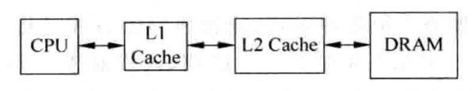

一般来说，`L1 Cache`的容量很小，能够和处理器内核保持在同样的速度等级，`L2 Cache`的访问通常需要消耗处理器的几个时钟周期，但是容量要更大一些。

一般在处理器中，`L2 Cache`会使用写回的方式，但是对于`L1 Cache`来说，写通的实现方式也是可以接受的，这样可以简化流水线的设计，尤其是便于在多核的环境下，管理存储器之间的一致性。

##### Inclusive

如果`L2 Cache`包括了`L1 Cache`中的所有内容，则称`L2 Cache`是`Inclusive`的。


##### Exclusive

如果`L2 Cache`和`L1 Cache`的内容互不相同，则称`L2 Cache`是`Exclusive`的。


#### Victim Cache

`Victim Cache`可以保存最近被踢出`Cache`的数据，因此所有的`Cache set`都可以利用它来提高`way`的个数，通常`Victim Cache`采用全相连的方式，容量都比较小（一般可以存储4~16个数据），它在处理器的位置如图：


`Victim Cache`本质上相当于增加了`Cache`中`way`的个数，能够避免多个数据竞争`Cache`中有限的位置，从而降低`Cache`的缺失率。一般情况下，`Cache`和`Victim Cache`存在互斥关系，也就是它们不会包含同样的数据，处理器内核可以同时读取它们，如果在`Cache`中没有发现想要的数据，而在`Victim Cache`中找到了，那么只需要使用`Victim Cache`的数据就可以了，这样和`Cache`命中时的效果是一样的，同时`Victim Cache`的数据会被写到`Cache`中，而`Cache`中被替换的数据会写到`Victim Cache`中，这相当于它们互相交换了数据，这个过程其实和`Exclusive`类型的`Cache`是一样的。

#### Filter Cache

还有一种和`Victim Cache`类似的设计思路，称为`Filter Cache`，只不过它是用在`Cache ` `“之前”`，`Victim Cache`使用在`Cache` `“之后”`。当一个数据第一次被使用时，它并不会马上放到`Cache`中，而是首先会被放到`Filter Cache`中，等到这个数据再次被使用时，它才会被搬移到`Cache`中，这样做可以防止那些偶然被使用的数据占据`Cache`，因为这样的数据在以后的时间并不会继续被使用，这种设计思路如图：


#### 预取

当处理器第一次访问一条指令或者一个数据时，这个指令或数据肯定不会在`Cache`中，这样看起来，这种情况引起的缺失似乎是无可避免的，但是实际上，使用`预取`可以缓解这个问题。`预取`本质上也是一种预测技术，它猜测处理器在以后可能使用什么指令或数据，然后提前将其放到`Cache`中，这个过程可以使用硬件完成，也可以使用软件完成，它们最终的目的都是一样的。

##### 硬件预取

由于程序本身是串行执行，猜测后续会执行什么指令相对是比较容易的，因此只需要在访问`I-Cache`中的一个数据块的时候，将它后面的数据块也取出来放到`I-Cache`中。而由于程序中存在分支指令，所以这种猜测有时候也会出错，导致不会被使用的指令进行了`I-Cache`，不仅浪费了时间，还会影响处理器的执行效率，为了避免这种情况的发生，可以将预取的指令放到一个单独的缓存中，如图所示：


当`I-Cache`发生缺失时，除了将需要的数据块从下级存储器取出来并放到`I-Cache`中，还会将下一个数据块也读取出来，只不过它不会放到`I-Cache`中，而是放到一个称为`Stream Buffer`的地方，在后续执行时，如果在`I-Cache`中发生了缺失，但是在`Stream Buffer`中找到了想要的指令，那么除了使用`Stream Buffer`中读取的指令之外，还会将其中对应的数据块搬移到`I-Cache`中，同时继续从`L2 Cache`中读取下一个数据块放到`Stream Buffer`中。

不同于指令的预取，数据预取的规律更加难以捕捉。一般情况下，当访问`D-Cache`发生缺失时，除了将所需要的数据块从下级存储器中取出来之外，还会将下一个数据块也读取出来。

##### 软件预取

在程序的编译阶段，编译器就可以对程序进行分析，进而知道哪些数据是需要预取的，如果在指令集中设有预取指令，那么编译器就可以直接控制程序进行预取，此时的预取就是比较有针对性的了。

还需要注意的是，使用软件预取的方法，当执行预取指令的时候，处理器需要能够继续执行，也就是继续能够从`D-Cache`中读取数据，而不能够让预取指令阻碍了后面指令的执行，这就要求`D-Cache`是非阻塞结构的。

在实现了虚拟存储器的系统中，预取指令有可能会引起一些异常，例如发生`Page Fault`、`虚拟地址错误（Virtual Address Fault）`或者`保护违例（Protection Violation）`等。此时有两种选择，如果对这些异常进行处理，就称这种预取指令为处理错误的预取指令；反之，如果不对这些异常进行处理，并抛弃掉这条预取指令，就称这种预取指令为不处理错误的预取指令，此时发生异常的预取指令就会变成一条空指令，这种方法符合预取指令的定位，对于程序员来说是不可见的，现代的很多处理器都采用了这种方式。

### 多端口Cache

在超标量处理器中，为了提高性能，处理器需要能够在每周期同时执行多条`load/store`指令，这需要一个多端口的`D-Cache`，以便能够支持多条`load/store`指令的同时访问。而由于`D-Cache`的容量很大，如果采用多端口的设计，会对芯片面积和速度带来很大的负面影响，因此需要采用一些方法来解决这个问题，如`True Multi-port`、`Multiple Cache Copies`和`Multi-banking`。

#### True Multi-port

该方法通过一个多端口的`SRAM`来实现多端口的`Cache`，在这种设计中，所有在`Cache`中的控制通路和数据通路都需要进行复制，因此增大了面积，并且由于这种多端口的`SRAM Cell`需要驱动多个读端口，因此需要更长的访问时间，对于处理器周期时间的负面影响是很大的。

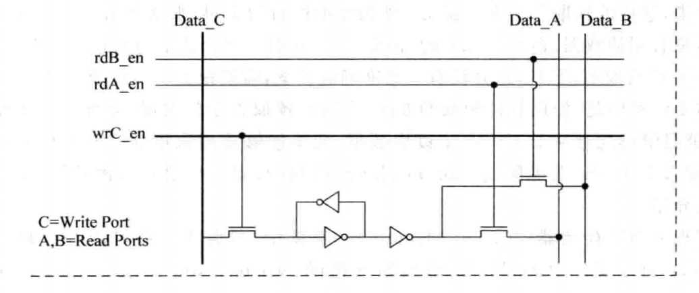

#### Multiple Cache Copies

该方法将`Tag SRAM`和`Data SRAM`进行了复制，因此`SRAM`将不再需要使用多端口的结构，这样可以基本上消除对处理器周期时间的影响。但是这种方法浪费了很多的面积，而且需要保持两个`Cache`间的同步，当对其中一个`Cache`操作时，需要对另一个`Cache`进行相同的操作，设计较为麻烦。


#### Multi-banking

该方法将`Cache`分为很多小的`bank`，每个`bank`都只有一个端口，如果在一个周期之内，`Cache`的多个端口上的访问地址位于不同的`bank`之中，那么这样不会引起任何问题，只有当两个或者多个端口的地址位于同一个`bank`之中时，才会引起冲突，称之为`bank冲突`。使用这种方法，一个双端口的`Cache`仍旧需要两个地址解码器、两个多路选择器、两套比较器和两个对齐器，而`Data SRAM`此时不需要实现多端口结构了，这样就提高了速度，并在一定程度上减少了面积。但是由于需要判断`Cache`的每个端口是不是命中，所以对于`Tag SRAM`来说，仍旧需要提供多个端口同时进行读取的功能，也就是需要采取多端口`SRAM`来实现，或者采用将单端口`SRAM`进行复制的方法。


影响这种多端口`Cache`性能的一个关键因素就是`bank冲突`，可以采取更多的`bank`来缓解这个问题，使`bank冲突`发生的概率尽可能降低，并且还可以提高`bank`的利用效率，避免有用的数据都集中在一个`bank`的情况发生（这个功能或许还需要编译器的配合才可以实现）。

### 超标量处理器的取指令

对于一个`n-way`的超标量处理器来说，它给出一个取指令的地址后，`I-Cache`应该能够至少送出`n`条指令，最简单的实现方法就是使数据块的大小为`n`个字，每周期将其全部进行输出，此时处理器送出的取指令地址应是`n`字对齐的，那么此时就可以实现每周期从`I-Cache`中读取`n`条指令的功能，但在实际情况中，由于存在跳转指令，处理器送出的取指令地址不可能总是`n`字对齐的，因此可以使处理器每周期取出的指令个数多余它能够解码的指令个数，通过一个缓存来将多余的指令缓存起来，这样就可以使后续的流水线得到充足的指令，避免了硬件资源的浪费。

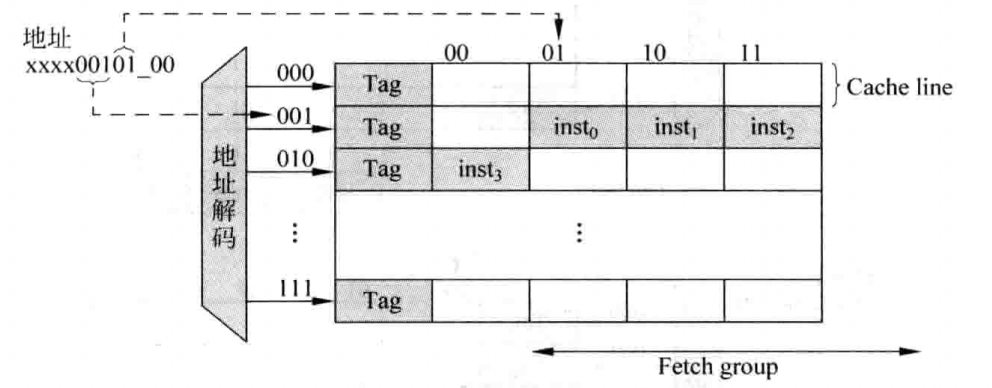

其实，上述的`Cache`仍然可以进行改进，即使取指令的地址不是`n`字对齐的，仍旧可以在一个周期内读取`n`条指令，最简单的方法就是使数据块变大，如使其包含`2n`个字，只要取指令的地址不是落在数据块的最后`n-1`个字上，就可以在每周期内读取`n`条指令。由于在实际的版图设计中，每块`SRAM`周围都需要摆放一圈保护电路，如果`SRAM`的个数过多，会导致这些保护电路也占用过多的面积，因此在这种`Cache`中，一个`2n`个字数据块仍旧通过`n`个`SRAM`来实现，也就是说，一个`Cache line`中包含的`2n`个字实际上占据了`SRAM`的两行。这样每次`Cache`命中时，每个`SRAM`的两行数据都是有效的，可以从这`2n`个字中选择`n`条指令。通过上面的描述，可以看出这个`Cache`需要两个额外的控制电路，一个控制电路用于产生每个`SRAM`的读地址，而真正要生成`SRAM`的地址还需要`Index`部分的配合才可以实现，`Index`部分用来寻址整个`Cache`，从而找到对应的`Cache set`；第二个控制电路用来将四个`SRAM`输出的内容进行重排序，使其按照程序中规定的原始顺序进行排序，重排序逻辑电路如下：


当取指令的地址指向了`Cache line`中最后`n-1`条指令的某一个时，此时在本周期并不能输出`n`条指令，因此在重排序逻辑电路中还需要加入指示每条指令是否有效的标志信号，这样才能够将有效的指令写入到后续的指令缓存`IB`中。

## 虚拟存储器

在没有使用虚拟地址的系统中，处理器输出的地址会直接送到物理存储器中，这个过程如图所示：


而如果使用了虚拟地址，则处理器输出的地址就是虚拟地址了，这个地址不会被直接送到物理存储器，而是需要先进行地址转换，负责地址转换的部件一般称为`内存管理单元（MMU）`。


通过操作系统动态地将每个程序的虚拟地址转化为物理地址，可以使得程序员在编写程序的时候，不需要考虑地址的限制，每个程序都认为处理器中只有自己在运行；同时，还可以实现程序的保护与程序间的共享。

### 地址转换

当前大多数处理器都使用基于`分页机制`的虚拟存储器，虚拟地址空间的划分以`页`为单位，典型的`页`大小为`4KB`，相应的物理地址空间也进行同样大小的划分；物理地址空间的划分以`frame`为单元，它和`页`的大小相等。

对于一个虚拟地址`VA`来说，`VA[11:0]`用来表示页内的位置，称为`page offset`，`VA`剩余的部分用来表示哪个`页`，也称为`VPN`。相应的，对于一个物理地址`PA`来说，`PA[11:0]`用来表示`frame`内的位置，称为`frame offset`，`PA`剩余的部分用来表示哪个`frame`。也称为`PFN`。由于`页`和`frame`的大小是一样的，所以从`VA`到`PA`的转化实际上也就是`VPN`到`PFN`的转化，`offset`的部分是不需要变化的。


当`MMU`发现`页`没有被映射之后，就产生一个`Page Fault`的异常送给处理器，这时候处理器就需要转到`Page Fault`对应的异常处理程序中处理这个事情，它必须从物理内存的`frame`中找到一个当前很少被使用的`frame`，然后将其与原来映射`page`解除映射关系，再把需要的内容从硬盘搬移到物理内存中该`frame`的空间，并将需要的`page`标记为该`frame`；如果被替换的`frame`是`dirty状态`，还需要先将它的内容搬移到硬盘中。处理完上述的内容，就可以从`Page Fault`的异常处理程序中进行返回。

#### 单级页表

在使用虚拟存储器的系统中，会使用一张表格来存储从虚拟地址到物理地址（实际上是`VPN`到`PFN`）的对应关系，这个表格称为`页表（PT）`，一般`PT`会被放置于物理内存中，使用虚拟地址来寻址，表格中被寻址的内容就是这个虚拟地址对应的物理地址。每个程序都有自己的页表，为了指示一个程序的页表在物理内存中的位置，在处理器中一般都会包括一个寄存器，用来存放当前运行程序的页表在物理内存中起始地址，这个寄存器称为`页表寄存器（PTR）`，每次操作系统将一个程序调入物理内存中执行的时候，就会将寄存器`PTR`设置好，下图表示了如何使用`PTR`从物理内存中定位到一个页表：

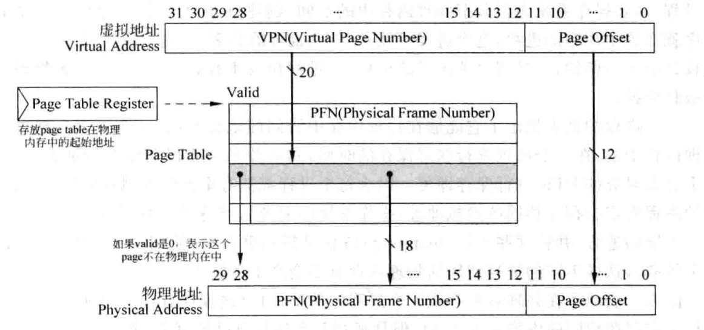

一个进程的页表指定了它能够在物理内存中访问的地址空间，这个页表位于物理内存当中，在一个进程进行状态保存的时候，并不需要保存整个页表，只需要将这个页表对应的`PTR`进行保存即可。因为每个进程都拥有全部的虚拟存储器空间，因此不同的进程肯定会存在相同的虚拟地址，操作系统需要负责将这些不同的进程分配到物理内存中不同的地方，并将这个映射信息更新到`页表`中（使用`store`指令就可以完成这个任务），这样不同的进程使用的物理内存就不会产生冲突了。

由于要得到一个虚拟地址对应的数据，需要访问两次物理内存。第一次访问物理内存中的页表，得到对应的物理地址；第二次使用这个物理地址来访问物理内存，得到需要的数据，而由于物理内存的访问速度和处理器的速度相比是很慢的，现实当中的处理器都会使用`TLB`和`Cache`来加快这个过程。

#### 多级页表

事实上，一个程序很难使用完整的虚拟存储器空间，大部分程序只是用了很少一部分，这就造成了页表中大部分内容都是空的，并没有被实际地使用，这样整个页表的利用效率是很低的。可以采用很多方法来减少一个进程的页表对于存储空间的需求，最常用的方法是多级页表，这种方法可以减少页表对于物理存储空间的占用，而且非常容易使用硬件来实现。

在多级页表的设计中，一个线性页表被划分为若干个更小的`子页表`，处理器在执行进程的时候，不需要一次把整个线性页表放入物理内存中，而是根据需求逐步放入这些子页表。而且，这些子页表不再需要占用连续的物理内存空间了，也就是说，两个相邻的子页表可以放在物理内存中不连续的位置，这样也提高了物理内存的利用效率。但是，由于所有的子页表是不连续地放在物理内存中，所以仍旧需要一个表格，来记录每个子页表在物理内存中存储的位置，称这个表格为第一级页表，而那些子页表则为第二级页表。


这样，要得到一个虚拟地址对应的数据，首先需要访问第一级页表，得到这个虚拟地址所属的第二级页表的基地址，然后再去第二级页表中才可以得到这个虚拟地址对应的物理地址，这时候就可以在物理内存中取出相应的数据了。


在一个页表中的`表项`简称为`PTE`，当操作系统创建一个进程时，就在物理内存中为这个进程找到一块连续的空间，存放这个进程的第一级页表，并且将第一级页表在物理内存中的起始地址放到`PTR`寄存器中。随着这个进程的执行，操作系统会逐步在物理内存中创建第二级页表，每次创建一个第二级页表，操作系统就要将它的起始地址放到第一级页表对应的表项中。

需要注意的是，使用这种多级页表的结构，要得到一个虚拟地址对应的数据需要多次访问物理内存：


利用虚拟存储器，可以管理每一个页的访问权限，这些权限的管理就是通过`页表`来实现的，通过在页表中设置每个页的属性，操作系统和内存管理单元`MMU`可以控制每个页的访问权限，这样就实现了程序的权限管理。

#### Page Fault

如果一个进程中的虚拟地址在访问页表时，发现对应的`PTE`中，`有效位`为`0`，这就表示这个虚拟地址所属的页还没有被放到物理内存中，因此在页表中就没有存储这个页的映射关系，这时候就说发生了`Page Fault`，需要从下级存储器，例如硬盘中，将这个页取出来，放到物理内存中，并将这个页在物理内存中的起始地址写到页表中。`Page Fault`是`异常`的一种，通常由操作系统来完成。

需要注意的是，直接使用虚拟地址并不能知道页位于硬盘的哪个位置，也需要一种机制来记录一个进程的每个页位于硬盘中的位置。通常，`操作系统`会在硬盘中为一个进程的所有页开辟一块空间，称为`swap`空间，在这个空间中存储一个进程所有的页，操作系统在开辟`swap`空间的同时，还会使用一个表格来记录每个页在硬盘中存储的位置，这个表格的结构其实和`页表`是一样的，它可以单独存在，也可以和`页表`合并在一起，如图所示：


在虚拟存储器的系统中，一般采用了`写回`的方式，因此在发生`Page Fault`的时候，操作系统需要从物理内存中找到一个页进行替换（当物理内存没有空闲的空间时），这就需要操作系统实现替换算法，以便能够找到一个最近不经常被使用的页。操作系统可以使用`LRU`算法进行替换，但是要达到这样的功能，操作系统要使用复杂的数据结构才可以精确地记录物理内存中哪些页最近被使用，这样的代价是很大的；每次执行访问存储器的指令，都需要操作系统更新这个数据结构。为了帮助操作系统实现这个功能，需要处理器在硬件层面提供支持，这可以在页表的每个`PTE`中增加一位，用来记录每个页最近是否被访问过，这一位称为`使用位`，当一个页被访问时，`使用位`被置为`1`，操作系统周期性地将这一位清零，然后过一段时间再去查看它，这样就能够知道每个页在这段时间是否被访问过，那些最近这段时间没有被使用过的页就可以被替换了。这种方式是近似的`LRU`算法，被大多数操作系统所使用，由于使用了硬件来实现`使用位`，所以操作系统的任务量被大大地减轻了。

需要注意的是，在`写回`类型的`Cache`中，`load/store`指令在执行的时候，只会对`D-Cache`起作用，对物理内存中`页表`的更新可能会有延迟，当操作系统需要查询页表中的这些状态位时，首先需要将`D-Cache`中的内容更新到物理内存中，这样才能够使用到页表中正确的状态位。


不发生`Page Fault`时的访问流程：


发生`Page Fault`时的访问流程：

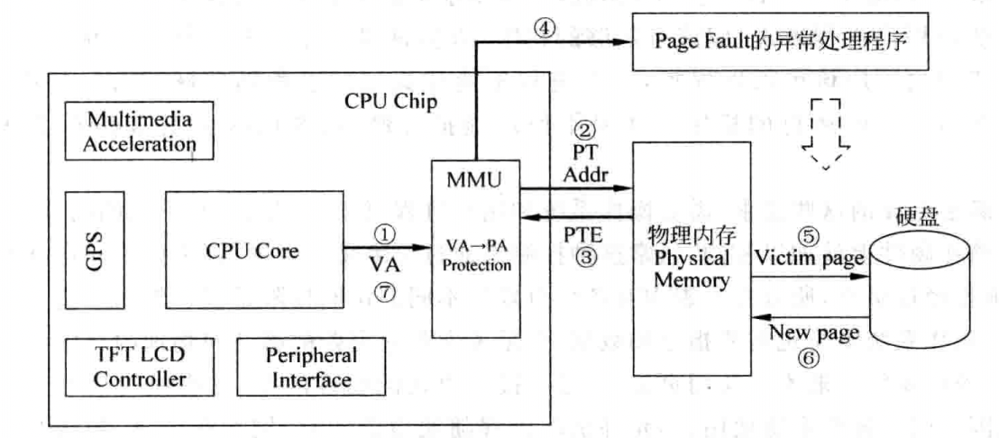

### 程序保护

在页表中规定了每个页的访问权限，因此一旦发现当前的访问不符合规定，例如一个页不允许用户进程访问，但是当前的用户进程却要读取这个页内的某个地址，这样就发生了非法的访问，会发生一个异常来通知处理器，使处理器跳转到异常处理程序中，这个处理程序一般是操作系统的一部分，由操作系统决定如何处理这种非法的访问，加入程序保护之后的地址转换如图：

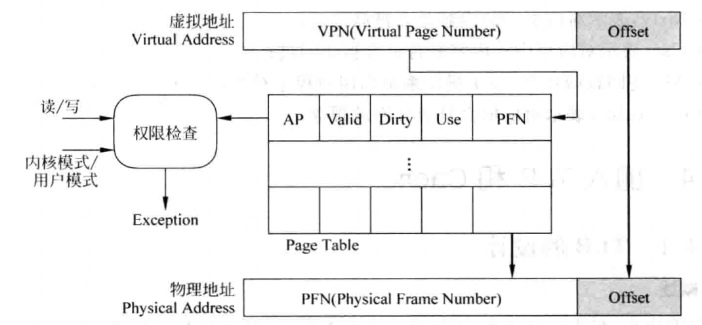

如果采用了两级页表的结构，上图为第二级页表的工作过程，事实上在第一级页表中也可以进行权限控制，而且可以控制更大的地址范围。

存在`D-Cache`的系统中，处理器送出的虚拟地址经过页表转化为物理地址之后，并不会直接去访问物理内存，而是先访问`D-Cache`。但是，如果处理器送出的虚拟地址并不是要访问物理内存，而是要访问芯片内的外设寄存器，此时对这些寄存器的读写是为了对外设进行操作，因此这些地址是不允许经过`D-Cache`被缓存的，如果被缓存了，那么这些读写将只会在`D-Cache`中起作用，并不会传递到外设寄存器中而真正对外设模块进行操作，因此在处理器的存储器映射中，总会有一块区域，是不可以被缓存的。

到目前为止，总结起来，在页表中的每个`PTE`都包括如下的内容：

1. `PFN`，表示虚拟地址对应的物理地址的页号；
2. `Valid`，表示对应的页当前是否在物理内存中；
3. `Dirty`，表示对应页中的内容是否被修改过；
4. `Use`，表示对应页中的内容是否最近被访问过；
5. `AP`，访问权限控制，表示操作系统和用户程序对当前这个页的访问权限；
6. `Cacheable`，表示对应的页是否允许被缓存。

### 加入TLB和Cache

#### TLB的设计

对于取指令来说，考虑到程序本身的串行性，会顺序地从一个页内取指令，此时若将`PTE`缓存起来能够加快一个页内内容的地址转换速度。缓存`PTE`的部件称之为`TLB`，在`TLB`中存储了页表中最近被使用过的`PTE`，从本质上讲，`TLB`就是页表的`Cache`，但只有时间相关性，因此`预取`是没有办法应用于`TLB`中的。

在现代的处理器中，很多都采用两级`TLB`，第一级`TLB`采用哈佛结构，分为`指令TLB（I-TLB）`和`数据TLB（D-TLB）`，一般采用全相连的方式；第二级`TLB`是指令和数据共用，一般采用组相连的方式，这种设计方法和`多级Cache`是一样的。

下图表示了一个全相连方式的`TLB`：


从处理器送出的虚拟地址首先送到`TLB`中进行查找，如果`TLB`对应的内容是有效的（即`valid`位是1），则表示`TLB`命中，可以直接使用从`TLB`得到的物理地址来寻址物理内存；如果`TLB`缺失（即`valid`位是`0`），那么就需要访问物理内存中的页表，此时有如下两种情况：

1. 在页表中找到的`PTE`是有效的，即这个虚拟地址所属的页存在于物理内存中，那么就可以直接从页表中得到对应的物理地址，使用它来寻址物理内存从而得到需要的数据，同时将页表中的这个`PTE`写回到`TLB`中，供以后使用。
2. 在页表中找到的`PTE`是无效的，即这个虚拟地址所属的页不在物理内存中，此时就应该产生`Page Fault`类型的异常，通知操作系统来处理这个情况，操作系统需要从硬盘中将相应的页搬移到物理内存中，将它在物理内存中的首地址放到页表内对应的`PTE`中，并将这个`PTE`的内容写到`TLB`中。

因为`TLB`采用了全相连的方式，所以相比页表，多了一个`Tag`的项，它保存了虚拟地址的`VPN`，用来对`TLB`进行匹配查找，`TLB`中其他的项完全来自于`页表`，每当发生`TLB`缺失时，将`PTE`从页表中搬移到`TLB`内。

在很多处理器中，还支持容量更大的页，但如果程序利用不到这么大的页，那么就会造成一个页内的很多空间被浪费了，这种现象称为`页内碎片`，它降低了页的利用效率，而且，每次发生`Page Fault`时，更大的页也就意味着要搬移更多的数据，需要更长的时间才能将这样大的页从下级存储器（如硬盘）搬移到物理内存中，这样使`Page Fault`的处理时间变得更长了。为了解决这种矛盾，在现代的处理中都支持大小可变的页，由操作系统进行管理，根据不同应用的特点选用不同的大小的页，这样可以最大限度地利用`TLB`中有限的空间。为了支持这种特性，在`TLB`中需要相应的位进行管理，例如在`MIPS`处理器的`TLB`中，有一个`12`位的`Pagemask`项，它用来指示当前被映射的页的大小。

在`TLB`的所有项中，除了`使用位`和`脏状态位`之外，其他的项在`TLB`中是不会改变的，它们的属性都是只读。

##### TLB缺失

当一个虚拟地址查找`TLB`，发现需要的内容不在其中时，就发生了`TLB`缺失，解决`TLB`缺失的本质就是要从页表中找到对应的映射关系，并将其写回到`TLB`内，这个过程称为`Page Table Walk`，可以使用硬件的状态机来完成这个事情，也可以使用软件来做这个事情。

###### 软件实现Page Table Walk

当发现`TLB`缺失时，硬件把产生`TLB`缺失的虚拟地址保存到一个特殊寄存器中，同时产生一个`TLB`缺失类型的异常，在异常处理程序中，软件使用保存在特殊寄存器当中的虚拟地址去寻址物理内存中的页表，找到对应的`PTE`，并写回到`TLB`中，因此，处理器需要支持直接操作`TLB`的指令，如`写TLB`、`读TLB`等。为了防止在执行`TLB`缺失的异常处理程序时再次发生`TLB`缺失，一般都将这段程序放到一个不需要进行地址转换的区域（这个异常处理程序一般属于操作系统的一部分，而操作系统就放在不需要地址转换的区域），这样处理器在执行这段异常处理程序时，相当于直接使用物理地址来取指令和数据，避免了再次发生`TLB`缺失的情况。使用软件处理`TLB`缺失的过程如图所示：


###### 硬件实现Page Table Walk

硬件实现一般由内存管理单元`MMU`完成，当发现`TLB`缺失时，`MMU`自动使用当前的虚拟地址去寻址物理内存中的页表。多级页表的最大优点就是容易使用硬件进行查找，只需要使用一个状态机，逐级进行查找就可以了，如果从页表中找到`PTE`是有效的，那么就将它写回到`TLB`中，这个过程全部都是由硬件自动完成的，软件不需要做任何事情。而如果`MMU`发现查找到的`PTE`是无效的，那么`MMU`会产生`Page Fault`类型的异常，由操作系统来处理这个情况。使用硬件处理`TLB`缺失的方法更适合超标量处理器，它不需要打断流水线，但是这需要操作系统保证页表已经在物理内存中建立好了，并且操作系统也需要将页表的基地址预先写到处理器内部对应的寄存器中（例如`PTR`寄存器），这样才能够保证硬件可以正确地寻址页表。

采用软件处理`TLB`缺失可以减少硬件设计的复杂度，而采用硬件处理`TLB`缺失则会复杂一些，除了需要使用硬件状态机来寻址页表之外，还需要将整个流水线都暂停，等待`MMU`处理这个`TLB`缺失，只有它处理完了，才可以使流水线继续执行，软硬件处理`TLB miss`的对比如下：


由于软件处理`TLB`缺失需要将流水线中的全部指令都清空，因此将这些指令重新取回到流水线中所耗费的时间也会比较长，这导致在超标量处理器中，软件处理`TLB`缺失需要更长的时间。而一旦由`TLB`缺失转变成`Page Fault`，所需要的处理时间就取决于页的替换算法，以及被替换的页是否是脏状态等因素了。

对于`组相连`或`全相连`结构的`TLB`，当一个新的`PTE`被写到`TLB`中时，如果当前`TLB`中没有空闲的位置了，那么就要考虑将其中的一个表项进行替换，例如最近最少使用算法。但是实际上对于`TLB`来说，`随机替换算法`是一种比较合适的方法，由于很难实现严格的随机，此时仍然可以采用一种称为`时钟算法`的方法来实现近似的随机。

##### TLB的写入

操作系统可以认为，被`TLB`记录的所有页都是需要被使用的，这些页在物理内存中不能够被替换。操作系统可以采用一些办法来记录页表中哪些`PTE`被放到了`TLB`中，而`TLB`中记录的所有页都不允许从物理内存中被替换。

##### 对TLB进行控制

对`TLB`的管理需要包括的内容有如下几点：

1. 能够将`I-TLB`和`D-TLB`的所有表项置为无效；
2. 能够将`I-TLB`和`D-TLB`中某个`ASID`对应的所有表项置为无效；
3. 能够将`I-TLB`和`D-TLB`中某个`VPN`对应的表项置为无效。

###### MIPS中对TLB进行控制的指令


`MIPS`中，一个典型的`TLB miss`的异常处理程序如下：

``` assembly
mfc0  $k1 context  // 将寻址PT的地址放到寄存器$k1中
lw    $k1, 0($k1)  // 寻址PT，将得到的PTE放到寄存器$k1中
mtc0  $k1, EntryLo // 将PTE放到寄存器EntryLo中
tlbwr              // 将EntryLo和EntryHi寄存器的内容随机写到TLB中
eret               // 从TLB异常处理程序中退出
```

#### Cache的设计

##### Virtual Cache

使用虚拟存储器，处理器送出的地址需要先经过`TLB`才能再访问物理`Cache`，因此必然会增加流水线的延迟，因此可以使用`Cache`来直接缓存从虚拟地址到数据的关系，这种`Cache`称为`虚拟Cache`，使用`虚拟Cache`的工作流程如图：


由于虚拟地址的属性和物理地址是不同的，每个物理地址总是有且只有一个物理内存中的位置和它对应，而使用`虚拟Cache`则会引入问题，可以概括为`同义问题`和`同名问题`。

###### 同义问题

即多个不同的名字对应相同的物理位置，使用`bank`的方法解决重名问题的方法如下：

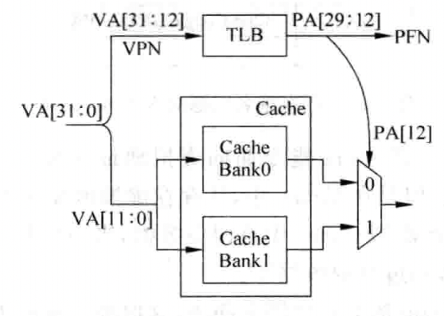

###### 同名问题

即相同的名字对应不同的物理位置，由于无法直接从虚拟地址中判断它属于哪个进程，那么就可以为每个进程赋一个编号`ASID`，每个进程中产生的虚拟地址都附上这个编号，这个编号就相当于是虚拟地址的一部分，这样不同进程的虚拟地址就肯定是不一样的了。

当多个进程想要共享同一个页时，就需要在`ASID`之外再增加一个标志位，称之为`Global`位，当一个页不只是属于某一个进程，而是被所有的进程共享时，就可以将这个`Global`位置为`1`，这样在查找页表的时候，就过发现`Global`是`1`，那么就不需要再理会`ASID`的值，使用了`ASID`之后的地址转换如图：


加入`ASID`后，相当于虚拟地址是`40`位，此时第一级页表和第二级页表可能过大，导致其内部出现碎片，降低页表的利用效率，因此可以采取三级页表的方式：

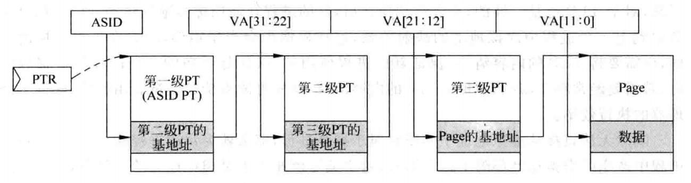

当系统中运行的进程超过`ASID`能够表示的最大范围时，此时就需要操作系统从已经存在的`ASID`中挑出一个不经常使用的值，将它在`TLB`中对应的内容情况，并将这个`ASID`分配给新的进程。由于此时新的进程会更新`PTR`寄存器，为了能够对旧的进程进行恢复，操作系统需要将被覆盖的`PTR`寄存器的值保存起来，这样等到这个旧的进程再次被执行时，就可以知道它存在于物理内存的哪个位置了。

##### 对Cache进行控制

对`Cache`进行的操作有如下几种：

1. 能够将`I-Cache`内的所有`Cache line`都置为无效；
2. 能够将`I-Cache`内的某个`Cache line`置为无效；
3. 能够将`D-Cache`内的所有`Cache line`进行`clean`；
4. 能够将`D-Cache`内的某个`Cache line`进行`clean`；
5. 能够将`D-Cache`内的所有`Cache line`进行`clean`，并置为无效；
6. 能够将`D-Cache`内的某个`Cache line`进行`clean`，并置为无效。

在上面的描述中，`Cache`的`clean`操作指的是将`脏状态`的`Cache line`写回到物理内存的过程。

###### MIPS风格的Cache管理

在`MIPS`处理器中，直接使用指令来完成对`Cache`的控制，这条指令就是`CACHE指令`，它的格式如图所示：


这条指令由指定的寄存器加上`16`位的立即数来共同产生一个地址，这个地址被`MIPS`称为`EA`，即`EA = GPR[base] + offset`。这个地址可以用作普通的虚拟地址从而直接寻址`Cache`，而在`MIPS`处理器中，也可以使用`set/way`的信息来直接寻址`Cache`，`set/way`的信息在这个地址`EA`中直接指定，总结起来，这个有效地址`EA`的用处如表所示：


在`5`位的`op`部分中，后`2`位用来指定对何种`Cache`进行操作，它的内容如下所示：


`op`的高`3`位用来指定操作的类型，如表所示：


#### 将TLB和Cache放入流水线

##### Physically-Indexed, Physically-Tagged

在使用虚拟存储器的系统中，仍旧可以使用物理`Cache`，因为处理器送出的虚拟地址`VA`会首先被`TLB`转换为对应的物理地址`PA`，然后使用物理地址来寻址`Cache`，此时就像是没有使用虚拟存储器一样，直接使用了物理`Cache`，并且使用物理地址的一部分作为`Tag`，这种设计的示意图如图所示：


因为这种设计方法完全串行了`TLB`和`Cache`的访问，所以很少被真实的处理器采用。

##### Virtually-Indexed, Physically-Tagged

这种方法使用了`虚拟Cache`，根据`Cache`的大小，直接使用虚拟地址的一部分来寻址这个`Cache`（这就是`virtually-indexed`），而在`Cache`中的`Tag`则使用物理地址中的`PFN`（这就是`Physically-tagged`），大多数的现代处理器都使用了这种方式。

如图为使用了这种方式的`直接映射`结构的`Cache`：


重名问题可以通过`L2 Cache`来解决：


##### Virtually-Indexed, Virtually-Tagged

在这种方式中，直接缓存了从虚拟地址到数据的过程，它会使用虚拟地址来寻址`Cache`（也就是`virtually-indexed`），并使用虚拟地址作为`Tag`（也就是`virtually-tagged`）。如果`Cache`命中，那么直接就可以从`Cache`中获得数据，都不需要访问`TLB`；如果`Cache`缺失，那么就仍旧需要`TLB`来将虚拟地址转换为物理地址，然后使用物理地址去寻址`L2 Cache`，从而得到缺失的数据。

重名问题仍旧可以通过`L2 Cache`来解决：

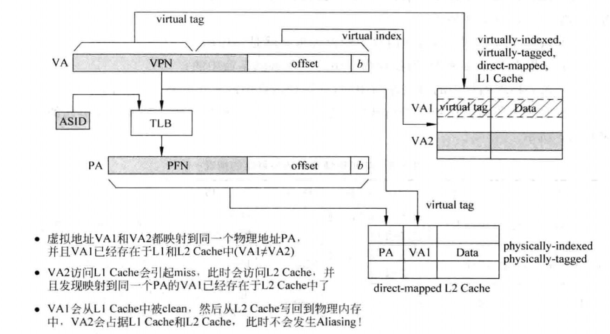

##### 访问存储器时各种可能的情况


## 分支预测

随着处理器并行度的提高以及流水线的加深，静态分支预测算法已经不能够满足复杂处理器对性能的要求，需要更准确的分支预测方法，能够根据处理器实际的执行情况，动态地对分支指令进行预测。动态分支预测并不简单地预测分支指令一直发生跳转或者不跳转，而是会根据分支指令在过去一段时间的执行情况来决定预测的结果。

要进行分支预测，首先需要知道从`I-Cache`取出来的指令中，哪条是分支指令，对于每周期取出多条指令的超标量处理器来说，这需要从指令组`fetch group`中找出分支指令。从指令组中的指令从`I-Cache`取出来之后，可以进行快速的解码，这只需要辨别解码指令是否是分支指令，然后将找到的分支指令对应的`PC`值送到分支预测器，就可以对分支指令进行预测了：


然而，由于`I-Cache`的访问可能需要多个周期才可以完成，采用上图所示的方式进行分支预测，从开始取指令直到分支预测得到结果，中间需要间隔好几个周期，在这些周期内无法得到准确的预测结果，只能够顺序地取指令，也就相当于这些周期都是预测分支指令不发生跳转，这样就降低了分支预测的准确度，造成了处理器性能的降低。

在流水线中，分支预测是越靠前越好的，因此分支预测的最好时机就是在当前周期得到取指令地址的时候，在取指令的同时进行分支预测，这样在下个周期就可以根据预测的结果继续取指令。对于一条指令来说，它的物理地址是会变化的（这取决于操作系统将它放到物理内存的位置），而它的虚拟地址，也就是`PC`值，是不会变化的。因为在一个进程内，每一个`PC`值对应的指令是固定的，不可能出现一个`PC`值对应多条指令的情况，所以使用`PC`值进行分支预测，只不过在进行进程切换之后，需要将分支预测器中的内容进行情况，这样可以保证不同进程之间的分支预测不会互相干扰，如果使用了`ASID`，那么可以将它和`PC`值一起进行分支预测，此时就不需要在进程切换时情况分支预测器了，这个过程如图所示：


### 分支指令的方向预测

对于分支指令来说，它的方向只有两个：发生跳转`taken`和不发生跳转`not taken`，因此可以用`1`和`0`来表示。

#### 根据最后一次结果进行预测

该方法直接使用上次分支的结果：

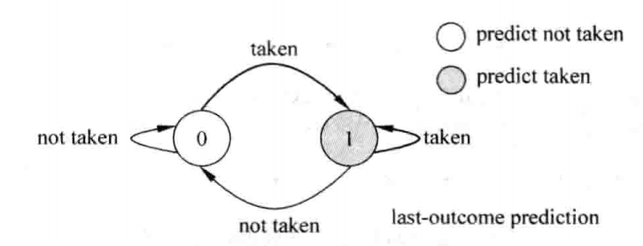

但是如果分支指令的方向每次都发生变化，则使用最后一次指令的结果进行分支预测的方法，它的失败率将是`100%`。

#### 基于两位饱和计数器的分支预测

基于两位饱和计数器的分支预测并不会马上使用分支指令上一次的结果，而是根据一条分支指令前两次执行的结果来预测本次的方向，这种方法可以用一个有着`4`个状态的状态机来表示，这四个状态分别如下：

1. `Strongly taken`：计数器处于饱和状态，分支指令本次会被预测发生跳转，编码为`11`；
2. `Weakly taken`：计时器处于不饱和状态，分支指令本次会预测发生跳转，编码为`10`；
3. `Weakly not taken`：计数器处于不饱和状态，分支指令本次会预测不发生跳转，编码为`01`；
4. `Strongly not taken`：计数器处于饱和状态，分支指令本次会被预测不发生跳转，编码为`00`。

整个状态机如图所示：


可以使用格雷码对状态机进行编码，保证在状态转换时每次只有一位发生变化，这样可以减少出错的概率，并降低功耗。

分支预测都是以`PC`值为基础进行的，正常来说，每一个`PC`值都应该对应一个两位的饱和计数器，因此，对于`32`位的`PC`值来说，共需要$2^{30}\times 2b$但是实际芯片当中无法使用这样大的存储器。考虑到并不是所有的指令都是分支指令，一般使用下图所示的方法来存储两位饱和计数器的值：


在上图中，`PHT`是一个表格，这个`PHT`使用`PC`值的一部分来寻址，但是，使用这种方式来寻址`PHT`，必然就导致了`k`部分相同的所有`PC`值都使用同一个两位饱和计数器的值，如果这些`PC`值对应的指令中不止有一条分支指令，那么相互之间肯定会产生干扰，这种情况称为`别名（aliasing）`。但是考虑到这个方法实现起来比较容易，而且占用的存储器资源也不大，因此轻微的预测准确度降低也是能够接受的。

在基于两位饱和计数器的分支预测方法中，别名会降低分支预测的准确度，可以采用一些更高级的方法来避免别名情况的发生，比较典型的方法就是使用`哈希`，对`PC`值进行处理之后再去寻址`PHT`，这个过程如图所示：

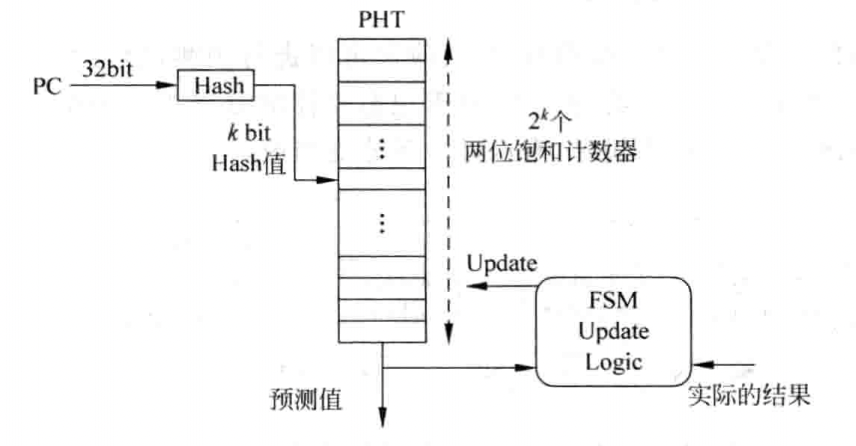

上图的哈希算法能够将`32`位的`PC`值压缩为固定长度的较小的值，这个小的值称为哈希值，在计算机算法领域中，哈希指的就是把任意长度的输入值，通过哈希算法，变为固定长度的输出，一般输出值的长度远小于输入值的长度。哈希算法的实现可以很简单，例如使用普通的异或逻辑，当然为了得到好的效果，也可以做得很复杂。

两位的饱和计数器需要根据分支指令的结果（发生跳转或者不发生跳转）进行更新，有三个时间点可以对`PHT`进行更新：

1. 在流水线的取指令阶段，进行分支预测时，根据预测的结果来更新`PHT`；
2. 在流水线的执行阶段，当分支指令的方向被实际计算出来时，更新`PHT`；
3. 在流水线的`Commit`阶段，当分支指令要离开流水线时，更新`PHT`。

对于第一种方法，因为此时分支预测的结果可能是错误的，使用错误的结果来更新`PHT`是不可靠的。

对于第二种方法，如果对分支指令采用了乱序执行的方式，那么即使在指令阶段得到了一条分支指令的结果，也不能够保证这个结果是正确的，因为这条分支指令可能处于分支预测失败的路径上。

对于第三种方法，在分支指令被确认已经正确执行的时候，更新`PHT`是万无一失的，而考虑到饱和计数器的特点，只要计数器处于饱和状态，它的预测值就会比较固定，因此即使更新`PHT`的时间晚一些，也不会对分支预测的精度产生太大的负面影响。

#### 基于局部历史的分支预测

在这种方法中，会使用一个寄存器来记录一条分支指令在过去的历史状态，当这个历史状态很有规律时，就可以为分支预测提供一个可以利用的工具，这样的寄存器称为分支历史寄存器`BHR`。对一条分支指令来说，通过将它每次的结果（发生跳转或者不发生跳转，用`1`或`0`表示）移入`BHR`寄存器，就可以记录这条分支指令的历史状态了，如果这条分支指令很有规律，那么就可以使用`BHR`寄存器对这条分支指令进行预测，这种分支预测的工作机制如图所示：


如果为每条分支指令都配一个`BHR`和`PHT`，这样需要很大的存储空间，将所有分支指令的`BHR`组合在一起称为分支历史寄存器表`BHT`，在实际当中，`BHT`不可能照顾到每个`PC`，一般都是使用`PC`的一部分来寻址`BHT`，如图所示：

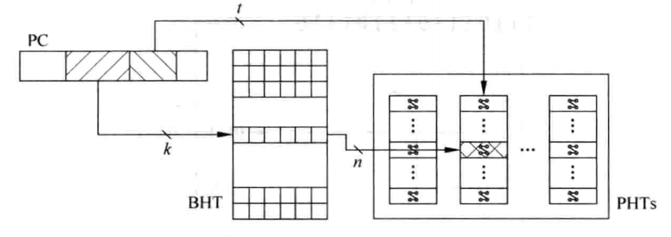

使用`PC`的一部分来寻址`BHT`，得到当前指令对应的分支历史寄存器`BHR`，设`BHR`的宽度为`n`位，则整个`BHT`所占的存储空间为$2^k\times nbit$。

然而，这种方法可能存在两种冲突：

1. 两条分支指令的`PC`值对应的`k`部分相同，此时这两条分支指令就会对应到同一个`BHR`寄存器，也就对应到了`PHT`中的同一个饱和计数器，这样，两条分支指令的结果就会互相干扰，降低了分支预测的准确度。
2. 两条分支指令虽然对应着两个不同的`BHR`，但是这两个`BHT`中的内容是一样的，这样两条分支指令也会共用`PHT`当中的同一个饱和计数器，也会降低分支预测的准确度。

为了避免上述两种情况，可以将`PC`进行哈希处理之后，得到一个固定长度的值，再用词此值来寻址`BHT`，这样可以解决上面提到的情况一当中遇到的问题。从`BHT`中可以得到这条分支指令对应的`BHR`值，再将该`BHR`的值和`PC`值的一部分进行拼接，用得到的新值来寻址`PHT`，从而得到饱和计数器的值，也就是得到了分支预测的结果，这样可以解决上面提到的情况二当中遇到的情况。有多种方法可以将`PC`值和`BHR`值进行处理，如`位拼接法`和`异或法`。


#### 基于全局历史的分支预测

如果对一条分支指令进行分支预测时，考虑到它前面的分支指令的执行结果，则称这种预测方法为基于全局历史的预测。在这种基于全局历史的分支预测方法中，需要一个寄存器来记录程序中所有的分支指令在过去的执行情况，这个寄存器被称为`全局历史寄存器（GHR）`。而`GHR`寄存器不可能记录下所有分支指令的执行结果，因此一般是使用一个有限位宽`GHR`，来记录最近执行的所有分支指令的结果，每当遇到一条分支指令时，就将这条分支指令的结果插入到`GHR`寄存器的右边，`1`表示发生了跳转，`0`表示没有发生跳转，`GHR`寄存器最左边被移出的位会被抛弃掉。

基于全局历史的分支预测方法，最理想的情况是对每条分支指令都使用一个`PHT`，这样每条分支指令都会使用当前的`GHR`来寻址自身对应的`PHT`，这种预测方法的示意图如图所示：


但是这种方法在实际当中是无法使用的，为每个`PC`值都使用一个`PHT`会占据非常大的存储空间，因此一般都会使用`哈希法`将`PC`进行处理，得到位宽很小的值，这样`PHTs`就可以包含少量的`PHT`了，如图所示：


考虑到上面方法中，`PHT`中有很多饱和计数器都没有被使用，因此可以采取一种更简单的方式，即只使用一个`PHT`，如图所示：


上图所示的分支预测方法的缺点是如果两条不同的分支指令所对应的`GHR`值恰好相同的话，那么这两条分支指令就会共用`PHT`中同一个饱和计数器，这样就造成了冲突。为了解决这个问题，仍旧可以将`PC`值和`GHR`做一定的处理，比如`位拼接法`和`异或法`，使用处理之后的结果来寻址`PHT`，这样即使两条不同的分支指令对应同样的`GHR`的值，也不会对应到`PHT`中的同一个饱和计数器，避免了冲突的问题，如图所示：


#### 竞争的分支预测

对于基于局部历史的分支预测和基于全局历史的分支预测，两种预测方法都有着自身的局限性，因此可以设计一种自适应的分支预测方法，根据不同的分支指令和执行情况自动地选择这两种分支预测方法，称为竞争的分支预测，如图所示为这种分支预测方法的原理图：


`P1`表示基于全局历史的分支预测方法，`P2`表示基于局部历史的分支预测方法，对于不同的分支指令会选择不同的预测方法。`CPHT`是由分支指令的`PC`值来寻址的一个表格，类似于`PHT`，它仍是由两位的饱和计数器组成的，当其中一种分支预测方法两次预测失败，而同时另外一种分支预测方法两次预测成功时，会使状态机转到使用另一个分支预测方法的状态，`CPHT`中每个饱和计数器的状态如图所示：


该状态机的转换机制如下：

1. 当`P1`预测正确，`P2`预测错误时，计数器减`1`；
2. 当`P1`预测错误，`P2`预测正确时，计数器加`1`；
3. 当`P1`和`P2`预测的结果一样时，不管预测正确与否，计数器都保持不变。

#### 分支预测的更新

对于分支指令的方向预测来说，需要更新的内容包括两个方面：

1. 历史寄存器，在基于全局历史的分支预测方法中是`GHR`，在基于局部历史的分支预测中是`BHR`。
2. 两位饱和计数器，基于全局历史和基于局部历史的分支预测方法均需要在`PHT`中使用饱和计数器来捕捉历史寄存器的规律，因此也需要对饱和计数器进行更新。

##### 更新历史寄存器

当分支指令到达流水线的`Commit`阶段，要离开流水线而退休时更新`GHR`是最保守的，但是会产生效率问题。假设一条分支指令`b`在时间`t`被分支预测，在时间$t+\Delta t$从流水线中退休并更新`GHR`，任何在$\Delta t$时间段之内被预测的分支指令，都不会从分支指令`b`的结果中获益，这就降低了分支预测的准确度。

当分支指令的方向在`执行`阶段被实际计算出来时更新`GHR`，会导致问题，因为如果对分支指令采用了乱序执行的方式，在执行阶段分支指令可能处于分支预测失败的错误路径中，即使是顺序执行分支指令的处理器，由于`异常`的处理需要清空流水线，分支指令在执行阶段的结果未必一定会写到`GHR`中，因此在执行阶段更新`GHR`也并不一定是正确的。

综合来看，最好在取指令阶段，根据分支预测的结果对`GHR`进行更新，这可以使后续的分支指令使用到最新的`GHR`，而且，当一条分支指令的分支预测失败时，即使后续的分支指令都使用了错误的`GHR`也不会产生影响，因为它们会被从流水线中清除。这种更新的`GHR`的方式在分支预测失败时，需要一种机制对`GHR`进行修复，使`GHR`能够恢复到正确的值，有如下两种修复方法。

###### Commit阶段修复法

在流水线的提交阶段防止一个`GHR`，每当一条分支指令退休的时候，就会将它的结果更新到这个`GHR`中，这个`GHR`称做`Retired GHR`，这样处理器中就有了两个`GHR`：在前端取指令阶段的`GHR`，它用来进行分支预测，采用了推测的方式进行更新；在后端提交阶段的`GHR`，每当一条分支指令退休的时候才会更新它，因此这个`GHR`肯定时正确的。当一条分支指令发现分支预测失败的时候，表明此时前端的`GHR`肯定是错误的，需要进行修复，此时只需要等待分支指令退休的时候，将后端的`GHR`写到前端的`GHR`中，就完成了前端`GHR`的修复，然后根据这条分支指令所指定的目标地址，重新取指令来执行即可。


使用这种方法对`GHR`进行修复，缺点是会造成分支预测失败时惩罚的增大。

###### Checkpoint修复法

在取指令阶段对前端的`GHR`进行更新的同时，可以将旧的`GHR`值保存起来，这个保存的内容就称为`Checkpoint GHR`。一旦这条分支指令的结果在流水线中被计算出来，就可以对这条分支指令的分支预测是否正确进行检查了，如果发现分支预测正确，说明此时前端`GHR`中的值是正确的，那么继续执行就可以了；如果发现其分支预测失败，那么就将这条分支指令对应的`Checkpoint GHR`恢复到前端的`GHR`中，并从这条分支指令正确的目标地址开始取指令来执行，这个过程如图所示：


由于分支预测发生在取指令阶段，此时指令之间仍然保持着顺序的方式，所以存储`Checkpoint GHR`的存储器只需要按照`FIFO`的方式进行写入就可以了；如果后续的流水线采用顺序的方式来执行分支指令，那么读取上述存储器也只需要按照`FIFO`的方式即可。而对于乱序执行分支指令的流水线来说，在执行阶段得到的分支指令的结果仍旧有可能是错误的，因为这条分支指令可能处于分支预测失败的路径上，也可能处于异常的路径上，所以仍旧需要在流水线的提交阶段对分支指令的预测是否正确进行检查。因此，在提交阶段仍需要放置一个`Retired GHR`，当分支指令退休的时候发现分支预测失败了，或者一条普通的指令发现了异常，都可以将此时的`Retired GHR`写回到前端的`GHR`中，这样就对`GHR`值进行了恢复。

在基于局部历史的分支预测方法中，可以在分支指令退休的时候更新`BHR`，这样可以简化设计，也不会对处理器的性能产生太大的负面影响。

##### 更新饱和计数器

在两种分支预测方法中，一般都是在分支指令退休的时候对`PHT`中的饱和计数器进行更新。

### 分支指令的目标预测

分支指令的目标地址可以分为两种，即直接跳转和间接跳转。对于直接跳转的分支指令，由于它的偏移值是以立即数的形式固定在指令当中，所以它的目标地址也是固定的，只要记录下这条分支指令的目标地址就可以了，当再次遇到这条分支指令时，如果方向预测的结果是发生跳转，那么它的目标地址就可以使用以前记录下的那个值；对于间接跳转的分支指令来说，由于它的目标地址来自于通用寄存器，因此进行目标地址的预测并不容易。然而，程序中大部分间接跳转类型的分支指令是用来处理子程序调用的`CALL`和`Return`指令，这两种指令的目标地址是有规律可循的，因此可以对其进行预测。

#### 直接跳转类型的分支预测

##### BYB

对于直接跳转类型的分支指令来说，它的目标地址有两种情况。

1. 当分支指令不发生跳转时，`目标地址 = 当前分支指令的PC值 + Sizeof(fetch group)`。
2. 当分支指令发生跳转时，`目标地址 = 当前分支指令的PC值 + Sign_extend(offset)`。

由于分支预测是基于`PC`值进行的，不可能对每一个`PC`值都记录下它的目标地址，所以一般都是用`Cache`的形式，使多个`PC`值共用一个空间来存储目标地址，这个`Cache`称为`BTB`，`PC`的一部分作为`Index`来寻址`BTB`，`PC`值的其他部分作为`Tag`，`BTB`中存放着分支指令的目标地址`BTA`。

为了解决`Cache`冲突的问题，可以采用组相连结构的`BYB`，如图所示：

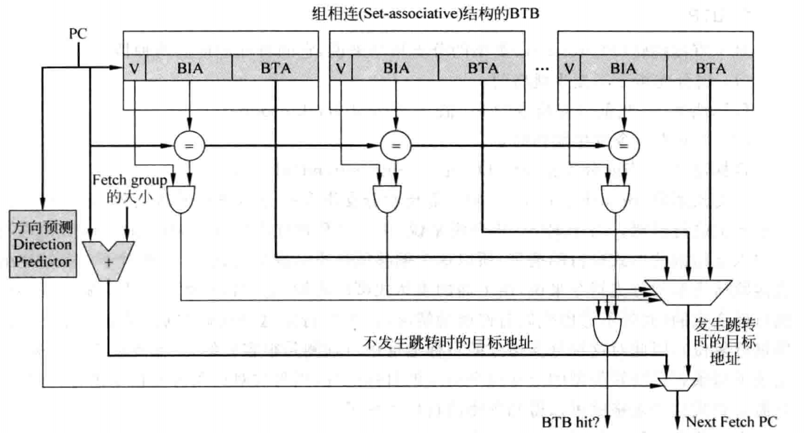

由于组相连结构降低了`BTB`的访问速度，因此在现实世界的处理器中，`BTB`中`way`的个数一般都比较小。

##### BTB缺失的处理

###### 停止执行

对于直接跳转类型的分支指令，在流水线的解码阶段就可以从指令中分离出偏移值，此时就可以将这条分支指令的目标地址计算出来，这个过程的示意图如图所示：


在分支指令的目标地址被计算出来之前，暂停取指令会导致流水线中出现一些气泡，如图所示：


###### 继续执行

对于方向预测会发生跳转的分支指令来说，如果发生了`BTB`的缺失，此时可以使流水线继续使用顺序的`PC`值来取指令。之所以这样做，是考虑到分支指令的方向可能会预测错误，所以当`BTB`发生缺失时，采用顺序的`PC`值来取指令，也存在正确的可能性。

#### 间接跳转类型的分支预测

##### CALL/Return指令的分支预测

在`MIPS`中，使用`JAL`指令作为`CALL`指令，而使用`JR $31`指令作为`Return`指令。对于程序中的一条指定的`CALL`指令来说，它每次调用的子程序都是固定的，也就是说，一条`CALL`指令对应的目标地址是固定的，因此可以使用`BTB`对`CALL`指令的目标地址进行预测，如图所示：

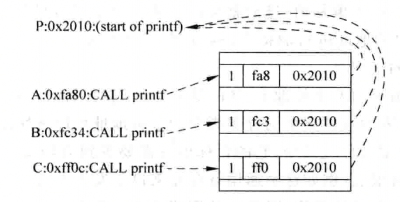

因为`Return`指令的目标地址是不确定的，还因此无法使用`BTB`对它的目标地址进行预测，但是可以看出，`Return`指令的目标地址总是等于最近一次执行的`CALL`指令的下一条指令的地址，因此，可以设计一个存储器，保存最近执行的`CALL`指令的下一条指令的地址，这个存储器是后进先出的，即最后一次进入的数据将最先被使用，称为`RAS`。使用`BTB`对`CALL`指令的目标地址进行预测，使用`RAS`对`Return`指令的目标地址进行预测，过程如图所示：


为了在分支预测阶段通过`PC`判断一条指令是否是`CALL`指令，这需要借助于`BTB`，因为`BTB`中保存了所有发生跳转的分支指令，而`CALL\Return`指令都是永远会发生跳转的，因此它们都会保存在`BTB`中，这需要在`BTB`中增加一项，用来标记分支指令的类型，这样就可以在分支预测阶段识别出`CALL`指令，从而将`PC + 4`的值保存在`RAS`中。

当对`Return`指令进行目标地址预测的时候，需要能够选择`RAS`的输出作为目标地址的值，而不是选择`BTB`的输出值，因此仍需要在分支预测阶段就可以知道指令的类型。

因此，在`BTB`中，除了存储目标地址和`Tag`值之外，还需要存储分支指令的类型：

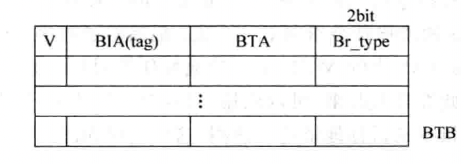

在实际当中，如果一个程序中`CALL`指令嵌套很深，`RAS`已经满了时，有两种方法可以处理：

1. 不对新的`CALL`指令进行处理，此时不修改`RAS`，最后执行的这个`CALL`指令对应的返回地址就会被抛弃掉。
2. 继续按照顺序向`RAS`中写入，此时`RAS`中最旧的那个内容就会被覆盖掉。由于存在递归函数调用的情况，所以这种方法存在正确的可能性。

对于连续执行的同一个`CALL`指令来说，完全可以将它们的返回地址都放到`RAS`中的同一个地方，并用一个计数器来标记`CALL`指令执行的次数，这样相当于扩展了`RAS`的容量，增大了预测的准确度。

##### 其他预测方法

对于非`CALL/Return`的间接跳转类型的分支指令，它的目标地址也可能和过去的执行情况有关系，因此可以利用基于局部历史的分支预测方法中使用`BHR`对目标地址进行预测，如图所示：


上图所示的方法已经在分支指令的方向预测中出现过，只是现在将`PHT`换成了`Target Cache`。

一种完整的分支预测方法如图所示：


### 分支预测失败时的恢复

分支预测是一种预测技术，需要处理器中有对应的验证和恢复机制，在流水线的很多阶段都可以对分支预测是否正确进行检查，它们包括以下几点。

1. 在解码阶段，可以得到一个`PC`值对应的指令是否是分支指令，以及这条分支指令的类型，如果这条指令是直接跳转类型的分支指令，还可以在这个阶段得到它的目标地址，因此在解码阶段可以对一部分的分支指令是否预测正确进行检查。如果此时发现了分支预测失败，可以马上进行恢复，但如果此时仍不能获得处理取指令的正确地址，则可以简单地停止流水线。
2. 在读取物理寄存器的阶段，如果此时读取到了寄存器的值，那么就可以对间接跳转类型的分支指令所预测的目标地址进行检查，如果发现目标地址预测错误了，那么就可以使用正确的地址开始重新取指令，此时可能需要在发射队列中选择性的清除指令。
3. 在执行阶段，不管什么类型的分支指令都可以被计算出结果，此时可以对分支预测是否正确进行检查。对于乱序执行的超标量处理器，此时的流水线中还有部分指令是在这条分支指令之前进入流水线中的，它们不应该受到分支预测失败的影响，可以继续执行，而`ROB`中记录了指令之间本来的顺序，因此可以使用`ROB`对分支预测失败时的处理器进行状态恢复。除了采用基于`ROB`的方法进行分支预测失败时的状态恢复，很多现代的处理器都采用了基于`Checkpoint`的方法进行状态恢复。所谓`Checkpoint`，是指发现分支指令，并且在分支指令之后的指令更改处理器的状态之前，将处理器的状态保存起来，这里所要保存的处理器状态主要是指寄存器重命名中使用的映射表`mapping table`，还有预测跳转的分支指令对应的下一条指令的`PC`值等。为了选择性的清除指令，可以对每一条分支指令进行编号，所有在这条分支指令后面进入到流水线的指令都会得到这个编号，直到遇到下一条分支指令为止。分支指令的编号个数决定了最多可以在流水线中存在的分支指令个数，这个编号值都会保存在一个`FIFO`中，这个`FIFO`称为编号列表`tag list`，它的容量等于处理器最多支持的分支指令的个数。一旦这个列表满了，就不能再向流水线中送入分支指令。因此，如果再解码出分支指令，就会暂停解码阶段之前的流水线，直到编号列表中有空余的空间为止。可以通过`tag list`和`free tag list`分别记录已使用和未使用的编号值，工作流程如下：


需要注意的是，编号值的分配应该放置于解码阶段。

通过编号列表的编号值来找到处于分支预测失败路径上指令的流程如图所示：


其实，并不是一定需要在一个周期之内将`ROB`和`Issue Queue`中的相关指令都清楚掉，因为在流水线的执行阶段发现一条分支指令预测错误时，需要从正确的地址开始取指令，这些新取出来的指令需要经过流水线的好几个阶段才可以到达发射阶段，只要在新指令到达这个阶段之前，`ROB`和`Issue Queue`以及发射阶段之后的其他流水级中的相关指令被清楚，那么流水线就可以使用到正确的状态，不需要暂停了，因此可以每周期只从分支指令的`tag list`广播一个或几个编号值。

在每周期执行多条指令的超标量处理器中，为了避免使用多端口的`FIFO`，可以约定在流水线的解码阶段每周期最多只能处理一条分支指令。如果在解码阶段，发现从`IB`中读出的N条指令中存在多于一条的分支指令，那么第二条分支指令及其后面的所有指令在本周期就不能够进入解码阶段，它们会被延迟到下一个周期。

要想在流水线的后续阶段得到分支指令的预测值，就需要在流水线的解码阶段，将每条指令的预测值保存起来，比如使用缓存来保存那些预测跳转的分支指令：


一条分支指令如果被预测发生跳转，那么会将它的信息写到`PTAB`中，同时这条分支指令在`PTAB`中的地址也随着分支指令在流水线中流动，这样，当这条分支指令到达流水线的执行阶段时，就可以使用这个地址，直接从`PTAB`中找到对应的预测信息了。

`PTAB`只需要保存所有预测预测跳转的分支指令，这样可以减少`PTAB`的容量，在这种情况下，写`PTAB`的过程可以在流水线的取指令阶段完成，只要在取指令阶段预测到一条发生跳转的分支指令，就将其写到`PTAB`中。对于`自修改代码`，执行完成后，需要将`分支预测器`、`I-Cache`等部件中的内容都进行清空，这样才能够保证流水线可以正确地执行被修改过的指令。

### 超标量处理器的分支预测

如果对超标量处理器取指令的过程进行限制，例如对于一个`4-way`的超标量处理器来说，使每周期取出的指令位于四字对齐的边界之内，那么这样就可以使用它们的公共地址来寻址分支预测器，而对于分支预测器来说，它只需要记录下每组四字对齐的指令中，第一个预测跳转的分支指令的信息就可以了。需要注意的是，在`BTB`中需要记录下分支指令在四条指令中的位置，避免有些时候错误地使用它的结果，如图所示：

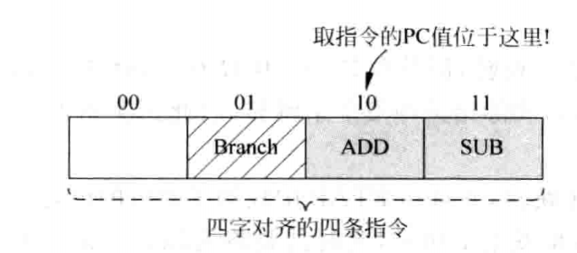

对于一个`4-way`的超标量处理器来说，每周期取出的指令可以不局限于四字对齐的边界之内，那么要达到最理想的效果，就需要对一个周期内取出的所有指令都进行分支预测，将第一个预测跳转的分支指令的目标地址作为下个周期取指令的地址，如图所示：


#### 交叠方式

交叠方式是在超标量处理器中经常使用的一种结构，可以通过单端口存储器来模拟多端口的结构，例如对于`PHT`，可以采用如图的方式实现四个读端口：


在超标量处理器内部，这种`交叠`结构的存储器是经常被使用的，大部分多端口的功能部件都需要使用这种结构，例如`ROB`、`Issue Queue`和`Instruction Buffer`等部件。

## 指令集体系

### 精简指令集概述

#### MIPS指令集

1. `op==000_xxx`时，表示分支和跳转指令（`000000`、`000001`除外），这些指令都是直接跳转类型的（`PC-relative`）；
2. `op==001_xxx`时，表示含有立即数的算术操作指令；
3. `op==100_xxx`时，表示访问存储器的`load`类型的指令；
4. `op==101_xxx`时，表示访问存储器的`store`类型的指令；
5. `op==000_000(Special)`、`000_001(RegImm)`、`011_100(Special2)`和`010_000(COP0)`这四个值时，有着特殊的含义，需要进一步解码才能够知道操作的类型。

在`Special`和`Special2`区域，需要使用指令当中的`Bit[5:0]`才可以进一步区分指令的类型。

## 指令解码

在超标量处理器中，即使是`RISC`指令集，仍存在一些指令不能使用一般指令的处理方式，需要特殊处理，例如有些指令的目的寄存器个数多于一个，这会影响寄存器重命名的过程；再例如，有些`RISC`指令集支持每条指令都可以条件指令，这样的指令在解码时需要进行特殊处理等，因为这些特殊的指令使用的频率并不高，没有必要让后面的流水线增加硬件来对它们进行处理，这需要在解码阶段将它们转换为普通的指令，后面的流水线按照一般指令的处理方式来执行它们。

### 指令缓存

为了减少`I-Cache`缺失带来的影响，处理器可以在取指令阶段从`I-Cache`中取出的指令个数多于每周期可以解码的指令个数，这就需要在取指令阶段和解码阶段之间加入一个缓存，用来将`I-Cache`取出的所有指令保存起来，这个缓存称为`指令缓存(Instruction Buffer)`

## 寄存器重命名

`WAW`和`WAR`相关性最好的解决办法是使用硬件管理的寄存器重命名，处理器中实际存在的寄存器个数要多于指令集中定义的通用寄存器的个数，这些在处理器内部实际存在的寄存器称为物理寄存器，与之对应的，指令集中定义的寄存器称为逻辑寄存器。

处理器在进行寄存器重命名的时候，会动态地将逻辑寄存器映射到物理寄存器，这样可以解决`WAW`和`WAR`的相关性，如图所示为使用寄存器重命名的方法来解决`WAW`和`WAR`相关性的过程：


### 寄存器重命名的方式

对于寄存器重命名来说，有三种方法都可以实现它，这三种方式分别如下：

1. 将逻辑寄存器扩展来实现寄存器重命名；
2. 使用统一的物理寄存器来实现寄存器重命名；
3. 使用`ROB`来实现寄存器重命名。

要实现寄存器重命名，一般都要考虑下面的内容：

1. 什么时候占用一个物理寄存器？这个物理寄存器来自于哪里？
2. 什么时候释放一个物理寄存器？这个物理寄存器去往何处？
3. 发生分支预测失败时，如何进行处理？
4. 发生异常时，如何进行处理？

#### 使用ROB进行寄存器重命名

在超标量处理器中，每条指令都会将自身的信息按照程序中原始的顺序存储到`ROB`中，当一条指令将结果计算出来之后，会将其写到`ROB`中，但是由于分支预测失败和异常等原因，这些结果未必就是正确的，它们的状态被称为推测的。在一条指令离开流水线之前，它都会一直待在`ROB`中，只有当指令变为流水线中最旧的指令，并且被验证为正确的时候，才会离开`ROB`，并使用它的结果对处理器的状态进行更新，这种方式相当于将物理寄存器`PRF`和`ROB`集成到了一起，如图所示：


#### 将ARF扩展进行寄存器重命名

可以使用一个独立的存储部件，用来存储流水线中所有指令的结果，只有那些存在目的寄存器的指令才会占据这个存储部件当中的存储空间，这个存储部件称为`PRF`，它可以看作是`ARF`的扩展，`PRF`可以通过`FIFO`来实现，这和`ROB`是一样的。

指令在进行寄存器重命名的时候，如果它存在目的寄存器，则这条指令会占据`PRF`的一个空间，指令在得到结果之后，会首先将这个结果存储到`PRF`中，等到这条指令退休的时候，才会将它的结果搬移到`ARF`中，这个过程和基于`ROB`进行重命名的方式是一样的。如果`PRF`中已经没有空间了，那么流水线中，寄存器重命名阶段之前的所有流水线都需要暂停，直到流水线中有指令离开而释放`PRF`的空间时，寄存器重命名阶段之前的流水线才可以继续执行，如图所示：


#### 使用统一PRF进行寄存器重命名

在这种方法中，将上一种方法使用的`ARF`和`PRF`进行了合并，合并之后的部件称为统一的`PRF`，在其中存储了所有推测的和正确的寄存器值。在这个`PRF`中，没有和指令产生映射关系的寄存器都是处于空闲状态，使用一个空闲列表来记录这个`PRF`中哪些寄存器处于空闲状态；当一条指令被寄存器重命名，并且它存在目的寄存器的时候，它就会占据`PRF`当中的一个寄存器，这个寄存器就处于被占用的状态，处于这个状态的寄存器会经历值没有被计算出来、值被计算出来但是没有退休、退休这三个过程，在此过程中，并不需要将寄存器的内容进行搬移，这样便于后续的指令读取操作数。这种寄存器重命名的方法也需要一个重命名映射表，用来存储每个逻辑寄存器和物理寄存器的对应关系，如图所示：


一条指令只有退休的时候，它的结果才会被外部看到，此时还需要使用另一个`RAT`，用来存储所有`退休`状态的指令和物理寄存器的对应关系。

当一条指令和后面的某条指令都写到同一个目的寄存器时，则后面的指令退休的时候，前面指令对应的物理寄存器就已经没有用处了，可以将其变为空闲状态，为了实现上述的功能，在`ROB`中，除了记录逻辑寄存器当前对应的物理寄存器之外，还需要存储它之前对应的物理寄存器，以便在指令退休的时候，将它对应的旧映射关系进行释放。

### 重命名映射表

#### 基于SRAM的重命名映射表

在基于`SRAM`的重命名映射表中，表项的个数等于处理器中逻辑寄存器的个数，使用逻辑寄存器的编号作为地址对`sRAT`进行寻址，对于每个逻辑寄存器来说，在`sRAT`中只有一个表项与之对应，如图所示：

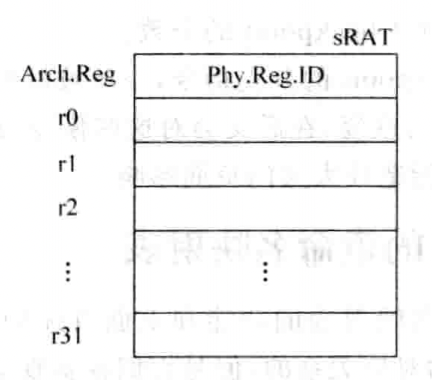

对于`4-way`的超标量处理器来说，每周期最多需要对四条指令进行重命名，也就是`sRAT`需要支持`8`个读端口和`4`个写端口，为了指示哪些物理寄存器是空闲状态的，还需要使用一个表格`Free List`来进行记录；新写入到`sRAT`的值会覆盖掉原来旧的对应关系。

基于`sRAT`的寄存器重命名方法中，不能使用个数太多的`Checkpoint`，而处理器性能的提高要求更多的分支指令存在于流水线中，而由于在超标量处理器中，大量地使用了预测算法，例如分支预测、`load\store`相关性预测、数值预测等，分支指令一旦预测正确，那么它对应的`Checkpoint`就没有作用，因此可以对分支指令预测的正确度也进行预测，对于那些预测正确率很高的分支指令，就不需要对它们使用`Checkpoint`了，而那些经常预测错误的分支指令，对它们就要使用`Checkpoint`，经常预测错误的分支指令只是一小部分，因此这种方法可以大大减少`Checkpoint`的个数。

#### 基于CAM的重命名映射表

在基于`CAM`的重命名映射表`cRAT`中，由于要找到逻辑寄存器和物理寄存器的对应关系，因此逻辑寄存器的编号就是每个表项中保存的内容，而物理寄存器的编号则是最后的结果。在`cRAT`中，表项的个数等于物理寄存器的个数，使用逻辑寄存器的编号对`cRAT`进行`CAM`方式的寻址，每个逻辑寄存器在`cRAT`中只有一个有效的表项与之对应，也就是在任意时刻，每个逻辑寄存器都只有一个物理寄存器与之对应，这可以使用一个有效位`V`来表示。每次对`cRAT`进行`Checkpoint`，只需要保存这个有效位即可，如图所示：


### 超标量处理器的寄存器重命名

#### 解决RAW相关性

若四条指令不存在`RAW`相关性，则四条指令的源寄存器只需要从重命名映射表`Mapping Table`中找到对应的物理寄存器，目的寄存器也会从`Mapping Table`中找到之前映射的物理寄存器的编号，同时本周期还会从`Free List`中找到四个空闲的物理寄存器的编号，将它们和四条指令的目的寄存器产生新的映射关系，并将这个关系也写到`Mapping Table`中。每次当一个物理寄存器不会再被使用时，就会将它的编号写回到空闲列表中。

然而，由于`RAW`相关性的存在，处理器中需要有一种检查机制，对一个周期内进行重命名的所有指令进行`RAW`相关性的检查。由于在寄存器重命名阶段，指令之间还保持着程序中指定的顺序，因此只需要将每条指令的源寄存器编号和它前面所有指令的目的寄存器编号进行比较，如果存在一个相等的项，那么这个源寄存器对应的物理寄存器就不是来自于`Mapping Table`的输出，而是来自于当前周期从`Free List`输出的对应值；如果存在多个相等的项，那么就使用最新的那条指令所对应的物理寄存器。

#### 解决WAW相关性

`WAW`相关性影响着对`Mapping Table`和`ROB`的写入过程，因此也需要在重命名阶段对其进行检查，但是对这两个部件来说，它们的处理过程是不一样的，需要区别进行对待。

##### 对写Mapping Table进行检查

在进行寄存器重命名的这个周期，如果存在多条指令的目的寄存器都相等的情况，那么只有最新的那条指令的映射关系才允许写入到`Mapping Table`中。因此，对于每条指令来说，都要将它的目的寄存器和后面所有指令的目的寄存器进行比较，如果发现存在相等的情况，则说明本条指令不应该更新`Mapping Table`：


##### 对写ROB进行检查

为了能够释放掉那些不再使用的物理寄存器，同时又可以对处理器的状态进行恢复，每条指令都需要从`Mapping Table`中读出它以前的物理寄存器，并将其写到`ROB`当中，如果在一个周期内进行寄存器重命名的几条指令中，有两条指令的目的寄存器相等，那么比较新的这条指令对应的旧的物理寄存器就直接来自于比较旧的那条指令，而不是来自于`Mapping Table`。

由于有些指令并没有目的寄存器，而有些指令的源操作数是立即数，这些特殊的情况都需要在指令解码之后加以标记，做法如下：

1. 根据当前周期中需要重命名的目的寄存器的个数，决定当前周期需要从`Free List`中读取的数值的个数；
2. 使用目的寄存器读取`Mapping Table`时，根据标记的信息，目的寄存器不存在的那些指令将不会读取`RAT`，也不会写入`RAT`；

3. 使用源寄存器读取`RAT`时，根据标记的信息，源寄存器不存在的那些指令将不会读取`Mapping Table`，或者忽略从`Mapping Table`中读出的结果；
4. 在重命名阶段进行`RAW`和`WAW`相关性的检查时，如果一条指令的源寄存器或者目的寄存器不存在，那么忽略掉和它相关的所有比较结果。

### 寄存器重命名过程的恢复

#### 使用Checkpoint

将`Checkpoint`简称为`GC`，对于一个正在工作的部件来说，它可以将整个内容放到任意一个`GC`中，在它进行状态恢复的时候，也可以从任意一个`GC`中读取数据，那么就称这种方式为随机访问的`GC`；如果在进行状态保存的时候，需要经过逐个地移位才能够放到指定的`GC`中，这种方式就称为串行访问的`GC`，这两种方式的工作原理如图所示：


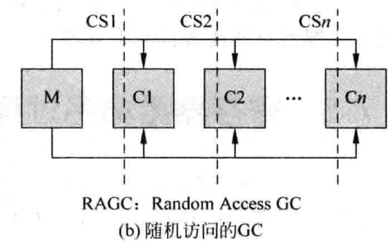

考虑到使用Checkpoint的目的是快速地对处理器中的某些部件进行保存和恢复，随机访问的`GC`是更合适的实现方式。

#### 使用WALK

对每一条指令来说，在`ROB`中都存储了这条指令之前对应的物理寄存器，利用这个信息，可以将`Mapping Table`的状态逐步地回退，使那些处于错误路径上的指令，对`Mapping Table`的修改都进行恢复。

#### 使用Architecture State

当需要从处理器外部访问一个逻辑寄存器时，直接使用寄存器重命名阶段的`Mapping Table`是很难做到的，因为它处于推测状态，因此一般都会在流水线的提交阶段也使用一个`Mapping Table`，所有正确离开流水线的指令都会更新这个`Mapping Table`，因此这个`Mapping Table`中记录的状态肯定是正确的，称它为`Architecture Mapping Table`。

### 分发

对于超标量处理器来说，乱序执行是最关键的地方，流水线的分发阶段是顺序执行和乱序执行的分界点，指令经过寄存器重命名之后，就会进入流水线的分发阶段。在这个阶段，经过寄存器重命名之后的指令会被写到流水线的很多缓存中，这样就为乱序执行做好了准备，具体来说，可以分为三大类的缓存。

#### Out-of-order Issue Queue

当指令被放到这个缓存中的时候，它的操作数可能还没有完全准备好，那么它就在这个缓存中等待，只要一个指令的所有源操作数都准备好了，就可以将其送到`FU`中执行 ，而不用理会这条指令在程序中原始的顺序。

#### In-order Issue Queue

即使在乱序执行的超标量处理器中，仍旧有部分指令是按照程序中指定的顺序来执行的，例如分支指令和`store`指令。

#### ROB

这个部件可以将乱序执行的指令拉回程序中指定的原始顺序，指令经过寄存器重命名之后，按照程序中指令的顺序写到`ROB`中，同时在`ROB`中还会记录下指令在执行过程中的一些状态，例如是否产生异常等信息。

## 发射

### 概述


上图给出了流水线的发射阶段的执行过程，以及所涉及到的一些重要的部件，包括以下几个：

1. 发射队列`Issue Queue`，用来存储已经被寄存器重命名，但是没有被送到`FU`执行的指令。
2. 分配电路`Allocation Unit`，用来从发射队列中找到空闲的空间，将寄存器重命名之后的指令存储到其中。
3. 选择队列`Arbiter Unit`，如果在发射队列中存在多条指令的操作数都已经准备好了，那么这个电路会按照一定的规则，从其中找出最合适的指令，送到`FU`中去执行。
4. 唤醒电路`Wake-up Unit`，当一条指令经过`FU`执行而得到结果数据时，会将其通知给发射队列中所有等待这个数据的指令，这些指令中对应的源寄存器会被设置为有效的状态，这个过程就是唤醒。如果发射队列中一条指令的所有源操作数都有效了，则这个指令就处于`ready`的状态，可以向选择电路发出申请。

#### 集中式VS分布式

如果所有的`FU`都共用一个发射队列，则这种结构为集中式的发射队列`CIQ`；而如果每个`FU`都有一个单独的发射队列，则这种结构为分布式的发射队列`DIQ`。

`CIQ`因为要负责存储所有`FU`的指令，所以它的容量需要很大，这种设计有着最大的利用效率，但是会使选择电路和唤醒电路变得比较复杂。

`DIQ`为每一个`FU`都配备了一个发射队列，所以每个发射队列的容量可以很小，这样就大大简化了选择电路的设计，但是由于它的分布比较分散，进行唤醒操作时所需要的布线复杂度较高。

正因为这两种方式各有优缺点，现代的处理器一般都结合使用上述的两种方法，使某几个`FU`共同使用一个发射队列。

#### 数据捕捉VS非数据捕捉

在流水线的发射阶段之前读取寄存器，这种方法称为数据捕捉的结构，在这样的设计中，被寄存器重命名之后的指令会首先读取物理寄存器堆，然后将读取到的值随着指令一起写入发射队列中。如果有些寄存器的值还没有被计算出来，则会将寄存器的编号写到发射队列中，以供唤醒的过程使用，它会被标记为当前无法获得的状态，这些寄存器都会在之后的时间通过旁路网络得到它们的值，不需要再访问物理寄存器堆。

在流水线的发射阶段之后读取物理寄存器堆，这种方法也称为非数据捕捉结构，在这样的设计中，被重命名之后的指令不会去读取物理寄存器堆，而是直接将源寄存器的编号放到发射队列中，当指令从发射队列中被选中时，会使用这个源寄存器的编号来读取物理寄存器堆，将读取的值送到`FU`中去执行。

#### 压缩VS非压缩

当一条指令被选中而离开时，在发射队列中就会出现空闲的位置，经过压缩之后，这个空闲的位置会被挤掉，这样所有的指令又都靠在一起了，这就是压缩方式的发射队列。这样可以保证空闲的空间都是处于发射队列的上部，此时只需要将重命名之后的指令写到发射队列的上部即可。

非压缩的发射队列就是每当有指令离开发射队列的时候，发射队列中其他的指令不会进行移动，而是继续停留在原来的位置。在这种方法中，空闲空间在发射队列中的分布将是没有规律的，不能够根据指令的位置来判断指令的新旧。

### 发射过程的流水线

#### 非数据捕捉结构的流水线

进入到发射队列当中的一条指令要被`FU`执行，必须要等到下述几个条件都成立：

1. 这条指令所有的源操作数都准备好了；
2. 这条指令能够从发射队列中被选中，即需要经过仲裁电路的允许才能够进行发射；
3. 需要能够从寄存器、`payload RAM`或者旁路网络中获得源操作数的值。

通过处理器中的旁路网络，能够使唤醒的过程提前。

#### 数据捕捉结构的流水线

这种结构相比于上一种方法，最大的不同就是它在发射队列中采用`payload RAM`来存储所有指令的源操作数，这样当指令离开发射队列的时候，可以直接得到操作数，而不需要再去读取物理寄存器堆。
