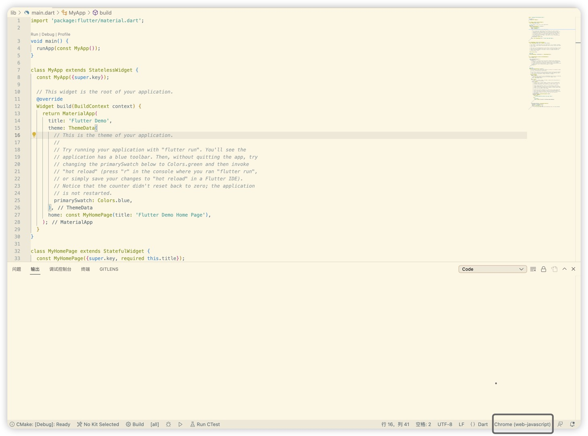
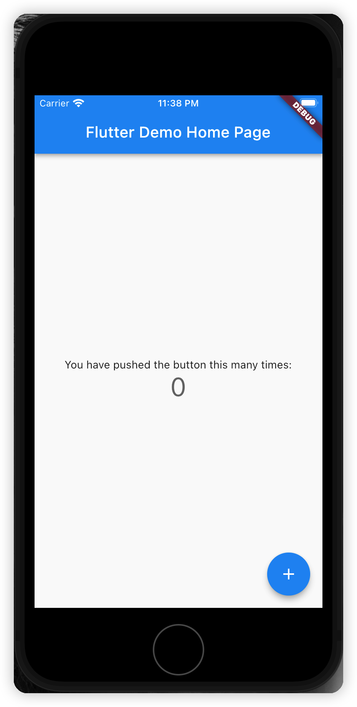
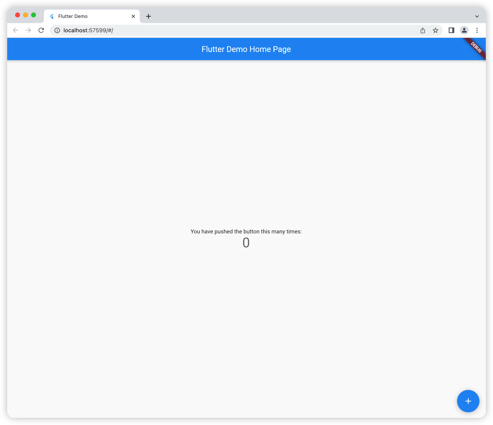

# Configure Flutter Environment in Your PC

## Download Dependency

At first, download dependencies through git and configure environment variables. My environment is MacOS and if you are using Windows or Linux, just only notice slight differences in the configuration of environment variables.

```shell
# download dependency
git clone -b beta https://github.com/flutter/flutter.git

# add to .bash_profile
export PUB_HOSTED_URL=https://pub.flutter-io.cn
export FLUTTER_STORAGE_BASE_URL=https://storage.flutter-io.cn
export PATH="$PATH:{ flutter download path, please replace }/flutter/bin"

# re-source .bash_profile
source ~/.bash_profile

# check whether the environment takes effect
flutter doctor

# create your first project
flutter create demo

# run your demo
cd demo && flutter run
```

## Use Simulator

you may have noticed that when you type `flutter run` in command line, you're asked to choose one device to display, such `chrome`(web) or macOS(desktop). If you have downloaded `Android Studio` / `Xcode`, even `QEMU`, you can choose them to display in your IDE simply, like Virtual Studio Code. Just download `flutter` plugin, click on the bottom right(in Virtual Studio Code) and then, type `flutter run`.


* in Xcode simulator

* in Chrome


## Perform Hot Reload

Maybe you're used to Hot Reload when you're developing a website. If you want to perform a hot reload when you use flutter, you can follow the steps below. Attention please, only `debug mode` can be hot reloaded.

* If you're running the app at the command line using flutter run, you can just type `r` in the terminal window.
* If you're running the app in IDE, take instance of Virtual Studio Code, you should firstly change the mode of `Dart: Flutter Hot Reload On Save` in `Code->Preferences->Settings`. There are 5 modes:
  * never: Never auto perform a hot reload when saving.
  * all: Trigger a hot reload for both manual save and autosave.
  * allDirty: Trigger a hot reload for both manual save and autosave only if the saved file had changes.
  * manual: Trigger a hot reload for an explicitly manual save like pressing `Ctrl + S` on `Windows` or `Command + S` on `Mac`.
  * manualDirty: Trigger a hot reload for an explicitly manual save only if the saved file had changes.

> I chose allDirty.
>
> When you're done configuring, you should type `fn + F5` on `Mac` or something like this on `Windows` to launch your app. If you still type `flutter run` in command line, auto hot reload is useless.
