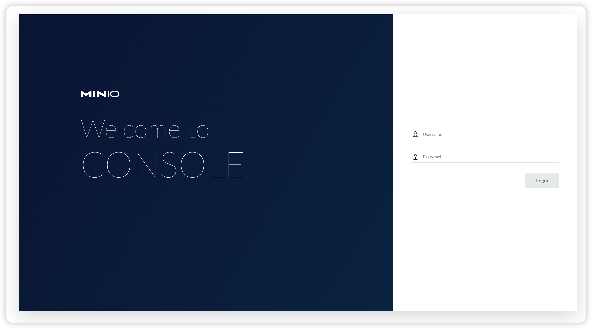
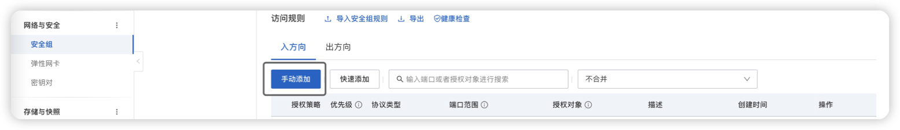

# Deploy Your Own Website Database and OSS on the Server

Through this article, you'll learn how to deploy a website simply. This article takes `Vue`, `Gin`, `MySQL`, and `MongoDB` as examples. Other frameworks and databases take a similar approach.

> My server is from Ali Could and ubuntu 22.04 system.

## Deployment of MySQL

* Connect to the server through ssh remotely，then download `docker`.

```shell
curl -fsSL https://get.docker.com | bash -s docker --mirror Aliyun
```

* Pull the MySQL image.

```shell
docker pull mysql
```

* Run image of MySQL in docker and enable remote service.

```shell
# Run img of mysql in docker
docker run --name NAME OF CONTAINER -d -p HOST PORT:CONTAINER PORT -e MYSQL_ROOT_PASSWORD=PASSWORD mysql
# Check whether docker starts and corresponding container ID
docker ps
# Enter docker
docker exec -it CONTAINER ID /bin/bash
# Login MySQL
mysql -u root -p
# Type password
# Switch database
use NAME OF DATABASE
# Query the users in the database, database can be connect remotely when exists user: root, host: %
select user,host from mysql.user;
```

> You can eonnect to MySQL from an external server via DataGrip.

## Deployment of MongoDB


```shell
docker pull mongo
docker run -itd --name NAME OF CONTAINER -p HOST PORT:CONTAINER PORT --auth mongo
# Enter mongo shell
mongo
use admin
db.createUser({user:"USERNAME",pwd:"PASSWORD",roles:[  {role:"root", db:"admin" } ]})

db.auth("USERNAME","PASSWORD")

use NAME OF DATABASE
db.createUser({user:"USERNAME", pwd:"PASSWORD,roles:[{role:"readWrite",db:"NAME OF DATABASE"},"readWrite"]})
db.createCollection("NAME OF COLLECTION")

# Refer to https://stackoverflow.com/questions/66719861/unable-to-authenticate-with-mongodb-golang-driver when happens 'connection() error occurred during connection handshake'
```

## Deployment of Backend

* Cross compile and package the backend.

```shell
CGO_ENABLED=0 GOOS=linux GOARCH=amd64 go build .
```

>If you cannot download dependencies due to without configuring agent, you can upload all dependencies of backend projects locally through 'scp'. The upload directory is ' /root/go/pkg/mod' of the server.

* Write `Dockerfile`.

```dockerfile
# Pull img
FROM ubuntu:22.04
# Create Directory, can be ignored
RUN mkdir /build
# Set working directory
WORKDIR /build
# Copy the project to the corresponding directory in docker
COPY NAME OF PACKAGED PROJECT /build/NAME OF PROJECT
# EXPOSE PORT
EXPOSE EXPOSED PORT
# Run the project directly when docker starts up
ENTRYPOINT ["./NAME OF PROJECT"]
```

* Generate docker image.

```shell
docker build -t NAME OF IMAGE .
```

* Run image in docker.

```shell
docker run --name NAME OF CONTAINER -d -p HOST PORT:CONTAINER PORT NAME OF IMAGE
```

* Check whether docker starts up。

```shell
docker ps
```

## Deployment of Frontend

* Package the project, you can choose to package locally or on the server.

```shell
npm run build
```

* Place the `dist` folder on a specific path.

* Configure nginx.

```shell
# install nginx
sudo apt-get install nginx

# Modify nginx configuration file, add one more server as follows
server {
                listen PORT LISTENED BY NGINX;
                root PATH OF DIST PATh;
                location / {
                }

        }
```

* Start the nginx service

```shell
# start nginx service
nginx

# reload nginx service
nginx -s reload
```

## Deployment of MinIO

* Set up MinIO on the server.

```shell
docker pull minio/minio

docker run \
	-p 9000:9000 -p 9090:9090 \
	-d \
	-e "MINIO_ACCESS_KEY=ACCOUNT" -e "MINIO_SECRET_KEY=PASSWORD" \
	-v /home/minio/data:/data -v /home/minio/config:/root/.minio \
	minio/minio server /data \
	--console-address ":9090" -address ":9000"
```

* Access MinIO on your server externally, through `PUBLIC IP ADDRESS OF SERVER:9090`.



## Q&A

### Docker Failed to Pull Image

Take MySQL as an example. If you use `docker pull mysql` to pull image of MySQL and the following error occurs:

```
Error response from daemon: Head "https://registry-1.docker.io/v2/library/mysql/manifests/latest": net/http: TLS handshake timeout
```

You can solve this problem by configuring the daemon.json, which is on '/etc/docker/daemon.json'. The specific modification is as follows

```shell
# daemon.json
{
 "registry-mirrors":["MIRROR IMAGE SOURCE"]
}
```

Then, reload service by:

```shell
systemctl daemon-reload
systemctl restart docker
```

Just pull it again.

### Port Inaccessible

Ali Cloud has its own port opening policy. By default, only 22 and 3389 are released. If you need to release some ports, you need to set the security group of the corresponding server on Ali Cloud platform.


