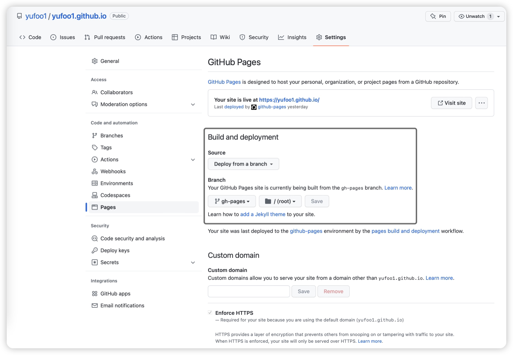

# Set Up Personal Site and Deploy Through GitHub

My website is built with `Docusaurus`, used `React` and `TypeScript`.

> Docusaurus is Facebook's easy-to-maintain static website creation tool for open source project developers. You can update your website with Markdown simply and build a static website with a home page, documentation, apis, help, and a blog page in just 5 minutes.
>
> [tutorial of Docusaurus](https://docusaurus.io/docs)

## Build Your Site Through Scaffolding

```she
npx create-docusaurus@latest my-website classic
```

If you want to maintain your own site through `TypeScript`, you can use

```shell
npx create-docusaurus@latest my-website classic --typescript
```

## Deploy Through GitHub

If you want to deploy your site through Github, you should firstly create a repository named your username.github.io. Since your site isn't built with `Jekyll`, you should write `CI/CD` to implement deployment automatically. Here is the teaplate for `CI/CD`:

```yaml
name: "Deploy"
on:
  push:
    branches: ["main"]

jobs:
  github-pages:
    runs-on: ubuntu-latest
    steps:
      - uses: actions/checkout@v2
      - name: Build the static site.
        run: |
          npm install
          npm run build
      - name: Publish the static site to GitHub Pages.
        uses: jamesives/github-pages-deploy-action@releases/v3
        with:
          GITHUB_TOKEN: ${{ secrets.GITHUB_TOKEN }}
          BRANCH: gh-pages
          FOLDER: build
```

Then configure `GitHub Pages`:



Once the `CI/CD` is configured, you just need to push the code of your site to the `main` branch, and `GitHub Actions` will help you build the project and push it to the `gh-pages` branch. Then, you can visit your site by `YOUR USERNAME.github.io`.

## Add Tutorial

In default configuration, you just need to create a folder in ./docs, write `_category_.json` and insert your `Markdown` file. The formate of `_category.json` is below:

```json
{
  "label": "LABEL",
  "position": POSITION,
  "link": {
    "type": "generated-index",
    "description": "DESCRIPTION"
  }
}
```

Go through the steps above, you must have built your site in 5 minutes and deploy it successfully. Next, all you need to do is think about how to decorate your website.
